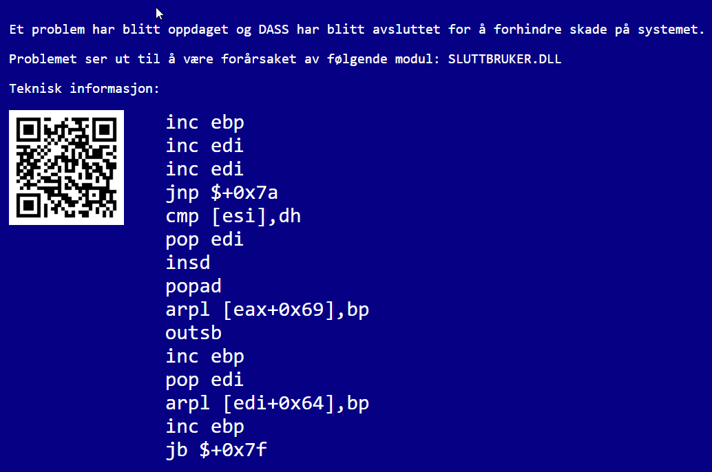
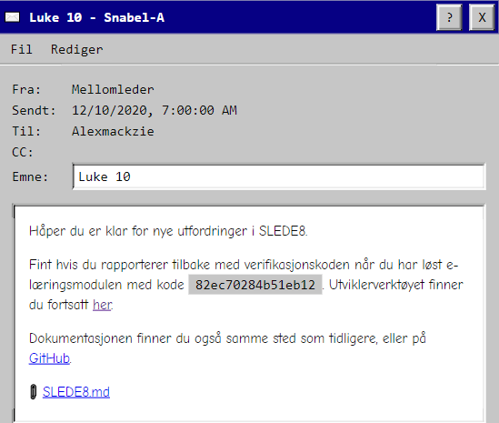
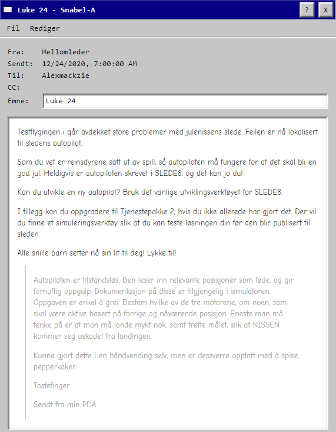
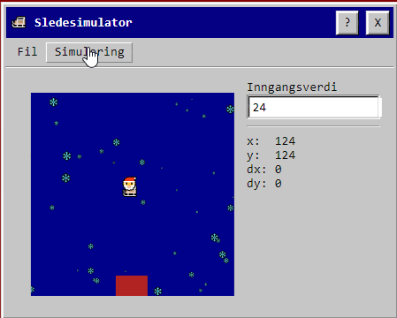

# NPST-2020


From December 1st to December 24th. PST will release a new Task/challenge for us to solve. This is all wrapped neatly in a fun package where we are employees of the NPST,

The North Polar Security Service. 

This years NPST was centered around a new System called DASS.
This bears resemblance to an old school windows OS


In the start-menu we have some different options to choose from. Some of these came later during some system updates. Like Mal(paint) and Sledesimulator(SleighSimulator)


```
Rules

It is not allowed to acquire access to other users' accounts.
It is not allowed to attack / bruteforce APIs on dass.npst.no.
It is not allowed to use offensive aliases.
It is allowed to cooperate.

We strongly encourage you not to publish solutions online openly until December 25th at the earliest.

In the event of a breach of the rules, we reserve the right to change aliases, block and/or remove users without notice.

General information
The scoring flag is in the form PST{.*}, For example PST {someTextandSomeNumbers}.

Flags are delivered in Snabel-A in response to the Middle Manager on today's task.

By entering a valid email address, you get the opportunity to win prizes. This is therefore completely voluntary! 
Email addresses will only be used to contact any winners, and they will be deleted after all winners have been announced. 
You can change your email at any time under Settings in the Snabel-A application.

Only users who have entered a valid email can win prizes. The winner of the Christmas calendar will be drawn at random among 
all participants, the more points you have, the greater the probability of being drawn.

All user accounts and associated data will be deleted after all winners have been announced, no later than February 1st, 2021.

Cooperation
There is an unofficial Discord channel that was used extensively by many participants last year. We encourage everyone who wants 
to discuss the tasks with others to use this. PST has nothing to do with the channel, but has been allowed to have a user present 
who you can ask questions to if you wish. Please respect the rules set by the channel administrators.
```


## Eggs
On the 5th, we received a message detailing how to do extra-tasks called eggs.
I will be detailing these on the dates they were unlocked as well.

```
It is still possible to respond to this year's employee survey. Feel free to praise me in the clouds, so that I appear as a 
good middle manager! Do this by sending a message to HR with the text EGG{w0rlds_b3st_b0ss}.

Answers are rewarded with a star in the margin!

--- original message ---

Hi Middle Manager,

As you are probably aware, we are currently conducting employee surveys. Based on the results so far, we want to call you in 
for a concern call 07.12, at 13:24.

Meet precisely.

-
HR
```


This unlocked Egg#4 There are called Utmerkelser, or commendations in English and are represented with stars on the Leaderboard.


## Egg #1 
By going to dass.npst.no/humans.txt you can notice this suspicious scrollbar on the right side. ----------->>>

Or be like me and check the source-code because you didn’t notice...

At the bottom we find the Egg: 


## December 1st
```
Hi,

Can you confirm that you have gained access to the system? To do this, reply to this message with the 
verification code RUV{JgkJqPåGtFgvLwnKilgp}.

NOTE: I lost your verification code in the salad, so you may need to correct it before responding.

Sincerely, your immediate manager

```


By looking at the scrambled code, we can see that it is already in the correct format, but the characters outside and inside the brackets are not exactly correct.
This suggests some sort of shift or substitution cipher, the most common and easy one is the ROT cipher also called the Caesar cipher as it was first recorded during his time. This is also hinted to in the text when it is mentioned that the code was lost in the salad, as a very popular type of salad is a Caesar salad.

There are many tools to solve such ciphers. Either webpages or self-coded scripts. I always suggest coding your own solutions at least once. But my favourite tool for these types of problems is cyberchef: https://gchq.github.io/CyberChef/ 


Here we can just paste the scrambled code into cyberchef and search on the left hand side for ROT or Caesar and rotate the characters. This can either be brute-forced by trying all the 25 possibilities, or realizing that the first character of the flag is always P as in PST{, and that the R in the scrambled code is only two rotations away from P.

NOTE: If you are working with ROT in other languages, you may have to find other tools, as by default it only rotates A-Z. Norwegian for example has ÆØÅ in addition, so the maximum rotation would be 28 instead of 25. But in this case the å is already in the flag, and is not rotated by cyberchef as it is treated as a special symbol just like the brackets.

Here is some Python code to achieve the same thing:

```
import string

def shift(melding):
    lowercase_alphabet = string.ascii_lowercase
    plaintext = ''
    shift = 0
    while shift < len(lowercase_alphabet):
        for c in melding:
            index = lowercase_alphabet.find(c.lower())
            if index != -1:
                isupper = c.isupper()
                c = lowercase_alphabet[(shift + index) % len(lowercase_alphabet)]
                if isupper:
                    c = c.upper()
            plaintext += c

        if 'PST' in plaintext:
            print(plaintext)
            print(shift)
            pass
        if 'pst' in plaintext:
            print(plaintext)
            print(shift)
            pass

        plaintext = ""
        shift += 1


shift("RUV{JgkJqPåGtFgvLwnKilgp}")

```
This code can be modified to include numbers or extra characters by changing 

```lowercase_alphabet = string.ascii_lowercase```

To

```lowercase_alphabet = string.ascii_lowercase + 'æøå'```

In order get a norwegian alphabet.
```
Excellent!

Welcome to NPST! As your immediate leader, I hope you are ready for greater challenges in the days to come. 
I will have new tasks for you everyday. Feel free to use the time between the tasks to familiarize yourself well with DASS and its functions.

For each task you complete, you get points that are shown in the points overview. How you do it there could possibly affect 
next year's wage negotiations.
```

## December 2nd
```
Intelligence officer GWYN, Pen was stopped at customs on departure on November 25th. In this connection, we secured a storage medium 
that contained a mysterious file. Can you parse the file pen_gwyn_greatest_hits.mid?

It is still unknown why GWYN was at the North Pole at this time, but he is said to have been observed at the local water hole Svalbar.

📎 beslag.zip
```


We are given a zip file named beslag.zip(confiscation.zip).
This contains the midi file, and a 7zip file called privat.7z which is password protected.
The midi file plays fine, although maybe not the greatest winter hit. 
I opened the file in HxD to see if there was something to spot there. As can be seen on the image on the right.

And I immediately spotted both curly brackets. So I checked right before the first bracket, and we can see that T is the letter just before. So the flag is in here, but it is obfuscated by the string “@.z€” and also doubled. Obviously this can be brute forced just by taking notes and looking at the decoded hex.
However I chose a way more effective method. Although not the prettiest.

I opened up WSL(Windows Subsystem for Linux) and entered the command:

```
cat pen_gwyn_greatest_hits.mid
```


We can see the letters, but only the @ and z are present in the cat.

```
cat pen_gwyn_greatest_hits.mid | tr -d '@z'
```
This reads the file, but deletes the characters @ and z from the result.


As I said, a lot faster than reading it manually. But not the most pretty, as I still had to write it down myself. 


```
Cleverly executed! The rest of the confiscated items will be processed in the line.
```
We also get a message from Santa himself:
```
Great to see that you are in the process of working. Hope you are well taken care of by your immediate manager, and contribute to 
a Merry Christmas!

🎅
```
## December 3rd
```
I guessed the password to the zip file,, and it worked!

Sent from my PDA.
```


And later a followup message saying: 

```In case the last message was unclear, the password is “til zip-fila,” ” Or in english: “to the zip file,```


Opening up the zip-file reveals two files, cupcake.png. And kladd.txt

Cupcake.png is a high-resolution image that looks very low-res. While kladd.txt is a text file containing 8 sleigh emojis with an encoded string.

```
Your colleague Tastefinger has identified something 🧁 with the file cupcake.png from the seizure you worked with yesterday. 
It is PROBABLE that there may be information in the image that is not visible to the naked eye. Can't wait to hear what you come up with!
```


Luckily, our new system has the ability to enhance images. So let's use that.


We choose the image, and click “Enhance” at the bottom


After clicking enhance a couple of times we get the flag on a post-it note. Amazing how technology can create information from blocks of color.

```
Good work! We make a great team!
```
## Egg #3
Running cupcake.png through zsteg reveals a youtube link: youtu.be/I_8ZH1Ggjk0 
Which is a CSI link called enhance. Not only is this a hint for the task of the day. But it is a hint for the egg.
By saving the final image of cupcake.png from the enhance module in DASS, and running the same zsteg command. We find the egg.


When I use zsteg I almost always use the -a flag. As it lists everything.

zsteg can be found at: https://github.com/zed-0xff/zsteg 

And can be installed on linux from the terminal using gem.

```gem install zsteg```

## December 4th

```
Hi,

As everyone knows, Christmas lasts until Easter(A common Norwegian phrase), and here the problems start ...

We in the middle management group have started a preliminary project for a study of staffing strategy for Easter in the years ahead. 
The system we use to find out when it's Easter is behaving strangely, so that this important work has now been put on hold. Can you figure out what's wrong?

We in the middle management group are very interested in target figures, and the management wants a report as soon as possible 
on the sum of the column Targets from and including 2020 to and including 2040. Can you answer me with this sum, surrounded by “PST {“ and ”}” when you find out?

📎 files.zip
```


The zip file contains 4 sql files: 

```GenererRapport.sql(GenerateRapport.sql)``` 

```dbo.ProcedureDatoPaaske.sql(ProcedureDateEaster.sql)```

```dbo.FunctionPaaskeAften.sql(FunctionEasterEvening.sql)```

```dbo.DatoPaaske.sql(DateEaster.sql)```

and a csv file, ```DatoPaaske.csv(DateEaster.csv)```. 

The csv file is a result of running the sql files which generates the numbers for Easter.
The CSV contains 5 columns separated by a semi-colon.

DatoPaaskeId;PaaskeAften;PaaskeFerieUke;Aar;MaalTall

translated:

DateEasterID;EasterEvening;EasterVacationWeek;Year;TargetNumbers

So the first thing to understand is what the TargetNumbers represent. 
So let's go through what each of the sql files do, and see if we can either fix the current operation, or understand what we need to do separately to get the answer.
GenererRapport.sql 
```
DECLARE @year smallint = 2020;
DECLARE @fj datetime = CAST(cast(@year as varchar) + '0101' as datetime)

WHILE @year <= 2040
BEGIN 
	EXEC [dbo].[ProcedureDatoPaaske] @foerste_jan = @fj
	SET @year = @year + 1
	SET @fj = CAST(cast(@year as varchar) + '0101' as datetime);
END;
```
This declares variables year to 2020 and fj to a datetime object.
This datetime object is the year followed by 0101. Which means the first of january that year.
This is further evident when we see the loop
While the year is less or equal to 2040 we run this loop to generate the Easter days.
We execute the ProcedureDatoPaaske program, with the variable @foerste_jan(frst_jan) equal to fj as the argument. So now we know for sure that we are sending a datetime object for each year 2020 to 2040 1st of January to the ProcedureDatoPaaske program. The year and fj variable is then incremented.

```
USE [NPSTDB]
GO


DROP PROCEDURE [dbo].[ProcedureDatoPaaske]
GO

SET ANSI_NULLS ON
GO

SET QUOTED_IDENTIFIER ON
GO


-- =============================================
-- Author:		Nissens hjelper
-- =============================================
CREATE PROCEDURE [dbo].[ProcedureDatoPaaske] @foerste_jan datetime
AS
BEGIN

	DECLARE @aar smallint,
			@paaskeaften datetime,
			@paaskeferie int,
			@maaltall int


	SELECT @aar = YEAR(DATEADD(day, 26 - DATEPART(isoww, @foerste_jan), @foerste_jan));
	EXECUTE @paaskeaften = [dbo].[FunctionPaaskeAften] @aar;
	SELECT @paaskeferie = DATEPART(ISOWK, @paaskeaften);
	SELECT @maaltall = CONVERT(INT, @paaskeaften);

	INSERT INTO [dbo].[DatoPaaske]
           ([PaaskeAften]
           ,[PaaskeFerieUke]
           ,[Aar]
           ,[MaalTall])
           
     	VALUES
           (@paaskeaften
           ,@paaskeferie
           ,@aar
           ,@maaltall)


END
GO
```
This procedure declares all our columns in the generated csv.
For now we are really only interested in understanding what the TargetNumbers of the task is, so let's focus on the @maaltall variable.
Maaltall is set to be an int conversion of the @paaskeaften variable. We know from the CSV that paaskeaften is a DateTime Object. So the TargetNumbers we are looking for seem to be a DateTime Object of EasterEvening converted to INT. The datetime happens to be based on 1900 Jan. 1. Which is why the number is so low compared to the normal Epoch & Unix timestamps we normally see

The calculations for this can be seen in FunctionPaaskeAften.sql:

```
USE [NPSTDB]
GO


DROP FUNCTION [dbo].[FunctionPaaskeAften]
GO

SET ANSI_NULLS ON
GO

SET QUOTED_IDENTIFIER ON
GO


-- =============================================
-- Author:		Nissens hjelper
-- =============================================
CREATE FUNCTION [dbo].[FunctionPaaskeAften]
(
	@aar smallint
)
RETURNS date
AS
BEGIN
	DECLARE @a tinyint, @b tinyint, @c tinyint,
	@d tinyint, @e tinyint, @f tinyint,
        @g tinyint, @h tinyint, @i tinyint,
        @k tinyint, @l tinyint, @m tinyint,
	@year date, @month date, @easterday date,
	@paaskeaften date;

    --- Calculation steps:
	SELECT @a=@aar%19, @b=FLOOR(1.0*@aar/100), @c=@aar%100;
	SELECT @d=FLOOR(1.0*@b/4), @e=@b%4, @f=FLOOR((8.0+@b)/25);
	SELECT @g=FLOOR((1.0+@b-@f)/3);
	SELECT @h=(19*@a+@b-@d-@g+15)%30, @i=FLOOR(1.0*@c/4), @k=@aar%4;
	SELECT @l=(32.0+2*@e+2*@i-@h-@k)%7;
	SELECT @m=FLOOR((1.0*@a+11*@h+22*@l)/451);
	SELECT @year = DATEADD(yy, @aar-2000, '2000/01/01');
	SELECT @month = DATEADD(mm, FLOOR((1.0*@h+@l-7*@m+114)/31)-1, @year);
	SELECT @easterday = DATEADD(dd, (@h+@l-7*@m+114)%31, @month);
	SELECT @paaskeaften = CONVERT(DATETIME, @easterday) - 1;

	-- Return the result of the function
	RETURN @paaskeaften

END
GO
```
This is the culprit, as DatoPaaske.sql only enters the information generated here into a table:

```
USE [NPSTDB]
GO


DROP TABLE [dbo].[DatoPaaske]
GO

SET ANSI_NULLS ON
GO

SET QUOTED_IDENTIFIER ON
GO

CREATE TABLE [dbo].[DatoPaaske](
	[DatoPaaskeId] [int] IDENTITY(1,1) NOT NULL,
	[PaaskeAften] [date] NULL,
	[PaaskeFerieUke] [tinyint] NULL,
	[Aar] [smallint] NULL,
	[MaalTall] [int] NULL,
PRIMARY KEY CLUSTERED 
(
	[DatoPaaskeId] ASC
)WITH (PAD_INDEX = OFF, STATISTICS_NORECOMPUTE = OFF, IGNORE_DUP_KEY = OFF, ALLOW_ROW_LOCKS = ON, ALLOW_PAGE_LOCKS = ON) ON [PRIMARY]
) ON [PRIMARY]
GO
```

Instead of going through the sql calculations and fixing it, I created my own in python:

```
import datetime

def foerste_jan(aar):
    paaskea = paaskeaften(aar)
    maaltall = (paaskea - datetime.datetime(1900,1,1)).days
    return maaltall-1

def paaskeaften(aar):
    a = aar % 19
    b = aar // 100
    c = aar % 100
    d = (19 * a + b - b // 4 - ((b - (b + 8) // 25 + 1) // 3) + 15) % 30
    e = (32 + 2 * (b % 4) + 2 * (c // 4) - d - (c % 4)) % 7
    f = d + e - 7 * ((a + 11 * d + 22 * e) // 451) + 114
    month = f // 31
    day = f % 31 + 1    
    return datetime.datetime(aar, month, day)

year = 2020
malltall_sum = []
while year <= 2040:
    fj = foerste_jan(year)
    malltall_sum.append(fj)
    year += 1

print(sum(malltall_sum))
```

However it does seem like the calculations are based off this algorithm:
https://dzone.com/articles/algorithm-calculating-date
And the mistake seems to be that the variable k is meant to be k =  c % 4, while the sql calculations do k = aar % 4 which is the Year instead of c. However I have not tested this. As my solution worked fine.


```
Thanks for the help!

Now the management team should be satisfied.
```

## December 5th
```
Access problems to the documentation vault are reported. We have received logs from the Section for passwords and prevention 
during the period where it is suspected that the error may be. Do you find anything 🧁 in the logs?

📎 log.csv
```


We receive a single csv file. It is 5185 lines long with each line being a password change request. It contains the date and time, Name of the person asking for a reset, the section handling the request(Password and prevention in this case), and the message received. And the message contains the password in the form PST%7B95b349c65133416bc9c5a73c4e4f46ee%7D for example. %7B being { and %7D being }. This is because the log is URL encoded.

My plan was to count occurrences on the lines to see if anything was out of the ordinary. Maybe a name only appeared once. Which would be interesting. Maybe the Section handling the request would be different.

```
import pandas
import chardet
from urllib.parse import unquote

with open('log.csv', 'rb') as f:
    result = chardet.detect(f.read())


log = pandas.read_csv("log.csv", ";", names=['Date', "Name", "Section", "Message"], encoding = result['encoding'])

print(log['Name'].value_counts())
```

Luckily I got a match on the first try, by sorting by names:

```
Gunvor+%3CGunvor%3E                  36
Trine+%3CTrine%3E                    36
Sigrid+%3CSigrid%3E                  34
Karen+%3CKaren%3E                    34
Grethe+%3CGrethe%3E                  34
                                     ..
Kenneth+%3CKenneth%3E                18
Alf+%3CAlf%3E                        17
Kjersti+%3CKjersti%3E                17
Nissen+%3CJule+Nissen%3E              4
Ni%E2%80%8Bssen+%3CJule+Nissen%3E     1
Name: Name, Length: 205, dtype: int64
[Finished in 0.8s]
```

We can see that there is something wrong with one of the names here.

I locate the wrong name easily by just searching the log:


And we have the flag!

```
This case is given priority for further processing in the line!

It may appear that a threat actor has managed to reset Chief NPST's password via a phishing attack.
```

## December 6th
```
It's time for you to start e-learning in SLEDE-8. This is the successor to SLEDE-4, and is used diligently by our developers.

Nice if you report back with the verification code after you have solved the e-learning module with code “4032996b1bbb67f6”. 
The developer tool can be found here(Hyperlink).

See also attached documentation.

📎 SLEDE8.md
```


You can find the translated documentation in [Slede8.md](Slede8.md), in the same folder as this writeup.

It turns out that this new tool is an assembly-like language with 16 registers and an input opportunity.


The task we get when we enter this number into the E-learning module is this:

The first byte of input is a number N that represents the number of following bytes of input. Sum the following N numbers and write the result
```
LES r10
SETT r11, 1

leseloop:
LIK r5, r10
BHOPP slutt
PLUSS r5, r11

LES r2
PLUSS r3, r2

HOPP leseloop


slutt:
SKRIV r3
STOPP
```

Luckily we did not have to consider the added numbers being greater than 256, as each register can only hold a value of 255.
Sending in the code via the E-Learning module will result in the verification code.

```
Good to see you up and running.

There will be more e-learning modules later.
```
## Egg #5
Solve the Hello World E-Learning module in slede8.

This can be done easily by just throwing the hex for "Hello World!" into the input, and just reading it straight into the output.

```
SETT r3, 0x01
FINN message
HOPP loop

message: 
.DATA 0x48,0x65,0x6c,0x6c,0x6f,0x2c,0x20,0x57,0x6f,0x72,0x6c,0x64,0x21,0x0a,0x00

loop:
LAST r2
PLUSS r0, r3
LIK r2, r4
BHOPP end
SKRIV r2
HOPP loop

end:
STOPP
```

## Egg #2
We now know what kladd.txt is.

Eight sleighs, followed by an encrypted string.
We simply throw this encrypted string after slede8.npst.no/#
Running the program gives us the egg:


##  December 7th
```
A strange signal has been picked up here at Santa's workshop. It does not seem to be a continuous signal, as it seems to come and go a bit. 
Can you figure out what it is?

📎 data.complex16u
```


Any signal-based task immediately screams Universal Radio Hacker: https://github.com/jopohl/urh 
And as we can see:


Immediately just opening the file and setting the signal to show ASCII reveals the flag.

```
Thank you for your efforts J
```
(J refers to Julenissen, or Santa Claus)


## December 8th
```
Professional development is important, even now in the run-up to Christmas. Today's topic is ASN.1. Here is some brain exercise from Nissens Kompetansebank ™.

MIIBOTCCATAwggEnMIIBHjCCARUwggEMMIIBAzCB+zCB8zCB6zCB4zCB2zCB0zCByzCBwzCBuzCBszCBqzCBozCBnDCBlDCBjDCBhDB9MHYwbzBoMGEwWjBTMEwwRTA+MDcwMTAqMCMwHDAVMA4wBwUAoQMCAROgAwIBA6EDAgEMogMCAQChAwIBE6ADAgEBoQMCARKkAgUAoQMCARShAwIBDqIDAgEYoQMCAQShAwIBEqEDAgEOoQMCAQ6hAwIBB6IDAgECogMCAQigAwIBAaIDAgENogMCARKiAwIBAKMCBQCiAwIBE6IDAgESogMCAQ+hAwIBEaEDAgEOoQMCAQugAwIBAKIDAgEDoQMCAQyhAwIBFKEDAgESoQMCAQ+gAwIBAaEDAgEMoAMCAQOhAwIBEaEDAgEOogMCAQs=

Spec DEFINITIONS ::= BEGIN
    LinkedList ::= Node
    Node ::= SEQUENCE {
        child CHOICE {
            node Node,
            end NULL
        },
        value CHOICE {
            digit                [0] INTEGER(0..9),
            lowercase           [1] INTEGER(0..25),
            uppercase           [2] INTEGER(0..25),
            leftCurlyBracket    [3] NULL,
            rightCurlyBracket   [4] NULL
        }
    }
END

Good luck!
```
(The fixed specifications are pasted here)


Well, we get a faulty ASN.1 specification.
A fixed one was luckily sent 25 minutes later :).


Since I had no idea what ASN.1 even was prior to this I had to do some research. Lets learn.
ASN stands for Abstract Syntax Notation. And it is a type of notation for describing abstract types and values. So we can use ASN.1 to create any type of encoding and data structures we want to. 
A type in ASN.1 is a set of values. These types can be a number of different things. They are assigned with the assignment operator ::=.  More detailed information can be read here: http://luca.ntop.org/Teaching/Appunti/asn1.html 

So we can see that the specification given creates a type called LinkedList which contains the type Node.
The type Node is a sequence of a child with the choices node with the type Node and end with the type NULL. So the Node type will have a sequence of nodes until it reaches a child element with the choice end. Which will presumably mark the end of the transmission.
It also has a second node containing the actual data. Which can be a digit, lowercase, uppercase, and the curly brackets. This is clearly our flag.
So the overall structure of this type Node will be:

{‘child’: (‘node’, for however many characters in the message, and it will end with {'child': ('end', None) followed by the values.

For example: 
{'child': ('node', {'child': ('node', {'child': ('end', None), 'value': (uppercase, 0)}), 'value': (digit, 1)}), 'value': ('lowercase', 2)}

Which is "A1c"

So each child will contain either a node or an end. And each child will contain a value after all the nodes have been declared.

This is not the end however, as there are also multiple encodings we can choose from. 
There are too many to list here, but here are some:

Basic Encoding Rules (BER)

Distinguished Encoding Rules (DER)

Canonical Encoding Rules (CER)

Basic Packed Encoding Rules (PER)

Basic XML Encoding Rules (XER)

JSON Encoding Rules (JER)

BER and DER are serialized in octets, CER and PER are serialized in bits, while XER and JER are serialized in Characters.
Other differences include:

Encoded Elements Discernable without Foreknowledge of Specification

Octet Aligned

Encoding Control Notation Rules Defined


So, now that we understand ASN.1 a bit more. Let’s figure out how to solve this.

There are multiple ways to use ASN.1. You can use OpenSSL, but I chose python with the ASN1Tools library.

```
import asn1tools
import base64

foo = asn1tools.compile_files('npst.asn', 'der') # Compile the ASN specification with DER encoding

msg = "MIIBOTCCATAwggEnMIIBHjCCARUwggEMMIIBAzCB+zCB8zCB6zCB4zCB2zCB0zCByzCBwzCBuzCBszCBqzCBozCBnDCBlDCBjDCBhDB9MHYwbzBoMGEwWjBTMEwwRTA+MDcwMTAqMCMwHDAVMA4wBwUAoQMCAROgAwIBA6EDAgEMogMCAQChAwIBE6ADAgEBoQMCARKkAgUAoQMCARShAwIBDqIDAgEYoQMCAQShAwIBEqEDAgEOoQMCAQ6hAwIBB6IDAgECogMCAQigAwIBAaIDAgENogMCARKiAwIBAKMCBQCiAwIBE6IDAgESogMCAQ+hAwIBEaEDAgEOoQMCAQugAwIBAKIDAgEDoQMCAQyhAwIBFKEDAgESoQMCAQ+gAwIBAaEDAgEMoAMCAQOhAwIBEaEDAgEOogMCAQs="

bar = base64.b64decode(msg) # Decode message as Base64
decoded = foo.decode('Node', bar) #Decode the message using the compiled ASN specification

filt = str(decoded) #Now we are going to filter out most of the characters
filt = filt.replace("'value':", "")
filt = filt.replace("})", "")
filt = filt.replace(",", "")
filt = filt.replace("(", "")
filt = filt.replace("}", "")
filt = filt.split(")")
flag = []

for e in filt: #Locate type of character, and transform
    e = e.strip()
    e = e.split(" ")
    if e[0] == "'uppercase'":
        e = (chr(int(e[1])+65))
        flag.append(e)
    if e[0] == "'rightCurlyBracket'":
        e = ("}")
        flag.append(e)
    if e[0] == "'leftCurlyBracket'":
        e = ("{")
        flag.append(e)
    if e[0] == "'digit'":
        e = e[1]
        flag.append(e)
    if e[0] == "'lowercase'":
        e = (chr(int(e[1])+65))
        flag.append(e.lower())
    else:
        continue


flag.reverse()
result = ''.join(str(v) for v in flag)

print(result)
```
And we are greeted with the flag along with some Lorem ipsum text.


```
Well done!

Now we know that you can contribute with similar tasks in the future.

Do not forget to update your competence in the Competence Bank, it is important that your profile is no less than 100% updated!
```

## December 9th
```
A collaborative service has sent us a chat log from a suspected SPST agent. The message attracted attention due to the excessive use of emojis. 
The message appears to be obfuscated in some way that is not known to us from previous seizures.

We wonder if HEXMAS encoding may have been used. Can you investigate that further?

🎅🤶❄⛄🎄🎁🕯🌟✨🔥🥣🎶🎆👼🦌🛷

🤶🛷✨🎶🎅✨🎅🎅🛷🤶🎄🔥🎆🦌🎁🛷🎅❄🛷🛷🎅🎶🎅✨🎅🦌🥣🔥🛷🦌⛄🎅🌟🛷🛷🔥🎄🦌🎅✨🦌🦌🕯🎶🎅🤶🦌❄🎁🕯 🎅✨🎶👼🌟🎆🕯🌟❄👼🎅🎅🤶❄🎄👼🎆🔥🎁🛷🤶👼🎅🎅🎅🎅🎅🎅
```


Here we get a message full of emojis. And on the first line we get 16 different emojis. This should be a clear sign, especially along with the HEXMAS tip. That this has something to do with hex. So my first thought was that the top line was a sort of dictionary for the rest of the message.
🎅= 0 and 🛷= F
However when I translated this. I only received a hex string I couldn't make any sense of.
After trying a number of things, I accidentally misclicked the Magic button in Cyberchef.

And there it is. It was the common compression algorithm Gzip. I was already familiar with the common “PK” magic key of zipped files. But on this day I learned of the Gzip magic 1F8B. I now always run stuff through the Magic operation on cyberchef.


This was the python code I used to translate the HEXMAS encoding to hex string:

```
hexmas = """🎅🤶❄⛄🎄🎁🕯🌟✨🔥🥣🎶🎆👼🦌🛷

🤶🛷✨🎶🎅✨🎅🎅🛷🤶🎄🔥🎆🦌🎁🛷🎅❄🛷🛷🎅🎶🎅✨🎅🦌🥣🔥🛷🦌⛄🎅🌟🛷🛷🔥🎄🦌🎅✨🦌🦌🕯🎶🎅🤶🦌❄🎁🕯🎅✨🎶👼🌟🎆🕯🌟❄👼🎅🎅🤶❄🎄👼🎆🔥🎁🛷🤶👼🎅🎅🎅🎅🎅🎅"""


hexdict = {
    "🎅": "0",
    "🤶": "1",
    "❄": "2",
    "⛄": "3",
    "🎄": "4",
    "🎁": "5",
    "🕯": "6",
    "🌟": "7",
    "✨": "8",
    "🔥": "9",
    "🥣": "A",
    "🎶": "B",
    "🎆": "C",
    "👼": "D",
    "🦌": "E",
    "🛷": "F",
    "\n": "\n"
}
hexxed_mas = []

for c in hexmas:
    print(hexdict[c], end="")
    hexxed_mas.append(hexdict[c])
```

```
Brilliantly done!

Now we know we can decode similar messages quickly in the future!
```

## Egg #6
We got a system update on the 9th. that introduced mal.exe, or paint.

Open the Paint module in DASS


Go to Help->Open Mal 3d(x86)


We get some Assembly x86 code, with a funny message:


```
A problem has been detected, and DASS has been terminated to prevent damage to the system.
The problem seems to be caused by the following module: ENDUSER.DLL

Technical information:
```



Just copying this to https://defuse.ca/online-x86-assembler.htm#disassembly
We get the Raw hex, which we can just paste into cyberchef:


## December 10th
```
Hope you are ready for new challenges in SLEDE8.

Nice if you report back with the verification code after you have solved the e-learning module with code 82ec70284b51eb12. 
The developer tool can still be found here(hyperlink).

You can also find the documentation in the same place as before, or on GitHub.

📎 SLEDE8.md
```



In this module we receive two numbers in the input. A and B.
We are to write the result of (A + B) modulus 256 as an ASCII string.

My main plan for this task was to check if the added numbers were above 255, and then do calculation from there. Since if n < 256, then n mod 256 would result in n.
The highest possible answer is 255, and that occurs if the two numbers added equals 255. Even with the highest possible (A + B) of 510, the answer would only be 254.
Essentially, if (A + B) is less than 256, the answer is (A + B). If it is over 255, the answer is (A + B) minus 256. This is the easy part however, as we now need to write the answer in ASCII.

ASCII is the table that translates any sort of number into the number you see on the screen.
For example, the binary number 0100 0001 represents the hexadecimal number 41. And the hexadecimal number 41 represents the decimal number 65. However in ASCII, all of these represent the letter ‘A’. so if we want to write the sequence ‘ABC’ our machines need to know how to represent that. So it simply writes 41 42 43 in hexadecimal. 24 bytes of information. And our program knows that we interpret that as ‘ABC’ thanks to the ASCII table.

So if we want to write the number 65 in ASCII, we don't actually use the value 65. As that would just write the letter ‘A‘ instead. We use the two hexadecimal values 36 35. So 6 is represented by the hexadecimal value 36, and 5 is represented by the hexadecimal value 35. This has a very easy pattern. If we have the value 6 and want to write that in ascii, we just add hexadecimal 30. But this will not work with a number above 9. As there is no ASCII table representation of anything other than 0-9.

So when we receive the number value of (A + B) mod 256, we need to go number by number and write the ASCII represented hexadecimal value.

So after calculating the answer, we just check if the value is under each tenth. And manually write in the number in the decimal ten position. We then go up all the way to under 100. Then we check if it is under 200, and finally under 300. As we know that the maximum answer is 255.

A small example:

A = 200

B = 34

(A + B) = 234


234 mod 256 = 234


Is 234 under 10?

No.

Is 234 under 20?

No.

...

...

...

Is 234 under 300?

Yes.

Write 2.


234 - 200 = 34

Is 34 under 10?

No.

...

...

...

Is 34 under 40?

Yes.

Write 3.


34-30.

Is 4 under 10?

Yes.

Write 4


Done.

And here is the slede8 code I wrote:
```

; Føde består av to tall, A og B
; Skriv ut resultatet av (A + B) mod 256 som en ASCII-streng

; Eksempel: A=0xA0 og B=0x08 => '168'
; Eksempel: A=0xFF og B=0xFF => '254'


LES r10
LES r13
SETT r14, r10
PLUSS r10, r13
SETT r5, 0xFF

ME r10, r14
BHOPP over256

MEL r10, r5
BHOPP skriv_tall

over256:
SETT r11, 0x01
SETT r6, 0x01 ; counter is now 1
MINUS r10, r5
MINUS r10, r11
HOPP skriv_tall


skriv_tall:
SETT r12, 0x09
MEL r10, r12
BHOPP underti
SETT r12, 0x14
ME r10, r12
BHOPP under20
SETT r12, 0x1E
ME r10, r12
BHOPP under30
SETT r12, 0x28
ME r10, r12
BHOPP under40
SETT r12, 0x32
ME r10, r12
BHOPP under50
SETT r12, 0x3C
ME r10, r12
BHOPP under60
SETT r12, 0x46
ME r10, r12
BHOPP under70
SETT r12, 0x50
ME r10, r12
BHOPP under80
SETT r12, 0x5A
ME r10, r12
BHOPP under90
SETT r12, 0x64
ME r10, r12
BHOPP under100
SETT r12, 0xC8
ME r10, r12
BHOPP under200
SETT r12, 0xFF
ME r10, r12
BHOPP under300


underti:
SETT r12, 0x30
PLUSS r10, r12
SKRIV r10
STOPP
under20:
SETT r12, 0x31
SKRIV r12
SETT r12, 0xA
MINUS r10, r12
HOPP skriv_tall
under30:
SETT r12, 0x32
SKRIV r12
SETT r12, 0x14
MINUS r10, r12
HOPP skriv_tall
under40:
SETT r12, 0x33
SKRIV r12
SETT r12, 0x1E
MINUS r10, r12
HOPP skriv_tall
under50:
SETT r12, 0x34
SKRIV r12
SETT r12, 0x28
MINUS r10, r12
HOPP skriv_tall
under60:
SETT r12, 0x35
SKRIV r12
SETT r12, 0x32
MINUS r10, r12
HOPP skriv_tall
under70:
SETT r12, 0x36
SKRIV r12
SETT r12, 0x3c
MINUS r10, r12
HOPP skriv_tall
under80:
SETT r12, 0x37
SKRIV r12
SETT r12, 0x46
MINUS r10, r12
HOPP skriv_tall
under90:
SETT r12, 0x50
SKRIV r12
SETT r12, 0x1E
MINUS r10, r12
HOPP skriv_tall
under100:
SETT r12, 0x39
SKRIV r12
SETT r12, 0x5A
MINUS r10, r12
HOPP skriv_tall
under200:
SETT r12, 0x31
SKRIV r12
SETT r12, 0x64
MINUS r10, r12
SETT r12, 0x09
MEL r10, r12
BHOPP underti_100
HOPP skriv_tall
underti_100:
SETT r12, 0x30
SKRIV r12
HOPP skriv_tall

under300:
SETT r12, 0x32
SKRIV r12
SETT r12, 0xC8
MINUS r10, r12
SETT r12, 0x09
MEL r10, r12
BHOPP underti_100
HOPP skriv_tall
underti_100:
SETT r12, 0x30
SKRIV r12
HOPP skriv_tall
```


```
Well done!

Mastering SLEDE8 can be crucial in this pre-Christmas season! If you think this was easy, you can try the e-learning module with code 8e7c9876c85e5471

```

## Egg #7
This requires us to write the result of A+B as an ASCII string.

For this I first figured out the decimal in the 100-position for both numbers and added them. So I could write that down first.

but I also had to check that the remaining numbers would not go over 100, as that would increase the 100-decimal by one.

After that it was just the same idea as above.

```
; Føde består av to tall, A og B
; Skriv ut resultatet av A + B som en ASCII-streng

; Eksempel: A=0xA0 og B=0x08 => '168'
; Eksempel: A=0xFF og B=0xFF => '510'


LES r10
LES r13

ULIK r10, r7
BHOPP ikkenull

ULIK r13, r7
BHOPP ikkenull
SETT r7, 0x30
SKRIV r7
STOPP

ikkenull:
SETT r14, r10
SETT r15, r13
PLUSS r10, r13
SETT r10, r14
SETT r12, 0x64
ME r10, r12
BHOPP sjekkb
SETT r12, 0xC8
ME r10, r12
BHOPP over100
SETT r12, 0xFF
MEL r10, r12
BHOPP over200


over100:
SETT r12, 0x64
MINUS r10, r12
SETT r3, r10
SETT r0, 0x01
HOPP sjekkb

over200:
SETT r12, 0xC8
MINUS r10, r12
SETT r3, r10
SETT r0, 0x02
HOPP sjekkb

sjekkb:
SETT r12, 0x64
ME r13, r12
BHOPP tierne
SETT r12, 0xC8
ME r13, r12
BHOPP over100b
SETT r12, 0xFF
MEL r13, r12
BHOPP over200b
HOPP tierne

over100b:
SETT r12, 0x64
MINUS r13, r12
SETT r4, r13
SETT r1, 0x01
PLUSS r0, r1
HOPP tierne

over200b:
SETT r12, 0xC8
MINUS r13, r12
SETT r4, r13
SETT r1, 0x02
PLUSS r0, r1
HOPP tierne


tierne:
PLUSS r10, r13
SETT r12, 0x64
ME r10, r12
BHOPP denvarunder

SETT r6, 0x01
PLUSS r0, r6
MINUS r10, r12

denvarunder:
LIK r0, r7
BHOPP skriv_tall
SETT r12, 0x30
PLUSS r0, r12
SKRIV r0
SETT r12, 0x09
MEL r10, r12
BHOPP underti_100b
HOPP skriv_tall
underti_100b:
SETT r12, 0x30
SKRIV r12
BHOPP skriv_tall


skriv_tall:
SETT r12, 0x09
MEL r10, r12
BHOPP underti
SETT r12, 0x14
ME r10, r12
BHOPP under20
SETT r12, 0x1E
ME r10, r12
BHOPP under30
SETT r12, 0x28
ME r10, r12
BHOPP under40
SETT r12, 0x32
ME r10, r12
BHOPP under50
SETT r12, 0x3C
ME r10, r12
BHOPP under60
SETT r12, 0x46
ME r10, r12
BHOPP under70
SETT r12, 0x50
ME r10, r12
BHOPP under80
SETT r12, 0x5A
ME r10, r12
BHOPP under90
SETT r12, 0x64
ME r10, r12
BHOPP under100
SETT r12, 0xC8
ME r10, r12
BHOPP under200
SETT r12, 0xFF
ME r10, r12
BHOPP under300


underti:
SETT r12, 0x30
PLUSS r10, r12
SKRIV r10
STOPP
under20:
SETT r12, 0x31
SKRIV r12
SETT r12, 10
MINUS r10, r12
HOPP skriv_tall
under30:
SETT r12, 0x32
SKRIV r12
SETT r12, 20
MINUS r10, r12
HOPP skriv_tall
under40:
SETT r12, 0x33
SKRIV r12
SETT r12, 30
MINUS r10, r12
HOPP skriv_tall
under50:
SETT r12, 0x34
SKRIV r12
SETT r12, 40
MINUS r10, r12
HOPP skriv_tall
under60:
SETT r12, 0x35
SKRIV r12
SETT r12, 50
MINUS r10, r12
HOPP skriv_tall
under70:
SETT r12, 0x36
SKRIV r12
SETT r12, 60
MINUS r10, r12
HOPP skriv_tall
under80:
SETT r12, 0x37
SKRIV r12
SETT r12, 70
MINUS r10, r12
HOPP skriv_tall
under90:
SETT r12, 0x38
SKRIV r12
SETT r12, 80
MINUS r10, r12
HOPP skriv_tall
under100:
SETT r12, 0x39
SKRIV r12
SETT r12, 90
MINUS r10, r12
HOPP skriv_tall
under200:
SETT r12, 0x31
SKRIV r12
SETT r12, 0x64
MINUS r10, r12
SETT r12, 0x09
MEL r10, r12
BHOPP underti_100
HOPP skriv_tall
underti_100:
SETT r12, 0x30
SKRIV r12
HOPP skriv_tall

under300:
SETT r12, 0x32
SKRIV r12
SETT r12, 0xC8
MINUS r10, r12
SETT r12, 0x09
MEL r10, r12
BHOPP underti_100
HOPP skriv_tall
underti_100:
SETT r12, 0x30
SKRIV r12
HOPP skriv_tall
```

## December 11th
```
The internal security team at NPST has discovered that an unauthorized modification has taken place on Santa's list of good and bad children. 
They claim that an md5 sum has been changed, but they need your help to find out exactly which one. Attached is a backup copy with 
Santa's list from the time the security team believes the modification has occurred.

📎 list.zip
```


We receive a zip file with a database. With two tables. Nice and Naughty. The tables contain the first name, last name, and a md5-sum. The trick here is to figure out that the MD5-sum is the first name+ the last name. And then just check which ones are not a match. So I extracted all the data into csv files and wrote a python script to do just that.

```
import hashlib

slemme = []
snille = []
with open('liste/slemme.csv', 'r',encoding='utf-8') as f:
    for line in f:
        slemme.append(line)


with open('liste/snille.csv', 'r',encoding='utf-8') as f:
    for line in f:
        snille.append(line)


for barn in slemme:
    barn = barn.split(",")
    s = barn[0]+barn[1]
    barn[2] = barn[2].rstrip("\n")
    has = hashlib.md5(s.encode('utf-8')).hexdigest()
    if barn[2] != has:
        print(barn[0], barn[1])
        print(barn[2], has)

for barn in snille:
    barn = barn.split(",")
    s = barn[0]+barn[1]
    barn[2] = barn[2].rstrip("\n")
    has = hashlib.md5(s.encode('utf-8')).hexdigest()
    if barn[2] != has:
        print(barn[0], barn[1])
        print(barn[2], has)
```

And we get the bad MD5-sum, and its owner.

```
Well done, and interesting findings!

I think we need to take this further in the line.
```

## December 12th
```
It is reported that SouthPolarSecurityService(SPST) had published s8asm code from its GitHub user at the beginning of December. 
This was quickly removed, but your colleague Tastefinger managed to secure the source code.

We ask ourselves how they got the specification for this language. HR follows up on who has left ila in the last year, 
and whether any of these may have shared this information with SPST.

In the meantime, I have been working hard to assemble the code. Can you understand what SPST wants with this? I look forward to valuable input from you!

See attached file for the mounted code. Tastefinger thought it was relevant to tell that you can find useful tools here.

📎 program.s8
```


We receive a slede8 program. And a link to the github page for slede8. There you can find a number of files. The most interesting being the slede8 assembler and the slede8 runtime code. The runtime code takes a s8 file as input. So I recreated the runtime in python, this would help read the code to see what ‘valuable input’ we needed to provide;).

```
import binascii
import math
import time
from functools import reduce
import struct
class DataView:
    def __init__(self, array, bytes_per_element=1):
        self.array = array
        self.bytes_per_element = 1

    def __get_binary(self, start_index, byte_count, signed=False):
        integers = [self.array[start_index + x] for x in range(byte_count)]
        bytes = [integer.to_bytes(self.bytes_per_element, byteorder='little', signed=signed) for integer in integers]
        return reduce(lambda a, b: a + b, bytes)

    def get_uint_16(self, start_index):
        bytes_to_read = 2
        return int.from_bytes(self.__get_binary(start_index, bytes_to_read), byteorder='little')

    def get_uint_8(self, start_index):
        bytes_to_read = 1
        return int.from_bytes(self.__get_binary(start_index, bytes_to_read), byteorder='little')

    def get_float_32(self, start_index):
        bytes_to_read = 4
        binary = self.__get_binary(start_index, bytes_to_read)
        return struct.unpack('<f', binary)[0] # <f for little endian


def readInstruction(memslice):
    memslice = DataView(memslice).get_uint_16(0)
    instruction = {
    'operationClass': memslice & 0xf,
    'operation': (memslice >> 4) & 0xf,
    'address': memslice >> 4,
    'value': memslice >> 8,
    'argument1': (memslice >> 8) & 0xf,
    'argument2': (memslice >> 12) & 0xf}
    return instruction


def wowgen(executable, fode):

    memory = load(executable)
    pc = 0
    flag = False
    regs = bytearray(16)
    inputPtr = 0
    stdout = bytearray()
    stdin = bytearray.fromhex(fode)
    backtrace = []
    recursion_limit = 1000
    solution = []
    skritt = 0
    while pc < len(memory):
        instr = readInstruction(memory[pc:pc+2])
        skritt += 1
        print("S["+str(skritt)+ "]  |  A["+str(pc).zfill(4)+"]"+"  "+"|"+"  "+"I["+memory[pc:pc+2].hex()[:2]+" "+memory[pc:pc+2].hex()[2:]+"]"+"  ", end="")
        pc += 2


        if instr == {'operationClass': 0, 'operation': 0, 'address': 0, 'value': 0, 'argument1': 0, 'argument2': 0}:
            p_ = "STOPP"
            break

        #NEWLINE
        if instr['operationClass'] == 0x0:
            continue


        #SETT
        elif instr['operationClass'] == 0x1:
            p_ = "SETT "+ "r" + str(instr['operation'])+ ", "+ str(instr['value'])
            regs[instr['operation']] = instr['value']

        elif instr['operationClass'] == 0x2:
            p_ = "SETT "+ "r" + str(instr['operation'])+ ", r"+ str(instr['argument1'])
            regs[instr['operation']] = regs[instr['argument1']]

        #FINN
        elif instr['operationClass'] == 0x3:
            regs[1] = (instr['address'] & 0x0f00) >> 8
            regs[0] = instr['address'] & 0xff
            p_ = "FINN "+ str(instr['address'])

        #LAST & LAGR
        elif instr['operationClass'] == 0x4:
            addr = ((regs[1] << 8) | regs[0]) & 0xfff
            if instr['operation'] == 0:
                regs[instr['argument1']] = memory[addr];
                p_ = "LAST "+"r"+str(instr['argument1'])+", "+str(memory[addr])
            elif instr['operation'] == 1:
                memory[addr] = regs[instr['argument1']]
                p_ = "LAGR "+"r"+str(instr['argument1'])+", "+str(memory[addr])
            else:
                p_ = "segfault LAST/LAGR"

        #ALE
        elif instr['operationClass'] == 0x5: 
            reg1 = regs[instr['argument1']]
            reg2 = regs[instr['argument2']]

            if instr['operation'] == 0x0:
                regs[instr['argument1']] &= reg2
                p_ = "OG "+"r"+instr['argument1']+", r"+str(instr['argument2'])
            elif instr['operation'] == 0x1:
                regs[instr['argument1']] |= reg2
                p_ = "ELLER "+"r"+str(instr['argument1'])+", r"+str(instr['argument2'])
                x = 0 ^ regs[3] ^ regs[7]
                solution.append(x)
            elif instr['operation'] == 0x2:
                regs[instr['argument1']] ^= reg2
                p_ = "XELLER "+"r"+str(instr['argument1'])+", r"+str(instr['argument2'])
            elif instr['operation'] == 0x3:
                regs[instr['argument1']] = (reg1 << reg2) & 0xff
                p_ = "VSKIFT "+"r"+str(instr['argument1'])+", r"+str(instr['argument2'])
            elif instr['operation'] == 0x4:
                regs[instr['argument1']] >>= reg2
                p_ = "HSKIFT "+"r"+str(instr['argument1'])+", r"+str(instr['argument2'])
            elif instr['operation'] == 0x5:
                regs[instr['argument1']] = (reg1 + reg2) & 0xff
                p_ = "PLUSS "+"r"+str(instr['argument1'])+", r"+str(instr['argument2'])
            elif instr['operation'] == 0x6:
                regs[instr['argument1']] = (reg1 - reg2) & 0xff
                p_ = "MINUS "+"r"+str(instr['argument1'])+", r"+str(instr['argument2'])
            else:
                p_ = "segfault/ ALE"

        #I/O
        elif instr['operationClass'] == 0x6:
            #Read
            if instr['operation'] == 0x0:
                p_ = "LES "+"r"+str(instr['argument1'])
                if len(stdin) > inputPtr:
                    regs[instr['argument1']] = stdin[inputPtr]
                    inputPtr += 1
                else:
                    print("\n-----------------------Ikke mer føde------------------------")
                    break
            #SKRIV
            elif instr['operation'] == 0x1:
                stdout += regs[instr['argument1']].to_bytes(2, 'big')
                p_ = "SKRIV "+"r"+str(instr['argument1'])+" \'"+chr(regs[instr['argument1']])+"\'"


            else:
                p_ = 'segfault/ I/O'

        #Sammenlign
        elif instr['operationClass'] == 0x7:
            reg1 = regs[instr['argument1']]
            reg2 = regs[instr['argument2']]

            if instr['operation'] == 0x0:
                p_ = "LIK "+ "r"+ str(instr['argument1'])+", r"+ str(instr['argument2'])
                flag = True if reg1 == reg2 else False

            elif instr['operation'] == 0x1:
                p_ = "ULIK "+ "r"+ str(instr['argument1'])+", r"+ str(instr['argument2'])
                flag = True if reg1 != reg2 else False

            elif instr['operation'] == 0x2:
                p_ = "ME "+ "r"+ str(instr['argument1'])+", r"+ str(instr['argument2'])
                flag = True if reg1 < reg2 else False

            elif instr['operation'] == 0x3:
                p_ = "MEL "+ "r"+ str(instr['argument1'])+", r"+ str(instr['argument2'])
                flag = True if reg1 <= reg2 else False

            elif instr['operation'] == 0x4:
                p_ = "SE "+ "r"+ str(instr['argument1'])+", r"+ str(instr['argument2'])
                flag = True if reg1 > reg2 else False

            elif instr['operation'] == 0x5:
                p_ = "SEL " + "r"+ str(instr['argument1'])+ ", r"+ str(instr['argument2'])
                flag = True if reg1 >= reg2 else False

            else:
                p_ = "segfault/ LIK"

        #HOPP
        elif instr['operationClass'] == 0x8:
            p_ = "HOPP "+str(instr['address'])
            pc = instr['address']

        #BHOPP
        elif instr['operationClass'] == 0x9:
            p_ = "BHOPP " + str(instr['address'])
            if flag:
                pc = instr['address']

        #TUR
        elif instr['operationClass'] == 0xa:
            if len(backtrace) > recursion_limit:
                p_ = "reclimfault"
            backtrace.append(pc)
            pc = instr['address']
            p_ = "TUR "+str(instr['address'])

        #RETUR
        elif instr['operationClass'] == 0xb:
            pc = backtrace.pop() or NaN
            p_ = "RETUR"
            if math.isnan(pc):
                p_ = "segfault"

        elif instr['operationClass'] == 0xc:
            p_ = (".DATA Probably")
            continue
        else:
            p_ = "segfault, no opclass"

        reggg = ":" + str(flag)+ ":" +"  |"
        for a in range(0,len(regs)):
            reggg += "r"+str(a)+": "+str(regs[a])+" | "
        p_ = ''.join(str(p_))

        print("{:20} {: >50}".format(p_, reggg))


    for x in solution:
        x = chr(x)
        print(x, end="")
    print()
    print()
    return stdout


def load(executable):
    spst = open(executable, "rb")
    ba = bytearray(spst.read())
    ba = ba[7:]

    memory = bytearray(4096)
    for i in range(0,len(ba)):
        memory[i] = ba[i]
    

    return memory

import sys, os
def blockPrint():
    sys.stdout = open(os.devnull, 'w')

def enablePrint():
    sys.stdout = sys.__stdout__


print(wowgen('program.s8', "FFFFFFFFFFFFFFFFFFFFFFFFFFFFFFFFFFFFFFFFFFFFFFFFFFFF").decode('ascii'))

```
When we read the program as we feed it junk. We see that there is a check for the input that needs to be fulfilled. And that happens 26 times. My method was to follow along with the runtime and then note anytime the read number register interacted with something, and the interacted register interacted with something.
The check consists of two XOR operations and then an OR operation before checking if the register was equal to 0. 
So in the runtime, any time there was an OR operation, I noted what the required value would be.

```
x = 0 ^ regs[3] ^ regs[7]
```
And then just printed the added numbers translated to letters:
```
for x in solution:
        x = chr(x)
        print(x, end="")
```

We can also remove all jump-functionality. so that all commands are printed. The issue with this is that stored data could appear as commands instead of data, if they happen to have the same values.


```
Thanks for the input!

This was food for thought. If you still have the desire to live, you can try this file as well.

📎💀.s8
```


## Egg #8
I did not complete
This was similar to Task #12, but a lot more convoluted. I'm solving this as I'm writing the writeup.

I knew the flag started with `EGG{` Which is `4547477B` in hex. So I threw that in the input and multiplied it 300 times. Just to fill out the input.

I then studied the registers and noticed that the first 4 inputs resulted in the register r8 being 0 after the command `ELLER r8, r9`. and it stopped resulting in that on the 5th input.

So the solution will appear if r8 = 0 at that command. Probably.

So I entered some code in the ELLER operation to return "wrong" if r8 != 0.

```
if regs[8] != 0:
     return("wrong")
```

And then to bruteforce it I created a function and a generator:


```
def gen_all_hex():
    i = 0
    while i < 256:
        yield "{:02X}".format(i)
        i += 1
	
def bruteforcer():
    food = "4547477b35"

    i=0

    while i<10:
        for s in gen_all_hex():
            blockPrint()
            if wowgen('💀.s8', food+s) != "wrong":
                food += s
                if s == "7D":
                    enablePrint()
                    return(bytes.fromhex(food).decode('utf-8'))
                enablePrint()
                print(bytes.fromhex(food).decode('utf-8'))
        i +=1


print(bruteforcer())
```

I also added some functions to block printing, so that the program doesn't constantly print the commands.

```
import sys, os

def blockPrint():
    sys.stdout = open(os.devnull, 'w')

def enablePrint():
    sys.stdout = sys.__stdout__
```

So the overall idea is to generate every hexadecimal string from 0x00-0xFF.
This will then be added to the input and ran until the program checks if the input resulted in wrong or right. if the program returns "wrong", that means it was wrong, so we try the next hexadecimal. If it was right, we add it to the input string and continue. If the successfull string was a "7D" or a "}" we know that the flag is found and we can end the loop.
It all runs in a while loop so we can adjust for how long we want to continue. Since it automatically ends the loop if it finds the whole flag.


The overall thing here is to just find that one conditional that is required for the program to work. And we can bruteforce each byte going in. 

The code also prints for every found input byte, which is very satisfying.


## December 13th
```
The following message was sent to NPST by fax, and no one in the post office understands the content. It looks like it uses some form of 
hex encoding, but even the hex decoding makes no sense.

Can you find meaning in the message?

📎melding.txt
```


The message was a 10 by 183 block of text


I tried a lot of different things on this one. I tried shifting bytes, shifting hexadecimals, shifting hexadecimals with norwegian alphabet. Checking out advanced 1337 speak. XORing all the lines together, and probably more things I deleted.
I then counted the occurrences of each character and discovered something. Half of the characters were used around 30-50 times, while the other half were used 160-200 times. So I tried removing both groups. Nothing. Then it hit me later, and I replaced the groups with spaces. And I got presented with the flag.

```
from collections import Counter
from collections import defaultdict


melding= """27E522F722F5EE2CF3112E1C327CE73C3E37F1F1EE37CFEE773C57F2E357FE1C2E55FEFCF1332771C31333EC5F27E3353171135CE5C33E5C71F22215F31E7227C517E23E2F2C271C1352EC3231571223C3F172CCEF732EC21DBF1E
790045C2E086B118A6967777401F2E96643591F181CD666D27F6A85EEB1170CCB217AF523CECEC00968E79CEF73326D8F5324A05557E27722864B437E8B4B7F37C3EF2C4BBAE185C20C14664DF5E9A4532917CB1CBCFC935DFEA55
FB332BE1AEF17CC1F01F15EAC34FE6C1FC776A72637615117C922F8CE6F5E4F54C3297E5C37723D35F7379CE751E95C561FBF52851211521C5F4C55FD51C13FF35FCF5412571F4B5E4719E271FF4771D52913E97F0F55B1F157031
7851262C0FE5352FFB2E773A77CF3DF1C1C7A39101EDCF73FF851E951672837F92EEA2F755FC3FD157E31BCC3EFC9F55012DCE55F225E331731471C795FE11F2572F230EEE2F5D545B5205E71256C27B1EAEE635FAEFC9F32126C5
FADB627EF8B935F7347777A5E17EE1BD6FC56EEB0C3D407F7F42C1A32660172578C8E375E3C152A99E1CEB13CF2242CCDECDC40B77FE51357F3857F77A4B1FE57FC5C730865CC92F4D7E00AE121672E91FA9025FFF670E7FCE7F62
EB713717E33245E218553CF85C7FEF17CA2E0E13B254F177FED00DAFFDF10732CC0CC32FC53FE1A75575EA3F27C269B6A328CFC42CFE37C1EC2A7325EF329E5525712F171C9C78FEE0CE9FFF321A0498EE9E1BF5CF2B1C5CF1765E
5A5CEEE13FF3BC27C9FF33F6E54511EC192EB3C14724EC351F4FC2A2747C7B13218F7CC51E7115AE1F51792E2E218F7F0E5B51543F15F5F2777A7ECC21E307E3FFECF1C53CA7342C245FA125C35BF2EA35452167EF3613EE771A1E
503355CFDB9D22E254223C759D23508982F587EF417A89BA37927F85F03EFA3F71ACE5F68940126CCF1278D868176F1187C7ABDE3C064D8EE44804524B44F7ED9D64C3AAD935243CC6514A8A43367E7DE14177B5357AE3579C36C7
1F3CC5273C7C3C5E12E525E577ECFC217CC75F2C1731FC3F1CC122535F311737E172F2C271F153CF25E5CECCC1C71FEE3C7322321EC3F5EC2E332FF77EE322FCEF3F5C3157222E2327FFC3253E25E3553F7151C57FF5E121EDD121
2533512CEC175CEFE552EC2251F3537EE7FCCE171115EE5FF711FF7F5FE31CE1FE755C5F71FE2ECF3225E3FF2FE5CCEF57C3553227222CFF777C52FF3F727575CE531CC111FEC755EC135C15255F7CE221235271EC71E311713711
"""

keyss = list(Counter(melding).keys())
valss = list(Counter(melding).values())
counts = defaultdict()


for k in range(0, len(keyss)):
    counts[keyss[k]] = valss[k]

counts = {k: v for k, v in sorted(counts.items(), key=lambda item: item[1], reverse=True)}

for k in counts:
    print(k, ":", counts[k])


dem = "7F51EC23"
nym = melding
for c in dem:
    nym = nym.replace(c, " ")

print(nym)


print()
rem = "46A9B08D"
nym = melding
for c in rem:
    nym = nym.replace(c, " ")

print(nym)
```

```
Well solved!

It was not easy to see right away.
```
## December 14th
```
The latest in target number reporting is the number of completed e-learning modules in SLEDE8 among the employees, so could you 
complete module 97672649875ca349? Report back as usual when you're done!

The developer tool can still be found here. See attached documentation, or on GitHub.

📎 SLEDE8.md
```


This one requires you to take an unknown number of inputs, where 0x00 marks the end of input. The input should then be written in the reverse order. 

We have to save the read inputs to memory, and then read them back in the opposite order later. In this instance, we cannot set the first input byte as the length, so we have to count instead. This means we have to account for the input length being over 255 bytes long. Since the current address is dictated by the r0 and r1 registres, we use r1 as the incrementer. So if r0 goes over 255, r1 is incremented and we get 255 more addresses to use, all the way up to r1 = 255. And we just go backwards once we have read and saved everything in memory.

So we read the input, increment the memory, save the input. Repeat. If r0 is 255 we increment r1 and set r0 back to 0. Once we read 0x00, we stop reading and start writing from the current address. We then decrement the memory, write the input from memory. Repeat. If we reach 0x00 we end.

```
SETT r0, 0xFF
HOPP fødeLoop

over255: 
SETT r15, 0x01 
PLUSS r1, r15 
SETT r0, 0x00 
RETUR 
incMinne: 
SETT r15, 0xff 
LIK r0, r15
BHOPP over255
SETT r15, 0x01
PLUSS r0, r15 
RETUR 

under255:
SETT r15, 0x01 
MINUS r1, r15 
SETT r0, 0xFF
RETUR 
decMinne:
SETT r15, 0x00
LIK r0, r15
BHOPP under255
SETT r15, 0x01
MINUS r0, r15 
RETUR 


fødeLoop:
LES r2 
SETT r15, 0x00 
LIK r2, r15
BHOPP slutt
LAGR r2
TUR incMinne
HOPP fødeLoop

slutt:
SETT r15, 0x01
MINUS r0, r15
skriveLoop:
LAST r2
SETT r15, 0x00 
LIK r2, r15 
BHOPP sluttern
SKRIV r2
TUR decMinne
HOPP skriveLoop

sluttern:
STOPP
```

```
Great, you're really starting to get the hang of this !.

At NPST, we love short and efficient code. If you recognize yourself in this, you can look at a variant of today's e-learning module, dc0583ff102e48c6. 
The tests should be the same as you have already passed, but the requirements for efficiency and comprehension have become stricter.
```

## Egg #9
This was just the same as the task of the day, but it required efficient code. Luckily my code was already efficient enough.


## December 15th
```
Following a private trip (earlier this year) to watch football in England, one of the elf officers has repeatedly picked up a mysterious signal. 
It looks like the signal is quite continuous, but it varies slightly in frequency.

This task has been in the backlog with us, but it would have been very nice if you could take a look and see if there is a message in the signal!

📎 data2.complex16u
```


As always we jump into URH again. This one took me a long time. Because I did not understand the clear hint. Luckily as always, the NPST community of elf officers gave some great advice to look at all the functions of URH.
The clear hint is that the elf officers watched a football match in England. There happens to be an Audio encoding known as the Manchester encoding. 
Let's look at the differences between non-return-to-zero (NRZ) and Manchester encoding for audio:


The top line just represents the data. On the line = 0, above the line = 1. Two clock ticks per bit period.

With NRZ encoding, the pulse only has two states, 0 or 1. We can see that when it is 0, the line rests below the neutral line. While it rests above the neutral line while it is 1. It does not return to the neutral line. It is not a self-clocking signal, and requires an additional synchronization technique to avoid errors.

The Manchester encoding decides the value by shifting the value. Here we can see while the signal shifts from above the neutral line to below the neutral line, the signal decodes to 1. While if the signal shifts from lower than the neutral line to above, it is a 0. Unlike NZE, Manchester is a self-clocking signal. 

Also keep in mind that these can be inverted. 


And by trying the different decoding types we find that Manchester 2 reveals the flag.

```
Well done!

That was a funny message to send with Manchester coding.
```

## December 16th
```
I am still a little behind in terms of targets after the 'reply all' incident earlier this month. It is probably therefore best for your 
salary development if you complete the e-learning module a522c5a55bcb743e in SLEDE8.

The developer tool can still be found here. See documentation on GitHub.

```


This one is a sorting algorithm. I think most people have seen the hypnotising sorting videos before. Sorting is often heavily focused on efficiency. So of course, for this challenge I chose one of the more inefficient, bubble sort. It is also pretty easy.
```
SETT r0, 0x00
SETT r1, 0x02
SETT r11, 0x01
SETT r12, 0xFF
SETT r13, 0x02
SETT r14, 0
LES r15 ; Antall føde
SETT r10, r15

LIK r15, r14
BHOPP sluttern

fødeLoop:
LES r2 
LAGR r2
PLUSS r0, r11
MINUS r10, r11
ULIK r10, r14
BHOPP fødeLoop

nyboble:
SETT r0, 0
SETT r10, r15
bubble:
MINUS r10, r11
LIK r10, r14
BHOPP sjekker
LAST r2
PLUSS r0, r11
LAST r3
SE r2, r3
BHOPP swap
HOPP bubble

swap:
LAGR r2
MINUS r0, r11
LAGR r3
PLUSS r0, r11
LIK r10, r14
BHOPP sjekker
HOPP bubble

sjekker:
SETT r0, 0
SETT r10, r15
sjekkLoop:
MINUS r10, r11
LIK r10, r14
BHOPP skrivern

LAST r2
PLUSS r0, r11
LAST r3
SE r2, r3
BHOPP nyboble

HOPP sjekkLoop

skrivern:
SETT r10, r15
SETT r0, 0

skriveLoop:
LAST r2
SKRIV r2
PLUSS r0, r11
MINUS r10, r11
LIK r10, r14
BHOPP sluttern
HOPP skriveLoop

sluttern:
STOPP

```

```
👏

The experiences you gain now can be crucial before you know it.

If you want to test how efficient your algorithm is, you can try e-learning module 611b1f7f8c63469e.
```

## Egg #10
I did not complete

This requires a very efficient sorting algorithm. A maximum of 4608 operations.

This is not actually possible with standard sorting algorithms, as I found out.

The trick is to write the amount of times each number appears in memory, and just write it out afterwards. We can do this since the first byte dictates how many bytes follow.
Therefore there can only be a maximum of 255 numbers. And a maximum of 255 different numbers.

So the pseudocode is like this:

Read the number of bytes.
Set the adress to 255, so we dont overwrite our code

read the byte to the address register

So if the byte read is 0xAA, the current address will also be 0xAA

Then we just increment the value on this address by one.

And decrement the number of bytes remaining.

We reset the address to 255 so we can start reading form 0x00

if the current address is more than 0, we write the address.

Then we decrement the address.

If the current address is 0, that means we have either written the number of times it appeared, or that it never appeared at all.

We then increment the memory by one, check that its not 0 and do the same process.

We do this until we reach the address for the byte 255. Where it will be incremented to 0 and we will end our program.

Thanks to the writeups from: 

Unblvr/Myrdyr: https://github.com/myrdyr/ctf-writeups/blob/master/npst20/README.md#dag-16---slede8-5-sortering

Roy Solberg: https://blog.roysolberg.com/2021/01/pst-challenge-5

William Solem/Sithis: https://github.com/williamsolem/NPST-2020-Writeup/blob/main/README.md#16-desember

For helping me understand this one.

```
LES r10
SETT r11, 1
SETT r1, 1


readloop:
LES r0
LAST r2
PLUSS r2, r11
LAGR r2
MINUS r10 , r11
ULIK r10, r12
BHOPP readloop

SETT r0, 0

memorycheck:
LAST r2
writeloop:
LIK r2, r12
BHOPP plusmem
SKRIV r0
MINUS r2, r11
HOPP writeloop

plusmem:
PLUSS r0, r11
ULIK r0, r12
BHOPP memorycheck
```

## December 17th
```
NPST has tapped the phone of a suspected intelligence officer from SPST. The telecommunications operator has transmitted data in accordance with ETSI232-1, 
but our systems are unable to understand the content. We suspect that a very simple code has been used, but our analysts say 
it is NOT likely that XMAS has been used.

📎 data.b64.txt
📎 ETSI232-1.txt
```


```
Spec DEFINITIONS ::= BEGIN
    LawfulInterceptionIdentifier ::= OCTET STRING (SIZE (1..25)) 
    
    PS-PDU ::= SEQUENCE { 
        pSHeader    [1] PSHeader,
        payload     [2] Payload
    } 

    PSHeader ::= SEQUENCE { 
        li-psDomainId                   [0] OBJECT IDENTIFIER,
        lawfulInterceptionIdentifier    [1] LawfulInterceptionIdentifier, 
        authorizationCountryCode        [2] PrintableString (SIZE (2)) OPTIONAL,
        communicationIdentifier         [3] CommunicationIdentifier,
        sequenceNumber                  [4] INTEGER (0..4294967295),
        timeStamp                       [5] GeneralizedTime OPTIONAL,
        ...,
        interceptionPointID             [6] PrintableString (SIZE (1..8)) OPTIONAL
    }

    Payload ::= CHOICE { 
        cCPayloadSequence  [1] SEQUENCE OF CCPayload,
       ...
    }

    CommunicationIdentifier ::= SEQUENCE  {
        networkIdentifier [0] NetworkIdentifier,
        communicationIdentityNumber [1] INTEGER (0..4294967295) OPTIONAL,
        deliveryCountryCode [2] PrintableString (SIZE (2)) OPTIONAL,
        ...
    }
    NetworkIdentifier ::= SEQUENCE  {
        operatorIdentifier          [0] OCTET STRING (SIZE(1..16)),
        networkElementIdentifier    [1] OCTET STRING (SIZE(1..16)) OPTIONAL,
        ...,
        eTSI671NEID                 [2] Network-Element-Identifier OPTIONAL
    }

    Network-Element-Identifier ::=  CHOICE {
        iP-Format           [3] OCTET STRING (SIZE (1..25)),
        dNS-Format          [4] OCTET STRING (SIZE (1..25)),
        ...
    }


    CCPayload ::= SEQUENCE { 
        payloadDirection    [0] PayloadDirection OPTIONAL,
        timeStamp           [1] GeneralizedTime OPTIONAL,
        cCContents          [2] CCContents,
        ...
    }

    PayloadDirection ::= ENUMERATED {
        fromTarget(0),
        toTarget(1),
        ...
    }

    CCContents ::= CHOICE { 
        undefinedCC     [0]  OCTET STRING,
        ...
    }
END

```

I pretty much used the same code as last time, except I removed all the stripping of characters, and used a prettify function I found online to make it more readable


Here we can see that the message is compiled of two dictionaries. pSHeader and payload.
I then used this map of the dictionary to find that the message was located in the ‘cCContents’ key in the second index. This was encoded, so I tried decoding with unicode-escape. This only resulted in nonsense, so I threw it into Cyberchef. 


And we can see that we need to XOR it with a hex value of 24.

```
import asn1tools
import base64
from collections import defaultdict


foo = asn1tools.compile_files('ETSI232-1.txt', 'der')
msg = "MIIEJaE3MDWgCQYHBAICAAUBDqEJBAdwZW5nd3luogQTAk5PoxAwDqAMMAqgCAQGU0FOVEVMpAUCAwj4k6KCA+ihggPkMIID4DAVoAMKAQCiDqAMBApjS0AET1JBSEAFMBCgAwoBAKIJoAcEBWtSQVYKMBCgAwoBAaIJoAcEBWxBTQoEMCKgAwoBAaIboBkEF2xFVgRAUQRCUUpKQVAESktBBEPnnF0bMBagAwoBAKIPoA0EC25FCARXQQRMQVYKMA6gAwoBAaIHoAUEAxsbBDAfoAMKAQGiGKAWBBRuQUMEV0FWBE1KQ0FKBFBNSkMKBDAboAMKAQCiFKASBBAODg4ODg4ODg4ODg4ODg4OMCigAwoBAaIhoB8EHW5BQwRXQVYERkVWQQQODg4ODg4ODg4ODg4ODg4OMDugAwoBAKI0oDIEMGtNCAROQUMER0tUXQtURVdQQVAEVEVXV0tWQEFQBElNUFAEUkFABEFKBEJBTUgKBDAeoAMKAQCiF6AVBBNmVkUEQEFQBEZIQQRXSEVAQEFQMBGgAwoBAaIKoAgEBk5BQ0FWFjANoAMKAQCiBqAEBAIbGzAdoAMKAQGiFqAUBBJgQVAEQlFKT0FQBE1PT0EKCgowG6ADCgEAohSgEgQQCgoKBFJBSlAESE1QUAQKCjAToAMKAQCiDKAKBAhAHUcXEkdHQjAPoAMKAQGiCKAGBARM54IbMA+gAwoBAKIIoAYEBBJFFxwwD6ADCgEAogigBgQEEBYcFTAPoAMKAQCiCKAGBARGEBxCMA+gAwoBAaIIoAYEBBsbGxswF6ADCgEAohCgDgQMQBUQQEYSHRBARUVBMBugAwoBAaIUoBIEEGxSRQRXQVYETkFDBFTngRkwI6ADCgEAohygGgQYYEFQBFdPRUgEUueCVkEEQUoEUVFNQAoEMCygAwoBAKIloCMEIWZNSkBBV1BWQU9PSkVUVEFKBElNSgRCUUpPQVYETU9PQTAroAMKAQGiJKAiBCBrQwRMUkUEQ0tAUARXT0VIBEBBUARDTuecVkEESUFDGzBPoAMKAQCiSKBGBERgUQRJ54EEUEUESUARBEVSBFFRTUADQUoEV0tJBEhLU0FWR0VXQQRMQVwES0MESEFDQ0EEUE1IBEBBUARSRUpITUNBCjAVoAMKAQGiDqAMBAp3T07nnEpKQVYFMB6gAwoBAaIXoBUEE2BBUARCUUpPQVYETU9PQQQKCgowNKADCgEAoi2gKwQpc0xLS1RXCgRxUU1AQUoEV09RSEhBBFdQRVZQQQRJQUAERx1HDAoKCg0wJaADCgEAoh6gHAQaCgoKBEtDBFdIUVBQQQRJQUAEDAoKCg0QRRcwFaADCgEBog6gDAQKc21qBQRwRU9PCjAYoAMKAQCiEaAPBA1xSkBBVgRLQwRNSkoK"
ba = base64.b64decode(msg)
encoded = foo.decode('PS-PDU', ba)

def pretty(d, indent=0):
   for key, value in d.items():
      print('\t' * indent + str(key))
      if isinstance(value, dict):
         pretty(value, indent+1)
      else:
         print('\t' * (indent+1) + str(value))

pretty(encoded)
contents = encoded['payload'][1]

melding = b""

for k in contents:
    #print(k['cCContents'][1])
    melding += (k['cCContents'][1])

print()
print(melding.decode('unicode-escape'))

for k in contents:
    print(k['payloadDirection'], ": ", ''.join([chr(y ^ 0x24) for y in k['cCContents'][1]]))


``` 
Which results in this message:
```
fromTarget :  God kveld!
fromTarget :  Over.
toTarget :  Hei. 
toTarget :  Har du funnet noe gøy?
fromTarget :  Ja, se her.
toTarget :  ?? 
toTarget :  Jeg ser ingen ting. 
fromTarget :  ****************
toTarget :  Jeg ser bare ****************
fromTarget :  Oi, jeg copy/pastet passordet mitt ved en feil. 
fromTarget :  Bra det ble sladdet
toTarget :  jeger2
fromTarget :  ??
toTarget :  Det funket ikke...
fromTarget :  ... vent litt ..
fromTarget :  d9c36ccf
toTarget :  hæ?
fromTarget :  6a38
fromTarget :  4281
fromTarget :  b48f
toTarget :  ????
fromTarget :  d14db694daae
toTarget :  Hva ser jeg på=
fromTarget :  Det skal være en uuid. 
fromTarget :  Bindestrekknappen min funker ikke
toTarget :  Og hva godt skal det gjøre meg?
fromTarget :  Du må ta md5 av uuid'en som lowercase hex og legge til det vanlige.
toTarget :  Skjønner!
toTarget :  Det funker ikke ...
fromTarget :  Whoops. Uuiden skulle starte med c9c(...)
fromTarget :  ... og slutte med (...)4a3
toTarget :  WIN! Takk.
fromTarget :  Under og inn.
```

```
fromTarget: Good evening!
fromTarget: Over.
toTarget: Hi.
toTarget: Did you find anything fun?
fromTarget: Yes, look here.
toTarget: ??
toTarget: I see nothing.
fromTarget: ****************
toTarget: I only see ****************
fromTarget: Oops, I copy/pasted my password by mistake.
fromTarget: Good it was censored
toTarget: hunter2
fromTarget: ??
toTarget: It did not work ...
fromTarget: ... wait a minute ..
fromTarget: d9c36ccf
toTarget: hi?
fromTarget: 6a38
fromTarget: 4281
fromTarget: b48f
toTarget: ????
fromTarget: d14db694daae
toTarget: What am I looking at=
fromTarget: It’s supposed to be a uuid.
fromTarget: My hyphen-button does not work
toTarget: And what good will it do me?
fromTarget: You need to take the md5 of the uuid as lowercase hex and add the usual.
toTarget: Beautiful!
toTarget: It does not work ...
fromTarget: Whoops. The uuid should start with c9c (...)
fromTarget: ... and end with (...) 4a3
toTarget: WIN! Thanks.
fromTarget: Under and in.
```

Which includes a funny interaction similar to the old hunter2 password chat logs. However we also get a messed up uuid. As the sender says their hyphen-button is not working.

d9c36ccf-6a38-4281-b48f-d14db694daae

However it also says that it should start with c9c and end with 4a3. And that we have to md5sum the uuid and add the usual.
So the final uuid should be:
c9c36ccf-6a38-4281-b48f-d14db694d4a3

We can then take the md5sum of this with WSL:
```
echo -n c9c36ccf-6a38-4281-b48f-d14db694d4a3 | md5sum
```
It is important to remember the -n after echo, as it removes the newline at the end of the echo. We have to do this before we pipe it through to the md5sum, or else the result would be completely different.


Let's look into uuid’s.
UUID is a Universally unique identifier. It’s a 128-bit number that is used to identify information in computer systems. Also called GUID. 
from https://pynative.com/python-uuid-module-to-generate-universally-unique-identifiers/ 
We see that it is generated from a timestamp, the clock sequence associated with the UUID and the Node. There are quite a few different versions of uuid. Which is used depends on the specific use cases.

```
Well done!
```

## Egg #11
I did not complete

https://pingvin.spst.no/ also links to https://egg.spst.no/ which requires a password
This actually turns out to be the password from task #17. The password is literally “****************”


## December 18th
```
SPST has published what they claim is a very advanced artificial intelligence on their GitHub account.

I have checked it out on pingvin.spst.no, but only get a beautiful picture of a penguin. Can you take a look?
```


The advanced AI can apparently count the penguin emojis that are input.


On the page itself we can find this javascript code:

```
<script>
		document.querySelector("form").addEventListener("submit", (event) => {
			event.preventDefault();
			const input = btoa(unescape(encodeURIComponent(document.getElementById("input").value || "")))
			fetch(`/.netlify/functions/count?input=${encodeURIComponent(input)}`)
				.then(res => {
					if (!res.ok) return handleError();
					return res.json()
						.then(handleSuccess)
						.catch(handleError)
				})
				.catch(handleError)
			});
		
		function handleSuccess(response) {
			alert(`Fant ${response.svar[0]} pingviner!`);
		}

		function handleError(error) {
			alert("Noe gikk galt!");
		}
	</script>
```

So we can see it takes the input and encodes it before sending it to the AI.

We can take a look at the AI itself over at  https://github.com/SydpolarSikkerhetstjeneste/kunstig-pingvinopptellingsintelligens/blob/main/ai.js 

Here we can see that it is actually a slede8 program. 
```
SETT r10, 0
SETT r11, 1
HOPP forbi
flagg:
.DATA ${Buffer.from(flag).join(",")},0
print:
LAST r2
PLUSS r0, r11
LIK r2, r10
BHOPP print_ferdig
SKRIV r2
HOPP print
print_ferdig:
RETUR
input_buffer:
.DATA 0,0,0,0,0,0,0,0,0,0,0,0,0,0,0,0
.DATA 0,0,0,0,0,0,0,0,0,0,0,0,0,0,0,0
.DATA 0,0,0,0,0,0,0,0,0,0,0,0,0,0,0,0
.DATA 0,0,0,0,0,0,0,0,0,0,0,0,0,0,0,0
.DATA 0,0,0,0,0,0,0,0,0,0,0,0,0,0,0,0
.DATA 0,0,0,0,0,0,0,0,0,0,0,0,0,0,0,0
.DATA 0,0,0,0,0,0,0,0,0,0,0,0,0,0,0,0
.DATA 0,0,0,0,0,0,0,0,0,0,0,0,0,0,0,0
forbi:
TUR les_input
TUR tell_pingviner
TUR skriv_svar
fin:
STOPP
les_input:
FINN input_buffer
les_neste_input:
LES r2
; ULK r2, r11 ; dette funker ikke...
LIK r2, r10
BHOPP lest_ferdig
LAGR r2
PLUSS r0, r11
HOPP les_neste_input
lest_ferdig:
RETUR
tell_pingviner:
SETT r4, 0
FINN input_buffer
lik_0xf0:
TUR last_neste
LIK r2, r10
BHOPP telt_pingviner
SETT r3, 0xf0
LIK r2, r3
BHOPP lik_0x9f
HOPP lik_0xf0
lik_0x9f:
TUR last_neste
SETT r3, 0x9f
LIK r2, r3
BHOPP lik_0x90
HOPP lik_0xf0
lik_0x90:
TUR last_neste
SETT r3, 0x90
LIK r2, r3
BHOPP lik_0xa7
HOPP lik_0xf0
lik_0xa7:
TUR last_neste
SETT r3, 0xa7
LIK r2, r3
BHOPP pingvin_funnet
HOPP lik_0xf0
pingvin_funnet:
PLUSS r4, r11
HOPP lik_0xf0 
telt_pingviner:
SETT r2, r4
RETUR
last_neste:
LAST r2
PLUSS r0, r11
RETUR
skriv_svar:
SKRIV r2
RETUR
`
```
The flag is saved at address 8. And we have an input buffer of 128 bytes. So this is a classic buffer overflow task. We need to fill the buffer input so that the next command the program reads is our own code. And we also need to figure out how long the flag is so that we can jump to the printing function just below it.

Essentially we have to:
Fill the input buffer
Set the address to 0x06, the start of the flag
Jump to the writing method.
End correctly.

So I just brute-forced the length of the flag. I assumed it was between 20-40 bytes long. The easiest way to test this was just to take the code on the github and replace the flag with my own flag. So I made a flag that was 24 characters long. And I got it to work. Now I could start incrementing the Jump on the official code. And I found the correct flag length at 27.

```
import urllib.request, json 
import urllib
import urllib.parse
import base64

#check the length of the flag with the last 2 bytes. (7)A0(2) where 2 is in the 10 decimal spot and 7 is in the 1 decimal spot. = 7A02 = JUMP(and return) to 27

pengwengs = "f09f90a7"*32 # 32 penguins
payload = pengwengs + "FFFF01067A02" #overwrite last command, Set address to 0x06, the start of the flag, Jump to write function.
payload = bytes.fromhex(payload)
payload = base64.urlsafe_b64encode(payload)
payload = urllib.parse.quote(payload)
payload = "https://pingvin.spst.no/.netlify/functions/count?input=" + payload
with urllib.request.urlopen(payload) as url:
    data = json.loads(url.read().decode())
    for c in data['svar']:
        print(chr(c),end="")
```
We also have to encode the payload properly by reading the script we found on the website earlier. And we are sending it straight to the function.

```
Well done!
```

## December 19th
```
To prevent the responsibility for the Christmas gift vault from resting on one individual, elf officer Sigurd has developed an 
algorithm that can divide a secret into X numbers of equal shares. The algorithm is further designed so that a Y number of arbitrary 
proportions is needed to be able to return to the original secret.

In the trial phase, Sigurd has divided the key to the Christmas gift vault into five parts, and decided that three parts are needed to 
unlock it. Sigurd has given the first two shares (1 and 2) to Santa, while elf officer Reidar has received share 3, and elf officer 
Adrian has received share 5. Sigurd has kept share 4 himself.

(X = 5, Y = 3)

This means that the vault can be opened either by Santa together with one arbitrary elf officer, or by all three elf officers together.

As a curiosity we can mention that Sigurd's favorite number is 6864797660130609714981900799081393217269435300143305409394463459185543183397656052122559640661454554977296311391480858037121987999716643812574028

Now it turns out that Jule NISSEN has lost its shares. The remaining known shares are

Reidar: (3, 570999082059702856147787459046280784390391309763131887566210928611371012340016305879778028495709778777)
Sigurd: (4, 922383132557981536854118203074761267092170577309674587606956115449137789164641724882718353723838873409)
Adrian: (5, 1361613195680829887737031633110361870469394661742852962657887598996346260195423498636393760259000241699)
Can you recreate the key to the Christmas gift vault? It goes without saying that this is urgent!

```


This is a clear reference to RSA encryption. RSA is originally an acronym for Rivest–Shamir–Adleman. The names of its inventors. And in the message, we also get three names. With Sigurd being the one with the idea. So if we search for “Shamir algorithm”. We get the Shamir’s Secret Sharing algorithm. We can also google something like “Split secret into X numbers of parts, combine with Y number of parts” Almost just googling the task text, which will also lead you to the Shamir’s Secret Sharing algorithm.

We have the parts, and their number. So we need to find a way to combine them with Shamir’s algorithm.
Luckily there is a python library here https://github.com/shea256/secret-sharing, that specializes in this algorithm.

Now all we have to do is write the script:

```

from secretsharing import points_to_secret_int
from Crypto.Util.number import long_to_bytes

sig_fav = 6864797660130609714981900799081393217269435300143305409394463459185543183397656052122559640661454554977296311391480858037121987999716643812574028291115057151

reidar = 570999082059702856147787459046280784390391309763131887566210928611371012340016305879778028495709778777
sigurd = 922383132557981536854118203074761267092170577309674587606956115449137789164641724882718353723838873409
adrian = 1361613195680829887737031633110361870469394661742852962657887598996346260195423498636393760259000241699

pool = [(3, reidar), (4, sigurd), (5, adrian)]
shamir_get = (points_to_secret_int(pool))

print(long_to_bytes(shamir_get))
```

Now it turns out I didn’t actually need Sigurds favourite number, although you are meant to use it. 

The reason for this is how Shamir’s algorithm works.


```
Then there will be packages for Christmas this year too!

That's good, because I wanted an official Windows 95 Christmas sweater!

```

#December 20th
```
We believe an intruder may have gained access to our internal network. System variables seem to be tampered with, but we also think 
that some information is missing?

After all the strange events lately, we are happily monitoring our network. This case has high priority, fine if you look at it right away.

📎 trafikk.pcapng
```


In this task we receive a traffic capture file. I opened this in Wireshark and used Statistics->Protocol Hierarchy.
This revealed a single packed of Line-based text data and MIME Multipart Media Encapsulation.


I applied the Line-based text data as a filter and saw a message that said “Hemmeligheten er mottatt” translated to “The secret is received”.
I then filter by this IP to find a file transfer. 
[Request URI: http://shadyserverfunction.azurewebsites.net/api/submitit?code=aMdhWlyaKU5cMjZ4sk6njSRcVVrS6FpiKrLLvbNIswaNcBAW/PyPwg==]
We see that two files are transferred.
The first is file1, a base64 encoded string.
The second is file2, a zip file containing another file named file2.
And a message that says “Som avtalt”, translated to “As agreed”.


File1 is decoded to many lines of this:

```
CLIENT_HANDSHAKE_TRAFFIC_SECRET c08e088c3a8de40c4e984836f470b57ddd9563580d77039a07902265be82c392 9a396f29df0c36bd2a48bc02230ba5e45593c8b8645d5cc095762c633ce1f40b
SERVER_HANDSHAKE_TRAFFIC_SECRET c08e088c3a8de40c4e984836f470b57ddd9563580d77039a07902265be82c392 677422db66a266caaef05441d06f62fd8d52a2133ecafc4b9a84fdad4e58c7fb
CLIENT_HANDSHAKE_TRAFFIC_SECRET f99a9091baec11d52ac93f72c532fc140bd963c3a9c57e19b715f1a5a732605f cd34d899919ad54828ed6477bd5e385d8a47deb2d42b12a04b36e54105a04c52
SERVER_HANDSHAKE_TRAFFIC_SECRET f99a9091baec11d52ac93f72c532fc140bd963c3a9c57e19b715f1a5a732605f bf8bf43e9e52d74284537291c5fa9cdc37fb7ea3ff83c0e9f4b087ea31ce7a1b
…
…
...
```
This is the master-secret log dump. These are the secret handshake logs of the encryption used in TLS communication. 
The pre-master key is the direct value obtained from the key exchange. The length of this differs based on the algorithm and parameters used. While the Master secret itself is always 48 bytes long. 

File2 is actually another network traffic file. We can assume that the master key can be used to decrypt some TLS traffic in this file. There are a couple of ways to do this. The easiest is to just go into Wireshark's Preferences->Protocols->TLS and add this decrypted file to the (Pre)-Master-Secret log filename.
Another is to use the Wireshark command line to merge the Master-Secret with the traffic file itself.

```
editcap --inject-secrets tls,file1_decrypted.txt file2.pcap out-dsb.pcapng
```
From https://wiki.wireshark.org/TLS#Using_the_.28Pre.29-Master-Secret 

After this, all we have to do is find the decrypted data.
Using the same method as the last file:


We find a pdf file.


Containing our flag


```
Thank you!

This confirms the suspicion that an outsider has access to our network. I'm creating an emergency on the line.

```

## December 21st
```
We have received a message from a cooperating service, but it seems that they have forgotten to send the key in a separate, secure channel.

Another elf officer has identified a pattern in the message, and has managed to decode the first four characters. Unfortunately, 
this elf officer has taken a break today, reportedly to play tetris, so we need your help with the rest of the message.

Good luck!

Asjoner generations.txt

```


The text file called generasjoner.txt(generations.txt) is composed of 10 generations of 0’s and 1æs, whereas the first is incomplete.


I tried to look for a pattern by replacing each of the numbers with spaces:


And we see some seemingly random upside down triangles. We can infer that we need to follow the pattern with the first line. The first line already spells PST{
So now we need to figure out the pattern. There is actually a hint in the text, although it is a bit of a meta hint. Last year, NPST used the same type of algorithm in another task, this was Tetris themed. Therefore the tetris hint makes it obvious for the ones in the know.

However, we can also google our way to the answer. (Full disclosure, I was tipped to check a writeup for the previous year, but I wanted to figure out a way to do it otherwise.)
Googling “random upside down triangle algorithm” Leads us to the wikipedia side for the Sierpiński triangle. Reading through this page leads us to Cellular Automation. And we see this pattern of 1’s and 0’s that lead to the next generation. Continuing to read up on the different rules like Rule 30 and 110. We can recognize the same type of pattern. So now we simply need to reverse the rules so the first line is filled out. 

```
from Crypto.Util.number import long_to_bytes

melding = """
01010000010100110101010001111011
010110001101110101010110100010010001111101011101000100110101110100011111100111011101101100110111101001100101110101000001001101011101110100100110101001101001010100100110010101101001111111000001110101101001010100010110010110001010010111010110100101100101100010100011100111011100000100000101
010011010100010101010010110111111010000101000101101111010100010110100000111001000100100111010000101110111100010101100011110101000100010111111010101110101111010111111011110100101110000001100010010100101111010110110011110011011011110001010010111100111100110110110100111001000110001110001101
011101010110110101011110010000001011001101101100100001010110110010110001001111101111111001011001100010000110110100110100010101101110110000001010100010100001010000001000010111100011000010110111110111100001010010011100011101001000011011011110000111000111010010010111001111101011010011010101
000101010010010101000011111000011001110100100111110011010010011110011011110000100000001111001110110111001010010111010110110100100010011000011010110110110011011000011100110000110101100110010000010000110011011111100110100101111100101001000011001001101001011111110001110000101001011101010101
101101011111110101100100001100101110010111111000011101011111100011101000011001110000010001110010010001111011110001010010010111110111101100101010010010011101001100100111011001010100111011111000111001011101000000111010111100000111101111100101111110101111000000011010011001101111000101010101
100101000000010100111110010111100011110000001100100101000000110100101100101110011000111010011111111010001000011011011111110000010000100111101011111111100101110111111001001111010111001000001101001111000101100001001010000110001000100000111100000010100001100000101011101110100001101101010100
111101100000110111000011110000110100011000010111111101100001010111100111100011101101001011100000001011011100101001000000011000111001111000101000000000111100010000001111110001010001111100010101110001101100110011111011001011011101110001000110000110110010110001101000100010110010100101010111
000100110001010001100100011001010110101100110000000100110011010000111000110100100101111000110000011001000111101111100000101101001110001101101100000001000110111000010000011011011010000110110100011010100111011100001001111001000100011011101011001010011110011010101101110110011110111101010000
001111011011011010111110101111010010100111011000001111011101011001001101010111111100001101011000101111101000100000110001100101110011010100100110000011101010001100111000101001001011001010010110101010111001000110011110001111101110101000101001111011100011101010100100010011100010000101011000
"""


splittern = melding.split("\n")[1:]


fin = splittern[0]

fin2 = "01010000010100110101010001111011"
guide = splittern[1]

"""
111 110 101 100 011 010 001 000
 0   1   0   1   0   1   1   0  
"""

for c in range(len(fin2), len(guide)):
    if guide[c-1] == "0":
        if fin2[c-2:c] == "11":
            fin2 += "1"
        if fin2[c-2:c] == "10":
            fin2 += "1"
        if fin2[c-2:c] == "01":
            fin2 += "1"
        if fin2[c-2:c] == "00":
            fin2 += "0"
    elif guide[c-1] == "1":
        if fin2[c-2:c] == "11":
            fin2 += "0"
        if fin2[c-2:c] == "10":
            fin2 += "0"
        if fin2[c-2:c] == "01":
            fin2 += "0"
        if fin2[c-2:c] == "00":
            fin2 += "1"


print(long_to_bytes(int(fin2,2)))

```


```
To think it could be that easy!

Thanks for the help!

```

## December 22nd
```
Hi,

The only station for decrypting wishlists has taken the evening off! We have received an encrypted wish list from a person high up on 
Santa's list of kind children, and now we can not decrypt it. With only two days until Christmas, this is, to put it mildly, a crisis.

One of the elf officers has tried to read the firmware from one of the reserve sending stations to get the crypto key, without much success. 
Unfortunately, it appears that the microcontroller has read protection turned on.

As a side track, another elf officer tried to connect with an oscilloscope to measure power consumption, while she sent 50 wish lists that 
only contained rubbish. Despite diligent efforts, the elf officer does not see any connection between the sent wish lists and measured power consumption.

Do you find a connection between wish lists and power consumption? And do you get the crypto key, and decrypt the important message?

📎 important_message.json
📎 wishlists.npy
📎 power consumption.npy
```


The file viktig_meldig.json(important_message.json) 
```
{
	"algorithm": 	"AES-128-ECB",
	"library": 		"TINYAES128C",
	"platform": 	"STM32F3",
	"ciphertext": 	"44f23b820d2240177475c36842137ca1a84de5664f6a10f9a8b2d551704cf0d078028ab2aaccf5a179a404c2b7b2e6685291fa3db038facd111484f97d54f1f6"
}
```

Tells us we need a key to decrypt the ciphertext. We also see that it is AES-128-ECB encryption.


I tried a couple of things with the different numpy files to attempt to find some pattern or something that could be the AES key. But I couldn't find anything. So I resorted to googling other CTF’s with the same theme. 
I found this article https://www.tandfonline.com/doi/pdf/10.1080/23742917.2016.1231523?needAccess=true&#:~:text=The%20assumption%20in%20using%20the,of%20power%20in%20a%20device 
And knew I was on the right page. I did some more googling hoping to find some code so I didn't have to write my own based on the paper. 
And I find this writeup:
https://teamrocketist.github.io/2018/11/14/Crypto-SquareCtf-2018-C4-leaky-power/ 
This includes code to use as well.
```
import numpy as np

HW = [bin(n).count("1") for n in range(0,256)]

sbox=(
0x63,0x7c,0x77,0x7b,0xf2,0x6b,0x6f,0xc5,0x30,0x01,0x67,0x2b,0xfe,0xd7,0xab,0x76,
0xca,0x82,0xc9,0x7d,0xfa,0x59,0x47,0xf0,0xad,0xd4,0xa2,0xaf,0x9c,0xa4,0x72,0xc0,
0xb7,0xfd,0x93,0x26,0x36,0x3f,0xf7,0xcc,0x34,0xa5,0xe5,0xf1,0x71,0xd8,0x31,0x15,
0x04,0xc7,0x23,0xc3,0x18,0x96,0x05,0x9a,0x07,0x12,0x80,0xe2,0xeb,0x27,0xb2,0x75,
0x09,0x83,0x2c,0x1a,0x1b,0x6e,0x5a,0xa0,0x52,0x3b,0xd6,0xb3,0x29,0xe3,0x2f,0x84,
0x53,0xd1,0x00,0xed,0x20,0xfc,0xb1,0x5b,0x6a,0xcb,0xbe,0x39,0x4a,0x4c,0x58,0xcf,
0xd0,0xef,0xaa,0xfb,0x43,0x4d,0x33,0x85,0x45,0xf9,0x02,0x7f,0x50,0x3c,0x9f,0xa8,
0x51,0xa3,0x40,0x8f,0x92,0x9d,0x38,0xf5,0xbc,0xb6,0xda,0x21,0x10,0xff,0xf3,0xd2,
0xcd,0x0c,0x13,0xec,0x5f,0x97,0x44,0x17,0xc4,0xa7,0x7e,0x3d,0x64,0x5d,0x19,0x73,
0x60,0x81,0x4f,0xdc,0x22,0x2a,0x90,0x88,0x46,0xee,0xb8,0x14,0xde,0x5e,0x0b,0xdb,
0xe0,0x32,0x3a,0x0a,0x49,0x06,0x24,0x5c,0xc2,0xd3,0xac,0x62,0x91,0x95,0xe4,0x79,
0xe7,0xc8,0x37,0x6d,0x8d,0xd5,0x4e,0xa9,0x6c,0x56,0xf4,0xea,0x65,0x7a,0xae,0x08,
0xba,0x78,0x25,0x2e,0x1c,0xa6,0xb4,0xc6,0xe8,0xdd,0x74,0x1f,0x4b,0xbd,0x8b,0x8a,
0x70,0x3e,0xb5,0x66,0x48,0x03,0xf6,0x0e,0x61,0x35,0x57,0xb9,0x86,0xc1,0x1d,0x9e,
0xe1,0xf8,0x98,0x11,0x69,0xd9,0x8e,0x94,0x9b,0x1e,0x87,0xe9,0xce,0x55,0x28,0xdf,
0x8c,0xa1,0x89,0x0d,0xbf,0xe6,0x42,0x68,0x41,0x99,0x2d,0x0f,0xb0,0x54,0xbb,0x16)

def intermediate(pt, keyguess):
    return sbox[pt ^ keyguess]

traces = np.load('strømforbruk.npy')
pt = np.load('ønskelister.npy')

bestguess = []
if bestguess == []:

    numtraces = np.shape(traces)[0]-1
    numpoint = np.shape(traces)[1]

    bestguess = [0]*16
    
    for bnum in range(0, 16):
        cpaoutput = [0]*256
        maxcpa = [0]*256
        for kguess in range(0, 256):
            #Initialize arrays & variables to zero
            sumnum = np.zeros(numpoint)
            sumden1 = np.zeros(numpoint)
            sumden2 = np.zeros(numpoint)

            hyp = np.zeros(numtraces)
            for tnum in range(0, numtraces):
                hyp[tnum] = HW[intermediate(pt[tnum][bnum], kguess)]


            #Mean of hypothesis
            meanh = np.mean(hyp, dtype=np.float64)

            #Mean of all points in trace
            meant = np.mean(traces, axis=0, dtype=np.float64)

            #For each trace, do the following
            for tnum in range(0, numtraces):
                hdiff = (hyp[tnum] - meanh)
                tdiff = traces[tnum,:] - meant

                sumnum = sumnum + (hdiff*tdiff)
                sumden1 = sumden1 + hdiff*hdiff 
                sumden2 = sumden2 + tdiff*tdiff

            cpaoutput[kguess] = sumnum / np.sqrt( sumden1 * sumden2 )
            maxcpa[kguess] = max(abs(cpaoutput[kguess]))


        bestguess[bnum] = np.argmax(maxcpa)

    key = ''
    for b in bestguess: 
        key += "%02x"%b
    print("Best Key Guess: %s" % key)
```
We receive the key, and can decrypt the message:


```
There was a lot of excitement about whether you would solve this task.

Well done!

```
## December 23rd
```
Santa's workshop at the North Pole has received this Christmas card. The card was not in an envelope and has no postmark or stamps. 
So someone must have put it right in the mailbox.

Can you find out if there is anything strange about the card?
```


We receive another image. The first thing I did this time was to throw it in the Enhance module in DASS. Which resulted in nothing.
The next thing I did was use the tool Zsteg, which did not really provide any real use for me.
I threw it in the online tool https://stegonline.georgeom.net/upload And checked the options. When I browsed the bit planes I was greeted with a QR code. There was one on bit planes Red0, Green0, and Blue0. 
I simply combined them all in photoshop, and threw it into Cyberchef:


So what are bit planes?

```
That was a special Christmas greeting.

Probably Tastefinger trying to be funny ...

```

## December 24th
This was the only main task I did not complete.
```
The test flight yesterday revealed major problems with Santa's sleigh. The fault is now located to the sled's autopilot.

As you know, the reindeer are out of action, so the autopilot must work for a Merry Christmas. Fortunately, the autopilot is written in SLEDE8, and you can!

Can you develop a new autopilot? Use the standard development tool for SLEDE8.

In addition, you can upgrade to Service Pack 2, if you have not already done so. There you will find a simulation tool 
so you can test your solution before it is published to the sled.

All kind children now put their trust in you! Good luck!

The autopilot is stateless. It reads in relevant positions such as food, and provides sensible incentive. Documentation of these is available in the simulator. 
The task is easy to do: Decide which of the three engines, if any, will be active based on the previous and current position. 
All you have to think about is that you have to land softly enough, as well as hit the target, so that NISSEN recovers unscathed from the landing.

Could have done this in a jiffy myself, but is unfortunately busy eating gingerbread.

Tastefinger

Sent from my PDA.

```





As was stated, the autopilot is not doing well.

We can see the specifications from the simulator:
```

Position ::= SEQUENCE {
	x INTEGER(0..255),
	y INTEGER(0..255)
}

Target ::= SEQUENCE {
	upperLeftCorner Position,
	lowerRightCorner Position
}

AutopilotFøde ::= SEQUENCE {
	currPos Position,
	prevPos Position,
	target Target
}

AutopilotOppgulp ::= SEQUENCE {
	leftThruster BOOLEAN,
	rightThruster BOOLEAN,
	verticalThruster BOOLEAN
}
				
```
We can upload a slede8 program to update the autopilot.

So our task is to use these specifications to create a slede8 program to make sure that Santa lands safely.

The first course of action is to figure out how to take the inputs, and deliver the outputs.


We can find the source-code by opening the browser developer tools. 


simulator.ts:
```
import asn from "asn1js";
import { step } from "@pstnorge/slede8";
export const timeBetweenFrames = ~~(1000 / 30);
export const width = 255;
export const height = 255;
export const target = {
    x: ~~(width / 2) - 20,
    y: height - 25,
    w: 40,
    h: 25,
};
const unit = 10;
const framesPerSecond = 1000 / timeBetweenFrames;
const unitToScale = unit / framesPerSecond;
const g = 9 * unitToScale;
const vThrusterForce = -11.0 * unitToScale;
const hThrusterForce = 1.0 * unitToScale;
const getRNG = (seed) => () => {
    let t = (seed += 0x6d2b79f5);
    t = Math.imul(t ^ (t >>> 15), t | 1);
    t ^= t + Math.imul(t ^ (t >>> 7), t | 61);
    return ((t ^ (t >>> 14)) >>> 0) / 4294967296;
};
const range = (count, start = 0) => {
    return Array(count)
        .fill(null)
        .map((x, i) => i + start);
};
const encodePosition = (pos) => {
    const sequence = new asn.Sequence();
    sequence.valueBlock.value.push(new asn.Integer({ value: pos.x & 0xff }));
    sequence.valueBlock.value.push(new asn.Integer({ value: pos.y & 0xff }));
    return sequence;
};
const encodeTarget = () => {
    const sequence = new asn.Sequence();
    sequence.valueBlock.value.push(encodePosition({ x: target.x, y: target.y }));
    sequence.valueBlock.value.push(encodePosition({ x: target.x + target.w, y: target.y + target.h }));
    return sequence;
};
const encodeFøde = (input) => {
    let sequence = new asn.Sequence();
    sequence.valueBlock.value.push(encodePosition(input.pos)); // currPos
    sequence.valueBlock.value.push(encodePosition(input.prevPos)); // prevPosition
    sequence.valueBlock.value.push(encodeTarget()); // target
    return new Uint8Array(sequence.toBER());
};
function decodeOppgulp(oppgulp) {
    // const oppgulp = [0x30,0x09,0x01,0x01,0x00,0x01,0x01,0xff,0x01,0x01,0xff];
    const byte = (value) => value.toString(16).padStart(2, "0");
    const formatted = [...oppgulp].map(byte).join(""); // split 0101, i.e. single byte BOOLEAN
    const matches = formatted.match(/^30090101([0-9a-f]{2})0101([0-9a-f]{2})0101([0-9a-f]{2})$/);
    // validate output
    if ((matches === null || matches === void 0 ? void 0 : matches.length) !== 4)
        throw new Error("Ugyldig oppgulp!");
    const [leftThruster, rightThruster, verticalThruster] = matches
        .slice(1)
        .map((x) => parseInt(x, 16) > 0);
    return [leftThruster, rightThruster, verticalThruster];
}
function runAutopilot(firmware, input) {
    const føde = encodeFøde(input);
    const N = 500;
    const session = step(firmware, føde, N);
    const init = session.next();
    // randomize registers
    range(16).forEach((i) => (init.value.regs[i] = ~~(Math.random() * 256)));
    // run to completion
    while (true) {
        const { done, value } = session.next();
        if (done) {
            return decodeOppgulp(value.stdout);
        }
    }
}
export function* simulation(seed, autopilot) {
    const random = getRNG(seed);
    let tick = 0;
    let state = {
        x: ~~(width / 2),
        y: ~~(height / 2),
        dx: ~~(20 * random() * hThrusterForce * Math.sign(-0.5 + random())),
        dy: ~~(g * random()),
        thrusters: [false, false, false],
    };
    while (true) {
        const prevPos = { x: state.x, y: state.y };
        state = move(state);
        const autoPilotInput = { prevPos, pos: { x: state.x, y: state.y }, target };
        const thrusters = runAutopilot(autopilot, autoPilotInput);
        state = Object.assign(Object.assign({}, state), { thrusters, time: ++tick });
        if (onTarget(state)) {
            // console.log("JULEN ER KANSKJE REDDET!", state);
            state.thrusters = [false, false, false];
            return Object.assign(Object.assign({}, state), { thrusters: [false, false, false] });
        }
        if (state.x < 0 || state.x > width || state.y < 0 || state.y > height) {
            // console.error("LANDING FEILET", state);
            return Object.assign(Object.assign({}, state), { thrusters: [false, false, false] });
        }
        yield state;
    }
}
function onTarget(state) {
    return (state.x > target.x && state.x < target.x + target.w && state.y >= target.y);
}
function softLanding(state) {
    return Math.abs(state.dy) < 3 && Math.abs(state.dx) < 2;
}
export function getResult(state) {
    if (!onTarget(state))
        return {
            message: "Landing feilet: Sleden bommet på målet.",
            success: false,
        };
    if (!softLanding(state))
        return {
            message: "Landing feilet: Sleden hadde for stor hastighet i landingen.",
            success: false,
        };
    return {
        message: `Landing vellykket etter ${state.time} iterasjoner!`,
        success: true,
    };
}
function move(state) {
    const [lthruster, rthruster, vthruster] = state.thrusters;
    let dy = state.dy + g;
    let dx = state.dx;
    if (vthruster)
        dy += vThrusterForce;
    if (rthruster)
        dx -= hThrusterForce;
    if (lthruster)
        dx += hThrusterForce;
    return Object.assign(Object.assign({}, state), { x: state.x + dx, y: state.y + dy, dx,
        dy });
}
```

We can use this to figure out how the data is encoded and read.


We know from the ASN.1 specifications that the inputs are 

Current position, X and Y

Previous position, X and Y

Target position, X and Y

Unfortunately, this is also encoded...

```
const encodePosition = (pos) => {
    const sequence = new asn.Sequence();
    sequence.valueBlock.value.push(new asn.Integer({ value: pos.x & 0xff }));
    sequence.valueBlock.value.push(new asn.Integer({ value: pos.y & 0xff }));
    return sequence;
};
const encodeTarget = () => {
    const sequence = new asn.Sequence();
    sequence.valueBlock.value.push(encodePosition({ x: target.x, y: target.y }));
    sequence.valueBlock.value.push(encodePosition({ x: target.x + target.w, y: target.y + target.h }));
    return sequence;
};
const encodeFøde = (input) => {
    let sequence = new asn.Sequence();
    sequence.valueBlock.value.push(encodePosition(input.pos)); // currPos
    sequence.valueBlock.value.push(encodePosition(input.prevPos)); // prevPosition
    sequence.valueBlock.value.push(encodeTarget()); // target
    return new Uint8Array(sequence.toBER());
};
```

From the code above we see this.

In order to fully understand what the input was going to be I copied the needed files locally and did some modifications to make them both work, and print out the data.

I deleted the code I didn't need, fixed the required modules' paths, and had to rework utils.js into CommonJs instead of ES6. This can be done with tools like Babel, or the babel-website [here](https://babeljs.io/repl#?browsers=defaults%2C%20not%20ie%2011%2C%20not%20ie_mob%2011&build=&builtIns=false&spec=false&loose=false&code_lz=FBA&debug=false&forceAllTransforms=false&shippedProposals=false&circleciRepo=&evaluate=false&fileSize=false&timeTravel=false&sourceType=module&lineWrap=true&presets=env%2Creact%2Cstage-2&prettier=false&targets=&version=7.12.12&externalPlugins=)


```
var asn1js_1 = require("./asn1.js");

var encodePosition = function (pos) {
    var sequence = new asn1js_1.Sequence();
    sequence.valueBlock.value.push(new asn1js_1.Integer({ value: pos.x & 0xff }));
    sequence.valueBlock.value.push(new asn1js_1.Integer({ value: pos.y & 0xff }));
    return sequence;
}

var encodeTarget = function () {
    var sequence = new asn1js_1.Sequence();
    sequence.valueBlock.value.push(encodePosition({ x: target.x, y: target.y }));
    sequence.valueBlock.value.push(encodePosition({ x: target.x + target.w, y: target.y + target.h }));
    return sequence;
}

var encodeFøde = function (input) {
    var sequence = new asn1js_1.Sequence();
    sequence.valueBlock.value.push(encodePosition(input.pos)); // currPos
    sequence.valueBlock.value.push(encodePosition(input.prevPos)); // prevPosition
    sequence.valueBlock.value.push(encodeTarget()); // target
    return sequence.toBER();
}

var width = 255;
var height = 255;
var target = {x: ~~(width / 2) - 20,
              y: height - 25,
              w: 40,
              h: 25};

var prevPos = { x: 5, y: 255 };
var pos =     { x: 7, y: 221 }
var autoPilotInput = { prevPos: prevPos, pos: pos, target: target };

let føde = encodeFøde(autoPilotInput);
console.log(føde);
```

I could easily fiddle with the positions to see what was changing in the output.

I got answers like this

`30 27 30 07 02 01 07 02 02 00 dd 30 07 02 01 05 02 02 00 ff 30 13 30 07 02 01 6b 02 02 00 e6 30 08 02 02 00 93 02 02 00 ff`

These are actually numbers related to ASN.1. They are hexadecimal. More info here: https://en.wikipedia.org/wiki/X.690#BER_encoding 

`0x30` marks the start of a sequence

`0x27` marks the length of the sequence

`0x30` marks the start of a sequence

`0x07` marks the lenght of the sequence

`0x02` tells us that an integer is coming

`0x01` tells us that the integer takes the space of 1 byte. If the number is higher than 127, two bytes are required. With the first being 0x00

We don't really need to worry about reading the target, as it does not change. It is completely static.


Now lets see what our program needs to regurgitate:

```
function decodeOppgulp(oppgulp) {
    // const oppgulp = [0x30,0x09,0x01,0x01,0x00,0x01,0x01,0xff,0x01,0x01,0xff];
    const byte = (value) => value.toString(16).padStart(2, "0");
    const formatted = [...oppgulp].map(byte).join(""); // split 0101, i.e. single byte BOOLEAN
    const matches = formatted.match(/^30090101([0-9a-f]{2})0101([0-9a-f]{2})0101([0-9a-f]{2})$/);
    // validate output
    if ((matches === null || matches === void 0 ? void 0 : matches.length) !== 4)
        throw new Error("Ugyldig oppgulp!");
    const [leftThruster, rightThruster, verticalThruster] = matches
        .slice(1)
        .map((x) => parseInt(x, 16) > 0);
    return [leftThruster, rightThruster, verticalThruster];
}
```

We have a regex: `^30090101([0-9a-f]{2})0101([0-9a-f]{2})0101([0-9a-f]{2})$`

we start with `3009`, and then use `0101` to separate between booleans for each thruster.

so:

`0x30` refers to the start of a sequence

`0x09` refers to the length of the sequence

`0x01` marks that a boolean is coming

`0x01` marks that the length will be 1 byte

After this we throw in our boolean. 

And it separated by 0x01, that marks another boolean, and 0x01 again to tell the length


We can see in the `simulation` function in the script that the script will fail if

```
 if (state.x < 0 || state.x > width || state.y < 0 || state.y > height) {
            // console.error("LANDING FEILET", state);
```

so if the position is lower or larger than the canvas we immediately fail.

```
onTarget(state) {
    return (state.x > target.x && state.x < target.x + target.w && state.y >= target.y);
```

We need to be on the target.

```
function softLanding(state) {
    return Math.abs(state.dy) < 3 && Math.abs(state.dx) < 2;
```
And we need to have a low speed.

If we land on the target with a high speed, we fail.


The pseudocode will be the following:

```
Set up constants like an incrementer, the target coordinates.

Read the current and previous position.

If the sleigh is to the left of the target, we engage the left thruster in order to bring us back to the middle.

If the sleigh is to the right of the target, we engage the right thruster in order to bring us back to the middle.

If we are going too fast in a direction, for example if the difference between prevPos x and pos x is very large, we need to engage the opposite thruster.

If we are above the height of the target, we do not engage the vertical thruster

If we are below the height of the target, we engage the vertical thruster (Don't know if this will happen, but it's a great safety precaution)

If we are going too fast downwards, we engage the vertical thruster in order to not fail the softLanding check.

Regurgitate `30090101` and the state of the left thruster. then `0101` and the state of the right thruster, and finally `0101` and the state of the vertical thruster.
```

We can save the position data two ways.

Either by storing them in registers, or by saving them to .DATA fields in the memory. I think the .DATA fields use more steps, but that they are a bit more understandable. As we are basically creating some variables.

Lets split it into three parts: 

Reading and storing

Calculations

Writing


`Reading and storing`

```
SETT r11, 1
SETT r12, 0
SETT r13, 0
SETT r14, 0
HOPP prep
HOPP prep

pos:
.DATA 0x0, 0x0 ; x y
prevPos:
.DATA 0x0, 0x0 ; x y
targetMiddle:
.DATA 0x7F, 0xE6 ; x y


prep:
NOPE
LES r2           ; 0x30 = Sequence start
LES r2           ; Number of bytes in sequence
LES r2           ; 0x30 = Sequence start
LES r2           ; Number of bytes in sequence
LES r2           ; 0x02 = Integer incoming 
TUR checkSize

FINN pos         ; Find the position variable
LAGR r2          ; Save the position x
LES r2           ; Read the next 02
TUR checkSize
PLUSS r0, r11    ; increment the variable, so we can add the y
LAGR r2          ; Save the position y

LES r2           ; 0x30 = Sequence start
LES r2           ; Number of bytes in sequence
LES r2           ; 0x02 = Integer incoming 
TUR checkSize

FINN prevPos     ; Find the Previous position variable
LAGR r2          ; Save the Previous position x
LES r2           ; Read the next 02
TUR checkSize
PLUSS r0, r11    ; increment the variable, so we can add the y
LAGR r2          ; Save the Previous position y


FINN pos         ; Find the current position
LAST r2          ; x
PLUSS r0, r11
LAST r3          ; y

FINN prevPos     ; Find the previous position
LAST r4          ; x
PLUSS r0, r11
LAST r5          ; y

checkSize:
NOPE
LES r2           ; If 0x01, only 1 byte. if 0x02 theres an extra 00 in front
ULIK r2, r11     ; Larger than 127
BHOPP over127
LES r2           ; Get the number
RETUR
over127:
NOPE
LES r2           ; read the 00
LES r2           ; Get the number
RETUR
```


I initally wanted to store every variable so it was easily accessible, along with some constants like 0, 1 and maybe the maximum deltas. But I found I either did not need them, or I only needed them once. So saving them was unnecessary, and just made things more complicated.

I also spent the most time wondering why my calculations were not working. For some reason the thrusters stayed on, even when I stripped the calculations barebone.

Turns out, the registers do not reset after every run. Well they do, but they are randomized as can be seen in the original script:

```
 // randomize registers
    range(16).forEach((i) => (init.value.regs[i] = ~~(Math.random() * 256)));
```

Always read the source code propely :)

After I realized this, it was pretty straight-forward.


`Calculations`

```
calculations:
FINN pos
LAST r2          ; pos x
PLUSS r0, r11
LAST r3          ; pos y
PLUSS r0, r11
LAST r4          ; prev pos x
PLUSS r0, r11
LAST r5          ; prev pos y

SETT r6, 0x7F    ; target middle x
SETT r7, 0xE1    ; target height -5 Will have too much speed if the height is exact


check_left:
ME r2, r6             ; Is current x less than the middle of target?
BHOPP leftThrusterOn
SEL r2, r4            ; If the current x is larger than or equal to previous x. We are moving right or flying still
BHOPP check_right     ; We don't need to use the left thruster if we are already heading right or flying still
SETT r10, r4
MINUS r10, r2
SEL r10, r15          ; If deltaX is equal or larger than the max deltaX limit
BHOPP leftThrusterOn

check_right:
SE r2, r6             ; Is current x larger than the middle of target?
BHOPP rightThrusterOn
MEL r2, r4            ; If the current y is larger than or equal to previous yx. We are moving right or flying still
BHOPP check_vert      ; Only one left is vert
SETT r10, r2
MINUS r10, r4
SEL r10, r15          ; If deltaX is equal or larger than the max deltaX limit
BHOPP rightThrusterOn

check_vert:
SE r3, r7        ; Check if we are below the target
BHOPP vertThrusterOn
MEL r3, r5       ; Check if we are heading up, or standing still
BHOPP end
SETT r10, r3
MINUS r10, r5
SEL r10, r11     ; Check speed. 
BHOPP vertThrusterOn


leftThrusterOn:
SETT r12, 0x01
HOPP check_vert ; We don't need to check right thruster if the left is on

rightThrusterOn:
SETT r13, 0x01
HOPP check_vert ; If we arrive here, the left thruster is not on, the right is, so only vert remains

vertThrusterOn:
SETT r14, 0x01
HOPP end  ;We have now done all the thruster checks
```

I had some issues with landing too hard, but it seems like just messing with the target height fixes it.

The last part is just writing the answers.

We have saved the booleans to r12, r13, r14. And we know we just have to encode these for the ASN.1 specification

so we just add 30090101, left thruster, 0101, right thruster, 0101, vertical thruster. We can just write these out one by one.

```
end:
SETT r15, 0x30   ; Start of the sequence
SKRIV r15
SETT r15, 0x09   ; length of the sequence
SKRIV r15
SETT r15, 0x01   ; Mark that we are sending a boolean
SKRIV r15
SETT r15, 0x01   ; Boolean is only 1 byte long
SKRIV r15
SKRIV r12        ; Left thruster boolean
SETT r15, 0x01
SKRIV r15
SETT r15, 0x01
SKRIV r15
SKRIV r13        ; Right thruster boolean
SETT r15, 0x01
SKRIV r15
SETT r15, 0x01
SKRIV r15
SKRIV r14        ; Vertical thruster boolean
STOPP
```

And all of it in one:


```
SETT r11, 1
SETT r12, 0
SETT r13, 0
SETT r14, 0
SETT r15, 2
HOPP prep

pos:
.DATA 0x0, 0x0 ; x y
prevPos:
.DATA 0x0, 0x0 ; x y


prep:
LES r2           ; 0x30 = Sequence start
LES r2           ; Number of bytes in sequence
LES r2           ; 0x30 = Sequence start
LES r2           ; Number of bytes in sequence
LES r2           ; 0x02 = Integer incoming 
TUR checkSize

FINN pos         ; Find the position variable
LAGR r2          ; Save the position x
LES r2           ; 0x02 = Integer incoming 
TUR checkSize
PLUSS r0, r11    ; increment the variable, so we can add the y
LAGR r2          ; Save the position y

LES r2           ; 0x30 = Sequence start
LES r2           ; Number of bytes in sequence
LES r2           ; 0x02 = Integer incoming 
TUR checkSize

FINN prevPos     ; Find the Previous position variable
LAGR r2          ; Save the Previous position x
LES r2           ; Read the next 02
TUR checkSize
PLUSS r0, r11    ; increment the variable, so we can add the y
LAGR r2          ; Save the Previous position y

calculations:
FINN pos
LAST r2          ; pos x
PLUSS r0, r11
LAST r3          ; pos y
PLUSS r0, r11
LAST r4          ; prev pos x
PLUSS r0, r11
LAST r5          ; prev pos y

SETT r6, 0x7F    ; target middle x
SETT r7, 0xE1    ; target height -5 Will have too much speed if the height is exact


check_left:
ME r2, r6             ; Is current x less than the middle of target?
BHOPP leftThrusterOn
SEL r2, r4            ; If the current x is larger than or equal to previous x. We are moving right or flying still
BHOPP check_right     ; We don't need to use the left thruster if we are already heading right or flying still
SETT r10, r4
MINUS r10, r2
SEL r10, r15          ; If deltaX is equal or larger than the max deltaX limit
BHOPP leftThrusterOn

check_right:
SE r2, r6             ; Is current x larger than the middle of target?
BHOPP rightThrusterOn
MEL r2, r4            ; If the current y is larger than or equal to previous yx. We are moving right or flying still
BHOPP check_vert      ; Only one left is vert
SETT r10, r2
MINUS r10, r4
SEL r10, r15          ; If deltaX is equal or larger than the max deltaX limit
BHOPP rightThrusterOn

check_vert:
SE r3, r7        ; Check if we are below the target
BHOPP vertThrusterOn
MEL r3, r5       ; Check if we are heading up, or standing still
BHOPP end
SETT r10, r3
MINUS r10, r5
SEL r10, r11     ; Check speed. 
BHOPP vertThrusterOn

end:
SETT r15, 0x30   ; Start of the sequence
SKRIV r15
SETT r15, 0x09   ; length of the sequence
SKRIV r15
SETT r15, 0x01   ; Mark that we are sending a boolean
SKRIV r15
SETT r15, 0x01   ; Boolean is only 1 byte long
SKRIV r15
SKRIV r12        ; Left thruster boolean
SETT r15, 0x01
SKRIV r15
SETT r15, 0x01
SKRIV r15
SKRIV r13        ; Right thruster boolean
SETT r15, 0x01
SKRIV r15
SETT r15, 0x01
SKRIV r15
SKRIV r14        ; Vertical thruster boolean
STOPP

leftThrusterOn:
SETT r12, 0x01
HOPP check_vert ; We don't need to check right thruster if the left is on

rightThrusterOn:
SETT r13, 0x01
HOPP check_vert ; If we arrive here, the left thruster is not on, the right is, so only vert remains

vertThrusterOn:
SETT r14, 0x01
HOPP end  ;We have now done all the thruster checks


checkSize:
LES r2           ; If 0x01, only 1 byte. if 0x02 theres an extra 00 in front
ULIK r2, r11     ; Larger than 127
BHOPP over127
LES r2           ; Get the number
RETUR
over127:
LES r2           ; read the 00
LES r2           ; Get the number
RETUR
```


when the landing succeeds, we get a link to this website:

`Congratulations, You saved Christmas!`


```
Chief NPST will appreciate this!

PS: It is possible to get a total of 11 commendations.

```
```
Dear ____

Thanks to you, Christmas is saved! Thank you so much for your efforts!

On behalf of the entire NPST and our partner PST, I would like to wish you a very Merry Christmas!

🎅

```


