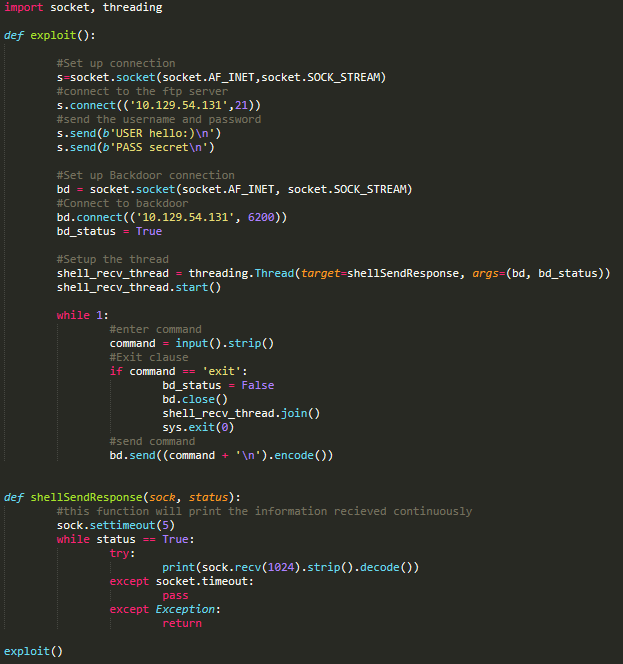

# Lame

I began by running some Nmap scans, and I usually prefer to use <a class="c4" href="https://www.google.com/url?q=https://github.com/rkhal101/nmapAutomator&amp;sa=D&amp;ust=1610798859691000&amp;usg=AOvVaw09fzKEMTk1muMPGiWP7lCu">https://github.com/rkhal101/nmapAutomator</a>&nbsp;to quickly run through important options.

Since this was an easy box, I chose to do Recon at first to keep it quick. 

This showed 4 open ports.

We get the ftp version

Smbmap scan shows read, write access to tmp. My immediate thoughts are to upload a reverse shell there.

After messing with my smbclient settings, I finally manage to connect,

Anonymous login is successful, but I get DC&rsquo;ed immediately.

I don&rsquo;t want to hit my head against a wall unless I have no other option, luckily I have other ports to check as well.

A searchsploit on the FTP version reveals an exploit:

This is a ruby script meant to work with the Metasploit framework. This makes it easy to implement and use. Unfortunately, using Metasploit will not teach how the backdoor works. So I will attempt to recreate it in python.

The references I am using are:

<a class="c4" href="https://www.google.com/url?q=https://scarybeastsecurity.blogspot.com/2011/07/alert-vsftpd-download-backdoored.html&amp;sa=D&amp;ust=1610798859696000&amp;usg=AOvVaw0z9VKkQ7BjHj5deORd28FE">https://scarybeastsecurity.blogspot.com/2011/07/alert-vsftpd-download-backdoored.html</a>&nbsp;

A short explanation of the exploit

<a class="c4" href="https://www.google.com/url?q=https://pastebin.com/AetT9sS5&amp;sa=D&amp;ust=1610798859696000&amp;usg=AOvVaw33UdSYQ4DFuzCs1hYYdVfv">https://pastebin.com/AetT9sS5</a>

The source code in order to reverse engineer it.

<a class="c4" href="https://www.google.com/url?q=https://github.com/offensive-security/exploitdb/blob/master/exploits/unix/remote/17491.rb&amp;sa=D&amp;ust=1610798859697000&amp;usg=AOvVaw0GsUybCZidaqgtgdM24YwE">https://github.com/offensive-security/exploitdb/blob/master/exploits/unix/remote/17491.rb</a>

The Metasploit exploit.

Essentially the backdoor responds to a &ldquo;:)&rdquo; sent as the login value and will attempt to create a callback TCP shell on port 6200.

This was the script I created, it would connect to the FTP server, send the information, and connect to the backdoor. Unfortunately, it did not work.

So to make sure it wasn&rsquo;t just my bad programming skills, I checked with Metasploit as well.

And it&rsquo;s a bust. Positives are more experience making my own exploits and familiarizing myself with python connections.

So I guess it&rsquo;s back to the smbclient to see if we can get that to work.

Some more exploits.

This exploit uses the non-default &quot;username map script&quot; configuration option. By specifying a username containing shell meta characters, attackers can execute arbitrary commands.

I generated the payload with Metasploit:

Using msfvenom to create a payload. -p tells the program to find a payload, specified after. Set the lhost and lport, we specify it to be used with python with -f python, which makes it easy to paste into our code.

Then created an easy SMBConnection in python, using the Metasploit script as a base:

And I gained root access immediately.

Rlwrap is a readline wrap found here: <a class="c4" href="https://www.google.com/url?q=https://github.com/hanslub42/rlwrap&amp;sa=D&amp;ust=1610798859700000&amp;usg=AOvVaw3faDt19JwLI3uKEVDiXJWw">https://github.com/hanslub42/rlwrap</a>&nbsp;Sometimes it is unnecessary, but I almost always add it just in case.

Looking back on it, I should have done Searchsploit on both of the services at the beginning. I think it&rsquo;s generally better to start super wide, and then close in. So start with using Nmap to see what services are running, check if any of those services have vulnerabilities. Then see which vulnerabilities are worth checking out. In this case, I could have been done a lot quicker by just using the Metasploit scripts already created, but I really want to create them manually from now on, as I think I learn a lot more that way.

In this box, the foothold also meant root, so there was no real privilege escalation, as that happened automatically.

## Comparing to the official writeup:

They reach the same conclusion, in that after checking out the vsftpd exploit, the only remaining solution is the samba exploit. They chose to run metasploit which makes the whole process extremely trivial.

## How to stop this exploit:

Update to the most recent version of vsftpd. As the exploit is only related to version 2.3.4
