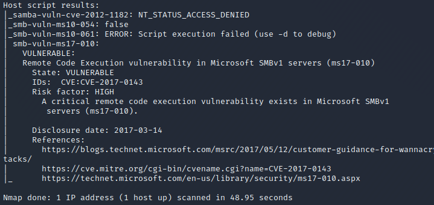
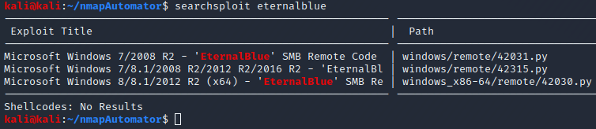
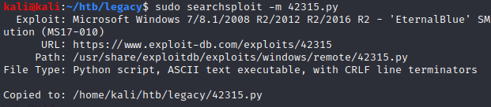
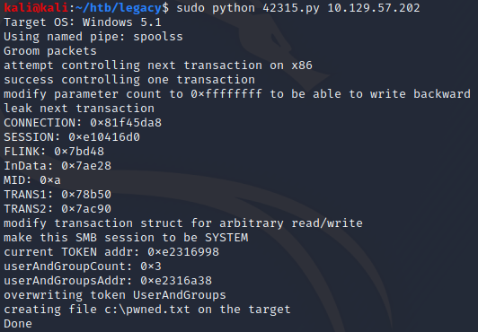
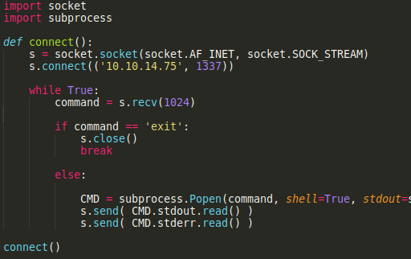
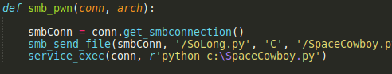
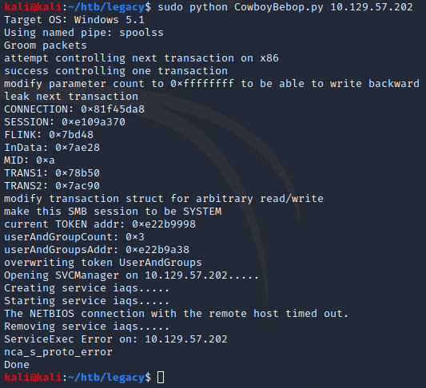
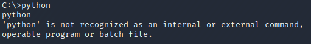

<html><head><meta content="text/html; charset=UTF-8" http-equiv="content-type"></head><body class="c3">
Running nmapAutomator with the Recon option reveals a samba vulnerability

Googling this CVE ID reveals that this is the infamous &ldquo;Eternal Blue&rdquo; exploit. 

We can also see three different versions using searchsploit.

Digging deeper, it is revealed that 42315.py has the most testing and supports the most target systems.

This can easily be copied via searchsploit.

And it seems to be working perfectly, now we can modify the code to upload a reverse shell.

I prepared this exploit script, assuming the target computer has python installed.

I tested the script and it worked perfectly. However, when adding the reverse shell to EternalBlue, nothing happens.

I assume the target machine does not have python, or do not have the permissions.

So I&rsquo;ll create a reverse shell with metasploit instead.

We use Sudo to make it run as root, -p signifies we want a payload, then we specify which payload we want, set our IP and listening port, we want an exe file, so we add -f exe. And since msfvenom just outputs to the terminal we do &gt; shell.exe to create and add that data to shell.exe

And it&rsquo;s working.

I can confirm python is not installed :)

After that, we can just cd around to the user and root desktops and use &ldquo;type root.txt&rdquo; to see the contents.

EternalBlue is nearly 1k python lines long, I did not want to recreate the entire exploit from scratch in this instance. I did create my own reverse shell, but the main exploit was a bit too large. 

Comparing to the official writeup:

The official writeup used nmap to enumerate the SMB service, and identifies the exploit available. They then use Metasploit to quickly gain access.

How to stop this exploit:

</body></html>